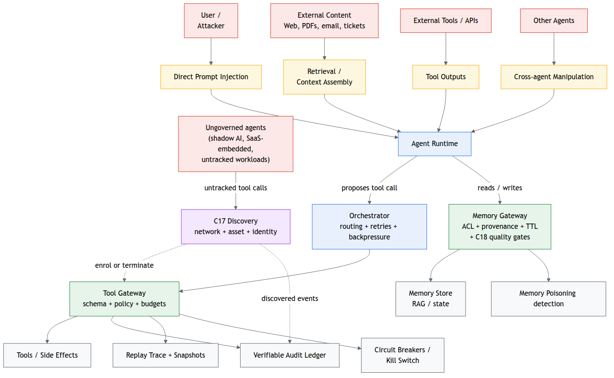

# Threat Model

Agent systems expand the attack surface beyond classic application threats because they (a) ingest untrusted natural language at scale, (b) retrieve and operationalize external content, and (c) execute actions through tools with real privileges. The core shift is that inputs can influence decisions and decisions can cause side effects - often across multiple systems and over time via memory.

This threat model describes: (1) the primary ingress vectors, (2) attacker capabilities and constraints assumed by GATE, (3) high-impact failure modes, and (4) the security objectives GATE enforces at control boundaries.

## Assets at risk

GATE focuses on protecting the following asset classes:

- Privileged tool access: API credentials, IAM roles, service accounts, and the right to invoke actions.

- Data confidentiality: sensitive documents, tickets, emails, customer data, secrets, and regulated data.

- Data and system integrity: records in CRMs, ticketing systems, code repositories, configurations, and infrastructure state.

- Availability and cost: workload capacity, rate limits, queue health, and cloud spend.

- Operational defensibility: the ability to attribute, audit, reproduce, and explain outcomes after an incident.

## Trust boundaries

In a GATE deployment, the model runtime is not trusted as an enforcement boundary. The relevant security boundaries are:

- Tool boundary: where actions are executed (Tool Gateway)

- Memory boundary: where long-lived state is read/written (Memory Gateway)

- Orchestration boundary: where workflow routing, retries, and concurrency are decided

- Evidence boundary: where audit, signatures, and replay traces are committed immutably

## Primary ingress vectors (adversarial influence paths)

Adversarial influence can enter through:

1.  User prompts (direct injection)\
    Attackers attempt to override system intent, request privileged actions, or coerce disclosure.

2.  Retrieved content (indirect injection)\
    Malicious instructions embedded in web pages, PDFs, tickets, emails, or docs are pulled into context and treated as authoritative.

3.  Tool outputs (untrusted responses)\
    External systems and APIs can return payloads that contain injection patterns, misleading data, or crafted content that steers subsequent actions.

4.  Memory poisoning (persistence attacks)\
    Long-lived context stores (RAG indexes, vector DBs, state stores) are polluted to bias future decisions-often invisibly and at scale.

5.  Cross-agent manipulation\
    In multi-agent systems, one compromised or misaligned agent can influence others through delegation, message passing, or shared state.

6.  Confused deputy attacks\
    The agent holds legitimate privileges; the attacker manipulates it into using those privileges for unintended outcomes (e.g., exporting data "for debugging," granting access "temporarily," changing configs "to fix an error").

7.  Extraction / probing\
    Attackers attempt to infer sensitive data from responses, learn internal policies, replicate behavior, or discover tool surfaces via iterative probing.

8.  Runaway execution / cost and operational damage\
    Attackers (or simple failures) trigger loops, recursion, high-frequency tool calls, or pathological retrieval patterns that cause spend spikes or service disruption.

## Adversary assumptions (baseline)

GATE assumes an adversary can:

- craft inputs to override or subvert instructions (including multi-turn attacks)

- embed malicious instructions inside content that appears "trusted"

- exploit ambiguity in natural language protocols ("call the tool with whatever seems right")

- exploit shared credentials, broad permissions, or weak attribution

- manipulate retrieval and ranking (SEO spam, poisoned corpora, malicious tickets)

- induce unsafe retries, loops, and spend blowouts through feedback manipulation

GATE does not require assuming the adversary has direct administrative control of your cloud account. However, GATE does assume standard enterprise conditions: misconfigurations occur, some internal sources may be compromised, and external dependencies are untrusted.

## Representative attack scenarios

**Scenario A - Indirect injection → privileged action**\
A malicious PDF contains "instructions" that direct the agent to export data "for verification." The agent obeys.\
Failure mode: tool call executed without deterministic constraints.\
GATE objective: enforce allow/deny + invariants + HITL obligations at tool boundary.

**Scenario B - Confused deputy via legitimate privileges**\
An attacker convinces the agent that rotating secrets requires temporarily widening IAM permissions.\
Failure mode: agent uses legitimate privileges for an unintended escalation.\
GATE objective: tool category gating + invariant checks + non-repudiation + approvals for privilege-affecting actions.

**Scenario C - Memory poisoning persistence**\
A malicious internal ticket gets indexed and becomes a persistent "source of truth," shaping future actions.\
Failure mode: long-lived corrupted state causes repeated unsafe behaviors.\
GATE objective: provenance checks, schema/ACL at read time, quarantine, and auditability of memory writes.

**Scenario D - Tool output injection**\
An external API returns a response containing prompt-injection instructions; the agent treats it as system guidance.\
Failure mode: untrusted tool output becomes executable instruction.\
GATE objective: strict separation of instruction channels, normalization, and deterministic policy enforcement.

**Scenario E - Runaway loops and spend**\
An attacker induces repeated "verification" steps, causing infinite retries and escalating cost.\
Failure mode: unbounded recursion and tool call storms.\
GATE objective: budgets, concurrency limits, breaker thresholds, and stop mechanisms.

## Security objectives

GATE's controls aim to guarantee the following properties at runtime:

- Attribution: every privileged action is linked to a unique agent instance identity.

- Authorization: no tool/memory operation executes without a policy decision record.

- Constraint enforcement: high-impact actions satisfy invariants and obligations (verification/HITL).

- Containment: abnormal behavior triggers breakers and kill-switch paths that stop side effects quickly.

- Forensic defensibility: actions are recorded in tamper-evident logs; replay can reproduce governed outcomes.

**Threat Flow and Enforcement Boundaries**

The diagram below shows how adversarial influence enters an agent system and where GATE enforces deterministic control boundaries. Inputs from users, retrieved content, tool outputs, memory, and other agents can all shape agent decisions. GATE therefore treats the agent runtime as an untrusted proposer and concentrates enforcement at the tool, memory, orchestration, and evidence boundaries - where actions can be authenticated, authorized, constrained, and made auditable.

{#fig-threat-model width="95%"}

**Figure TM.1 - Threat ingress paths and GATE enforcement boundaries. Adversarial influence enters via direct prompt injection (User / Attacker), retrieval and context assembly (External Content), tool outputs (External Tools / APIs), cross-agent manipulation (Other Agents), and ungoverned agents that bypass the control plane entirely (Shadow AI). GATE concentrates enforcement at the Tool Gateway, Memory Gateway, and C17 discovery boundaries, and forces all evidence through the verifiable audit ledger.**

Adversarial influence enters via prompts, retrieved content, tool outputs, memory poisoning, and cross-agent messages. GATE constrains outcomes by mediating tool execution and memory access through control-plane services, with circuit breakers and tamper-evident evidence capture on every governed action.

## Insider and operator threat assumptions

GATE assumes that accidental misconfiguration and operational mistakes occur, and that privileged operators may be compromised. GATE mitigates this by:

- separating duties (agent runtimes cannot modify enforcement),

- requiring signed/traceable changes for policy bundles and approvals,

- emitting tamper-evident evidence and integrity reports.

## Non-goals

GATE does not fully prevent a malicious administrator with unrestricted access from causing harm. It aims to make such actions attributable, reviewable, and constrained via governance controls (change control, approvals, key management, immutable evidence).
