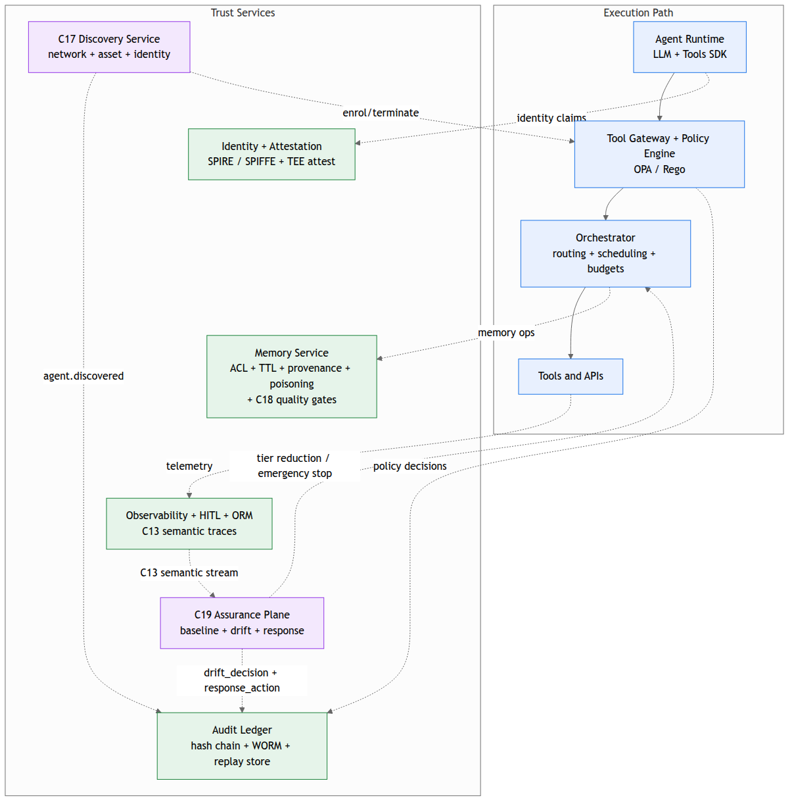

# GATE Reference Architecture

This section defines the minimum set of runtime boundaries required to operate agentic systems with enforceable governance. GATE decomposes the system into: (1) an execution path where the agent proposes work and tools produce side effects, and (2) trust services that authenticate, constrain, observe, and make actions reproducible. The architectural goal is to ensure that privilege, side effects, and persistence are only reachable through deterministic enforcement points that emit verifiable evidence.

### Core invariant

The agent runtime MUST NOT call tools or memory directly. All tool and memory operations MUST traverse GATE enforcement points (Tool Gateway and Memory Gateway) that:

- authenticate the caller (workload identity + attestation),

- validate schemas and invariants,

- evaluate policy and obligations,

- enforce budgets and circuit breakers, and

- emit evidence (decision records, ledger events, replay traces).

## Trust Logical Pipeline 

The trust pipeline shows GATE's "control plane first" workflow. The agent runtime produces tool requests and memory reads/writes, but GATE interposes deterministic enforcement at every boundary that can cause side effects or persistence. Evidence generation is not optional; it is part of the pipeline.

**Tool execution flow (governed)**

The agent runtime emits a tool request to GATE tool gateway (auth, policy, budget, signing). The tool gateway is the sole mediation point for tool execution. From the tool gateway:

- authorized requests proceed to enterprise tools and APIs, and

- evidence is emitted to GATE audit ledger (hash chained events to immutable sink) and GATE replay recorder (traces and snapshots), and telemetry is emitted to the observability pipeline (OpenTelemetry and semantic traces).\
  Where policy requires, the tool gateway uses the HITL approval service (optional gates) to hold or gate execution; the approval outcome is recorded as evidence and correlated to the originating request.

**Memory flow (governed persistence)**

The agent runtime performs memory read/write through the GATE memory gateway (ACL, TTL, provenance, poisoning checks), which mediates access to memory stores (vector and state). The memory gateway emits evidence to the audit ledger and replay recorder, and emits telemetry to the observability pipeline.

**Memory flow scope note**

The Memory Gateway is an access-control and provenance boundary, not a data-quality boundary. It enforces ACLs, TTL, provenance checks, and poisoning detection at retrieval time. It does not validate the accuracy, currency, or completeness of stored content. Vector store entries that are stale, hallucinated upstream, or scraped from low-quality sources will pass every Memory Gateway check provided their provenance is recorded and their ACL permits the caller. An agent that hallucinates confidently from retrieved content can produce all of the evidence required by C01-C16 while the underlying decision is wrong.

This is a deliberate scope boundary. GATE is a control plane framework, not a data quality platform. Data quality belongs upstream in the pipelines that produce stored content. However, the retrieval boundary is the last point at which the control plane can apply minimum quality gates before content reaches the model. C18 (Data Quality Gates) defines those gates: freshness checks against a configurable TTL, confidence thresholds, and provenance-required flags. Organisations operating without C18 should document this scope gap explicitly in their conformance self-assessment and route data quality assurance to a named upstream process.

**Risk feedback flow (autonomy dial)**\
\
The observability pipeline provides signals to ORM risk scoring (autonomy dial). ORM outputs are used to influence enforcement posture (e.g., tightening thresholds, enabling gates, adjusting budgets) as defined by policy and operational runbooks.

In the following diagram, the tool gateway and memory gateway are the only sanctioned egress points from the agent runtime; all evidence and risk signals are downstream of these enforcement points. Figure RA.1 shows the main runtime path. The C17 Discovery plane (Figure 17.1) and the C19 Assurance plane (Figure 19.1) operate alongside this path; they are described in their respective control sections.

![Figure RA.1 - GATE Trust Pipeline (logical). The agent runtime emits tool requests through the GATE Tool Gateway and memory operations through the GATE Memory Gateway. The C18 quality gate evaluates every retrieval before it reaches the memory stores. Both gateways write evidence through a chain that terminates at the audit ledger (WORM-backed), the replay recorder, and the observability pipeline, which feeds ORM autonomy scoring. The C17 Discovery plane and C19 Assurance plane operate alongside this main path; see Figures 17.1 and 19.1.](../assets/images/figure-ra-1.png){#fig-ra-1 width="60%"}

All tool and memory access is mediated by GATE enforcement points. The Tool Gateway authenticates requests, evaluates policy, enforces budgets, and optionally applies approval gates before tools execute. The Memory Gateway enforces ACLs, provenance checks, TTL, and poisoning controls for memory reads/writes. Every governed operation produces evidence through the audit ledger, replay recorder, and semantic observability pipeline; ORM consumes these signals to adjust autonomy.

The trust pipeline has two enforced paths out of the agent runtime:

- Tool path: The agent runtime emits a tool request to the GATE tool gateway (auth, policy, budget, signing). The gateway is the sole execution boundary for tool calls and is responsible for authentication, policy evaluation, budget enforcement, and (for required categories) signing. The gateway produces evidence into the GATE audit ledger (hash-chained events to an immutable sink) and the GATE replay recorder (traces and snapshots), and emits telemetry to the observability pipeline (OpenTelemetry and semantic traces). Where policy requires, the gateway coordinates with the HITL approval service before tool execution proceeds to enterprise tools and APIs.

- Memory path: The agent runtime performs memory read/write only through the GATE memory gateway (ACL, TTL, provenance, poisoning checks), which mediates access to memory stores (vector and state). Memory events and decisions are also exported to the audit ledger, replay recorder, and observability pipeline to preserve attribution and reproducibility.

Risk feedback

The ORM risk scoring (autonomy dial) consumes observability (and optionally evidence-derived signals) to adjust enforcement posture (e.g., tightening policy thresholds, requiring HITL gates, adjusting budgets).

## GATE Logical Architecture

GATE's logical architecture separates **execution** (what happens) from **assurance** (what must be true and provable). The top row represents the execution path that produces side effects. The bottom row represents supporting trust services bound to each stage, enabling identity, integrity, evidence, and containment.

{#fig-ra-2 width="70%"}

**Figure RA.2 - GATE Logical Architecture. The Execution Path (top) carries the agent runtime through the Tool Gateway and Policy Engine, the Orchestrator, and out to enterprise Tools and APIs. The Trust Services row (bottom) bind to each stage: Identity and Attestation, Audit Ledger, Memory Service (now including C18 quality gates), and Observability, HITL, and ORM. v1.3 adds the C17 Discovery Service and the C19 Assurance Plane as new Trust Services that feed and consume the runtime path respectively.**

The top row shows the execution path from agent runtime to tools/APIs via the Tool Gateway and Orchestrator. The bottom row shows trust services that bind to each stage: identity and attestation for attribution, a verifiable audit ledger and replay store for integrity and reproduction, a governed memory service for persistence safety, and an observability layer that supports HITL gates and ORM-driven autonomy control.

### Technical Implementation

**Execution path (top row)**

- Agent Runtime (LLM + Tools SDK): generates candidate plans and tool requests. It is treated as an untrusted proposer. It MUST operate without direct credentials to invoke enterprise tools or memory stores.

- Tool Gateway + Policy Engine: deterministic enforcement boundary for all tool actions. It validates the request schema, evaluates policy-as-code, enforces budgets, attaches obligations (e.g., HITL, verification), and emits decision records and evidence links.

- Orchestrator (Routing/Scheduling/Budgets): coordinates multi-step and distributed execution: retries/backoff, queueing, concurrency limits, workload routing, backpressure, and workflow state transitions. It is the operational governor that prevents runaway execution patterns and manages safe rollouts.

- Tools & APIs: enterprise systems or external dependencies that produce real-world side effects. They are treated as untrusted from a content perspective (their outputs can carry injection), and they must be reachable only through the gateway identity and network routes.

**Trust services (bottom row)**

- Identity & Attestation (SPIFFE/SPIRE + TEE attest): issues and verifies workload identities for agent instances and control-plane services. Provides attribution, revocation, and (optionally) hardware-backed attestation for higher assurance environments.

- Audit Ledger + Replay Store: provides tamper-evident, immutable evidence and the artifacts required for deterministic replay at the tool/memory boundary (hashes, snapshots, policy bundle references).

- Memory Service (ACLs/Schema/TTL + Poisoning checks): constrains persistence. Reads/writes are authorized at retrieval time; records are schema-bound; TTL limits blast radius; poisoning detection enables quarantine and provenance-based filtering.

- Observability (+ HITL + ORM): captures correlated telemetry and semantic traces, drives operational monitoring, supports approval workflows, and feeds ORM risk scoring to dynamically adjust autonomy and enforcement posture.

**Implementation note.** A GATE deployment is "real" only if the following are true:

1.  all tool and memory access is forced through the gateway (no bypass paths),

2.  every governed action produces a policy decision record and evidence pointer, and

3.  high-impact actions can be replayed at the tool/memory boundary using stored traces and snapshots.

## Component Responsibilities Table

| Component | Primary responsibilities | Enforces (controls) | Emits (evidence) |
|---|---|---|---|
| Identity Provider / Attestor | Mint short-lived workload identities; seal image / config / policy / toolset claim hashes | C01, C03 | Identity issuance events; attestation records |
| Discovery Service | Continuous network / asset-inventory / identity classification; emit candidates; enrol-or-terminate | C17 (feeds C04) | `agent.discovered`, `agent.remediation_outcome` |
| ABOM Registry | Store the signed Agent Bill of Materials per agent class; expose claim hashes to gateways | C03, C04 (consumed by C01 verification) | Signed ABOM artifacts |
| Lifecycle Service | Commission / Run / Quiesce / Decommission state machine, including the Discovered entry state for C17 candidates | C04 | Lifecycle state transitions |
| Tool Gateway | Authenticate identity, validate schema, evaluate policy-as-code, enforce obligations (HITL, sign, redact), commit decision to ledger | C05, C06, C07, C09 | Policy decision records, obligation enforcement events |
| Memory Gateway | Enforce ACLs, TTL, provenance, freshness / confidence / provenance quality gates at retrieval time | C03 (memory), C08 (retrieved-content injection), C18 | Retrieval decisions, `quality_decision` events |
| Invariant Engine | Evaluate non-overridable invariants after policy; handle break-glass overrides against signed exception records | C09 | Invariant decisions, break-glass records |
| Audit Ledger | Tamper-evident hash-chained sink for every control event; WORM retention selected per event | C11 | Ledger events with contiguous prev_event_hash chain |
| Replay Harness | Snapshot the inputs at the tool / memory boundary; replay produces matching output hashes | C10 | Replay traces |
| Semantic Observability Pipeline | trace_id correlates policy, ledger, replay, and semantic events; feeds C19 baseline profiler | C13 | Semantic trace events; correlation manifests |
| Assurance Plane | Baseline profiling and continuous drift detection against a signed baseline tied to the ABOM; distinct from C16 | C19 | `drift_decision`, `response_action` events |
| Output Classifier | Per-response classification at the delivery boundary; sensitivity tier, regulated category, confidence, obligations from the action matrix | C20 | `gate.output.classification` events |
| Adversarial Harness | Continuous red-team suite; regression on adversarial corpus in CI/CD; distinct from C19 | C16 | Adversarial outcomes |
| Multi-Agent Broker | Signed envelope + nonce + expiry on agent-to-agent messages | C14 | Multi-agent message records |
| Orchestration Control Plane | Routing, backpressure, safe rollout / rollback; tenant isolation enforced across agents | C15 | Orchestration events |
| HITL Service | Presents pending approvals to authorised humans; produces signed HITL Decision Records | C09, C12, C20 (`hitl_review` obligation) | HITL Decision Records |
| ORM Risk Engine | Runtime risk score consumed by policy evaluation and by C19 tier-reduction decisions | Contributes context to C05, C09, C19 | ORM score events |

C17 Discovery Service and C19 Assurance Plane are named alongside the Tool Gateway and Memory Gateway as first-class components in the v1.3 architecture; C20 Output Classifier is added at v1.4 as a delivery-boundary component that consumes C13 semantic context and commits to the C11 ledger.

