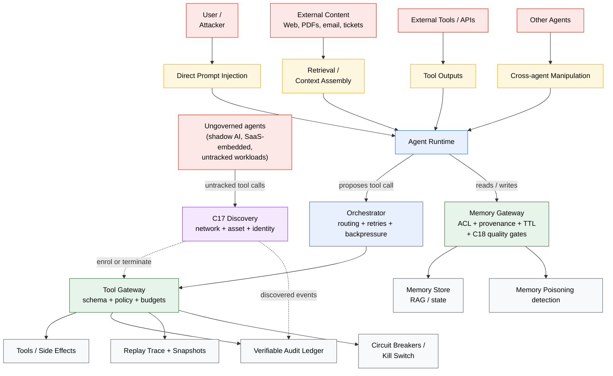
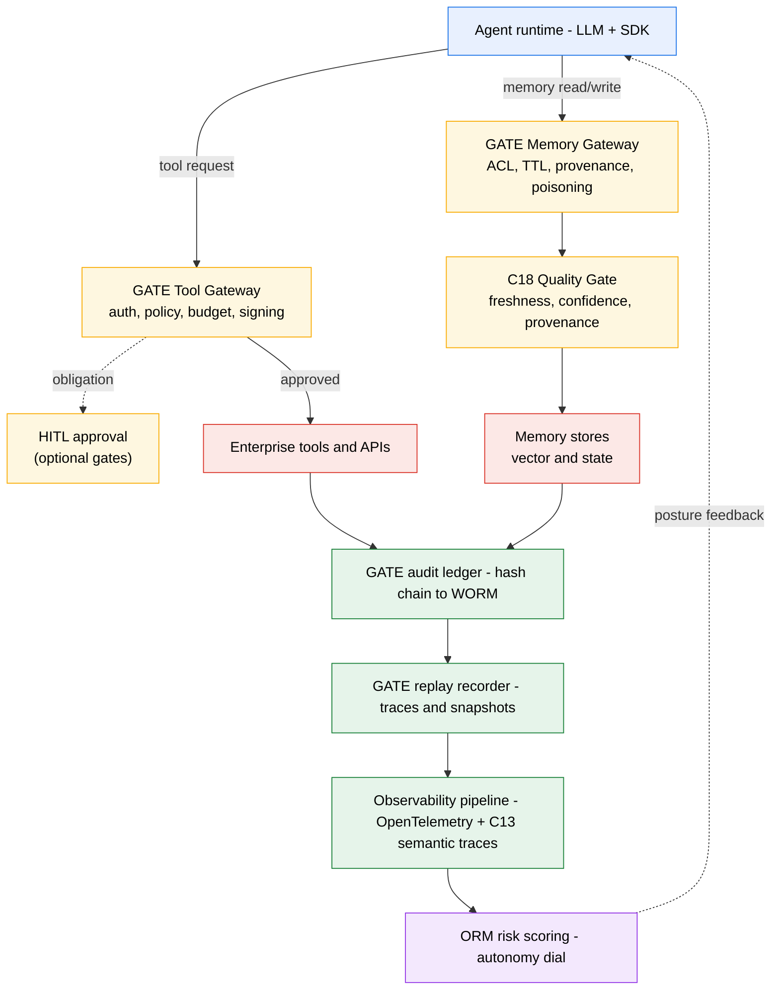
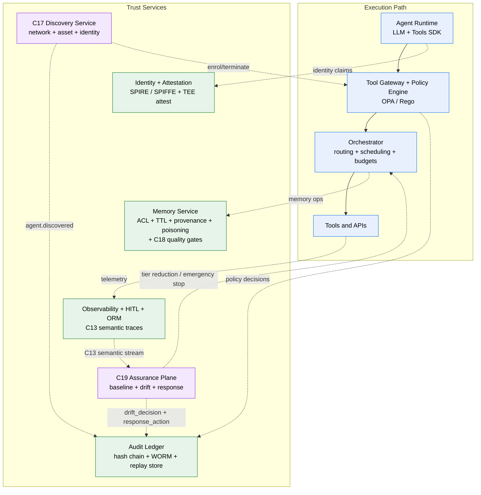
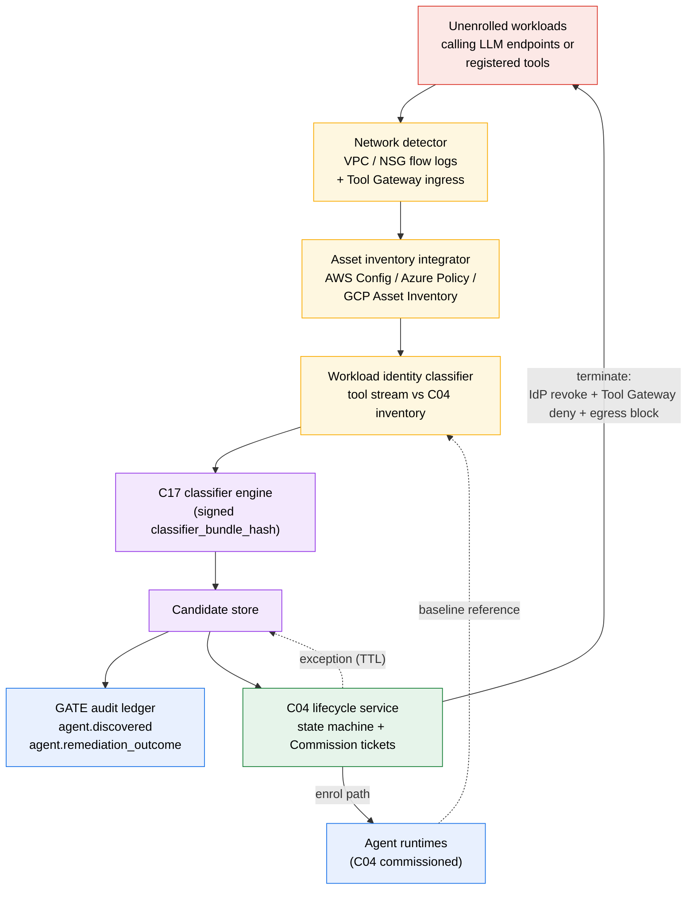
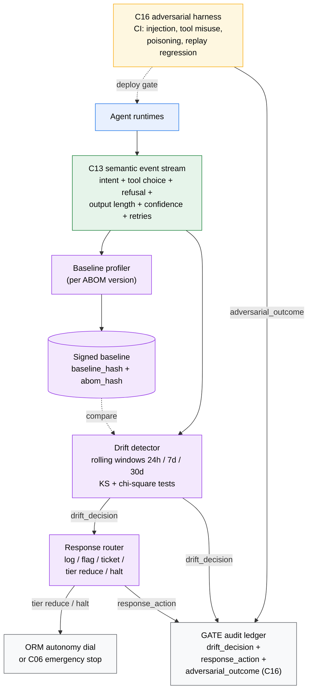
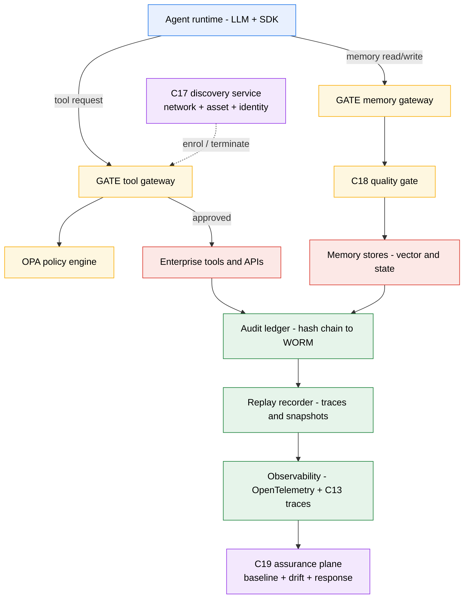
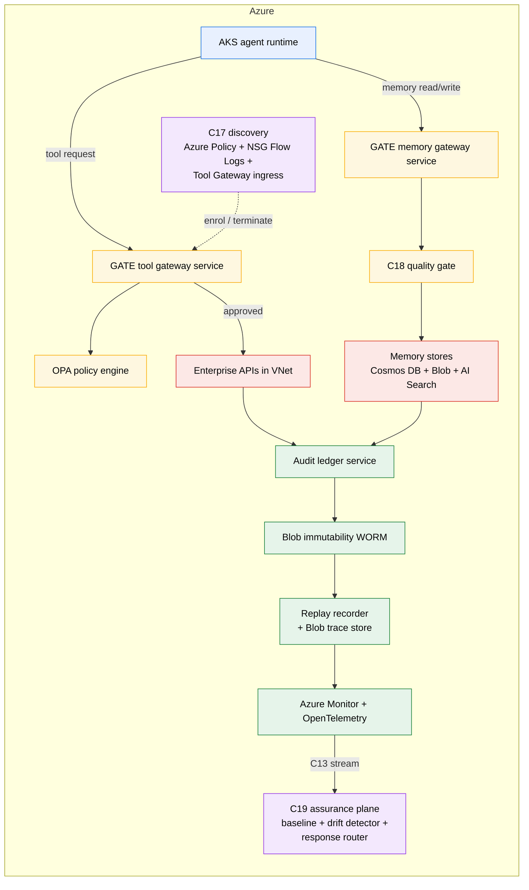
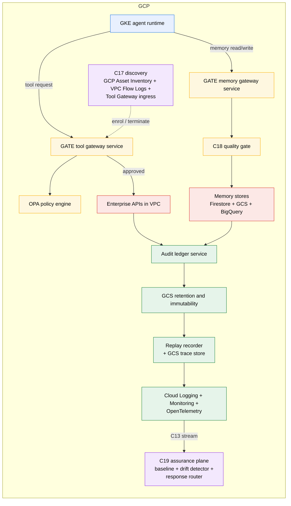

# Governed Agent Trust Environment
*A Cloud Reference Framework of Controls for Enterprise-Grade Trustworthy AI Agents*

Version: 1.4

Copyright © 2026 Andrew Stevens.

License (Documentation): Creative Commons Attribution 4.0 International (CC BY 4.0)  
This work is licensed under the Creative Commons Attribution 4.0 International License. You may copy, redistribute, remix, transform, and build upon this material for any purpose, including commercial use, provided that you give appropriate credit, include a reference to the license, and indicate if changes were made.

Required attribution (minimum):

> Author: Andrew Stevens
>
> Title: Governed Agent Trust Environment (GATE)
>
> Source: [www.deterministicagents.ai](http://www.deterministicagents.ai)
>
> License: CC BY 4.0

No endorsement:  
Attribution must not suggest the author endorses you, your organization, or your use of this work.

Disclaimer:  
This document is provided "as is" without warranties of any kind. Implementers are responsible for validating security, compliance, and suitability for their environment and applicable requirements.

# Licensing & Use

This framework is intended for broad adoption and reuse.

**Documentation license (CC BY 4.0)**

The text, diagrams, and other non-code content in this document are licensed under Creative Commons Attribution 4.0 International (CC BY 4.0). You may copy, redistribute, remix, transform, and build upon this material for any purpose, including commercial use, provided you give appropriate credit, include a link to the license, and indicate if changes were made.

License: [https://creativecommons.org/licenses/by/4.0/](https://creativecommons.org/licenses/by/4.0/)

**Recommended attribution**

"Governed Agent Trust Environment (GATE)" by Andrew Stevens, licensed under CC BY 4.0.  
Source: deterministicagents.ai/gate

**No endorsement**

Attribution must not suggest the author endorses you, your organization, or your use of this work.

**Implementation responsibility**

This framework provides architectural and engineering guidance only. It does not constitute legal advice and does not guarantee security or compliance. Implementers are responsible for validating controls, evidence retention, and risk thresholds for their environment, threat model, and applicable regulatory or contractual requirements.

# Changelog
## Changes since v1.3

Released: 2026-08-18  
Previous version: v1.3

The largest release since the initial publication. Adds one control (C20), tightens four existing controls (C09, C17, C18, plus a normative note in C19), adds three standards mappings (AISVS, ATLAS, SSDF), and introduces two new repositories (gate-rust as a high-throughput Tool Gateway companion, gate-fuzz as a property-based testing suite) and a knowledge bundle (gate-knowledge in OKF v0.1 format).

### Added

- **C20 Agent-to-Human Output Validation** (Layer 3). Per-response classification at the delivery boundary, with sensitivity tier, regulated category, confidence score, and configurable obligations (`redact_fields`, `hitl_review`, `hold_for_review`). Fail-closed default at high_privilege tier enforced by bundle-schema and policy guardrail. Streaming output disabled at high_privilege for any agent whose action matrix can produce a hold or review obligation (constraint applies in v1.4 only; streaming-aware classification arrives in v1.5).
- **AISVS, ATLAS, SSDF mappings** in the Standard Mappings appendix. Pinned to AISVS v1.0 at commit `aadf83a77b44cc5c6ee3033affe0d8c538dc3748`, ATLAS content `2026.05` / data format `5.6.0`, and SSDF SP 800-218 v1.1.
- **`break_glass_record` contract** in gate-contracts v1.2.0. A signed artifact carrying `record_id`, `invariant_halt_event_id`, `invariant_rule_id`, dual `approver_ids`, `justification`, `exception_scope`, `exception_expires_at`, and signatures. Closes the audit gap where v1.3 break-glass events could not be programmatically tied to the authorisation that permitted the override.
- **C17 automated enrolment fast-path** as a subsection within C17. Candidates meeting all classification criteria above a per-workload-class confidence threshold AND with resolvable asset tags AND in the approved workload class list are automatically enrolled without human Commission review. Configuration shape (`auto_enrolment_policy`) is normative in gate-contracts v1.2.0.
- **C18 provenance chain extension**. Provenance MUST chain back to a registered source: a data source in the C04 source registry or a verified external feed in the approved feed registry. A well-formed provenance record pointing to an unregistered source fails C18 at high_privilege tier.
- **gate-rust** (new repo, v1.0.0). Rust companion crate providing canonical JSON, envelopes, ledger, and signing. Hash-compatible with gate-python by contract: the canonical JSON test vectors in `gate-python/gate/test_vectors/canonical_json_vectors.json` are the cross-language compatibility source of truth.
- **gate-fuzz** (new repo, v1.0.0). Hypothesis-based cross-language differential test suite between gate-python v1.2.0 and gate-rust v1.0.0. Five active properties covering canonical-JSON byte equivalence, signing-key differential, schema-drift differential, and replay-trace differential; two properties (envelope-hash byte parity and ledger-event-hash byte parity) deferred to v1.5.
- **gate-knowledge** (new repo, v1.0.0). The GATE conceptual layer published as an Open Knowledge Format v0.1 bundle (McVeety and Hormati, 2026). CC BY 4.0 with a NOTICE crediting the OKF specification (Apache 2.0). Twenty controls, threat model entries, four architecture layer documents, ABOM templates, and adoption-path entries, all OKF-conformant.
- **Check20** in the conformance runner (`gate-conformance` v1.3.0). PARTIAL classification: coverage, bundle hash, obligation distribution, and bundle-default-hold guardrail are queryable; human review workflow and streaming policy verification require process inspection.
- **mappings/ directory in gate-conformance** containing `owasp-aisvs.yaml`, `owasp-aisvs-triage.yaml`, `mitre-atlas.yaml`, and `nist-ssdf.yaml`.
- **`policies/bundle_manifest.yaml`** in gate-policies. Explicit per-rego-file bundle assignment (policy or invariant), with directory-based default as a fallback for files not listed. Removes the implicit coupling between filesystem layout and bundle assembly.
- **`classification` field** in `self_assessment.yaml`. Backfilled for all 19 existing check entries (9 AUTOMATED, 10 PARTIAL) plus Check20. The runner and the YAML are now consistent on classification.

### Changed

- **gate-contracts v1.1.1 -> v1.2.0**. New schemas: `output_classification_event.schema.json`, `break_glass_record.schema.json`, `auto_enrolment_policy.schema.json`, `approved_feed_registry.schema.json`. Extensions: `agent_state.schema.json` gains `AutoEnrolled` state, `abom.schema.json` gains optional `output_classification_bundle_hash` and `auto_enrolment_eligible`, `quality_decision.schema.json` gains optional `source_registry_hash` and `feed_registry_hash`. All v1.2.0 schema changes are backward-compatible with v1.1.1. The gate-python regression test (`tests/test_v1_1_0_compatibility.py`) verifies this on every release build.
- **gate-policies v1.1.1 -> v1.2.0**. New Rego files for C20, C09 break-glass verification, and C17 auto-enrolment, in new subdirectories (`policies/output/`, `policies/invariants/`, `policies/discovery/`). Existing files unchanged. The C09 break-glass file is placed under `policies/invariants/` for namespace clarity but ships in the policy bundle, not the invariant bundle, per the new bundle manifest.
- **gate-conformance v1.2.0 -> v1.3.0**. Check17 and Check18 reclassified to "PARTIAL or AUTOMATED conditional on configuration." When the runner is configured with `quality_bundle_store_uri` (Check17) or `baseline_bundle_store_uri` (Check18), the check reports as AUTOMATED. Without configuration, the check remains PARTIAL. Conformance totals reported with floor and upgrade indicator (default: 9 AUTOMATED / 11 PARTIAL; configured: 11 AUTOMATED / 9 PARTIAL).
- **gate-python v1.1.0 -> v1.2.0**. New modules `gate/output/` (C20) and `gate/invariants/break_glass.py` (C09 break-glass). pyproject.toml created with hatchling backend (no PyPI publication in v1.4; PyPI publication is deferred to v1.5). Canonical JSON test vectors at `gate/test_vectors/canonical_json_vectors.json` published as the cross-language compatibility source.
- **Conformance section of the paper** carries updated paragraph text for Check17, Check18, and the new Check20 paragraph. Layer 3 control count: 5 -> 6 throughout.
- **Adoption Path**. C20 added to Phase 2 (flag-only minimum) and Phase 3 (enforce mode at high_privilege). C18 Phase 3 entry extended to call out the chain-to-registered-source check. C17 Phase 2 entry extended to permit the automated enrolment fast-path at bounded tier.

### Deprecated

None in v1.4. No control is deprecated; no schema is deprecated; no API surface is removed.

### Removed

None in v1.4. Backward compatibility with v1.1.1 contracts is normative: v1.1.1 fixture events MUST validate against v1.2.0 schemas (verified by a gate-python regression test).

### Known issues / deferred to v1.5

These are contract gaps v1.4 acknowledges without closing.

- **Unified exception register.** The `data.gate.exceptions` data source is referenced by C09, C17, C18, and C19 in their respective Rego policies but is not defined as a contract anywhere. v1.4 closes the narrow C09 break-glass record gap with `break_glass_record.schema.json` but does not unify the exception-lifecycle contract surface across the four controls. A unified `exception_record.schema.json` is planned for v1.5.
- **Dual-approver HITL Decision Record.** The HITL Decision Record schema is single-approver in v1.4. The new `break_glass_record` carries an `approver_ids` array with a schema-level dual-approval check, but the broader HITL pathway used by C20 (`hitl_review` obligations) and the v1.3 HITL pathway continue to use the single-approver record. Operators that require dual approval on output-side HITL use the break-glass record path as a manual workaround until v1.5 adds a multi-approver HITL extension.
- **Streaming-aware C20 classification.** v1.4 disables streaming output to the user at high_privilege tier for any agent whose action matrix can produce a hold or review obligation. A streaming-compatible classification path arrives in v1.5.
- **Residual em dashes in untouched v1.1.1 files.** The v1.4 sweep applies to files modified in v1.4 only. Roughly sixty em dashes remain in untouched files. A tracking issue is opened for a v1.4.1 chore release or v1.5 housekeeping workstream.
- **Per-claim confidence scoring in C20.** v1.4 C20 produces one confidence score per response. Per-claim scoring is a model-side capability not in v1.4 scope.
- **Multilingual classification vocabulary.** The C20 regulated category set is configured per organisation per jurisdiction; v1.4 does not impose a multilingual category vocabulary.
- **gate-python PyPI publication.** v1.4 creates pyproject.toml with hatchling but does not publish to PyPI. PyPI publication is a v1.5 deliverable.
- **gate-fuzz bundle-derived Hypothesis strategies.** The public v1.4 roadmap named strategies generated from the signed C09 invariant bundle so that every operator-defined invariant produces a property test without further authoring. v1.4 ships hand-authored strategies drawn from the four Workstream 2 schemas plus canonical-JSON pathological inputs. Bundle-derived strategies move to v1.5.
- **gate-fuzz HTTP-level protocol fuzzer against a running Tool Gateway.** The public v1.4 roadmap named a black-box HTTP fuzzer producing malformed and adversarial ToolRequestEnvelope traffic against a live gateway and asserting fail-closed behaviour. v1.4 ships a subprocess-driven library fuzzer over the gate-python and gate-rust surfaces instead. The HTTP-level protocol fuzzer moves to v1.5.
- **gate-fuzz PARTIAL-check mapping.** The public v1.4 roadmap named a table mapping each fuzz property to the specific gate-conformance PARTIAL check whose evidence the property closes. v1.4 does not carry this mapping. Operators may attach gate-fuzz output artefacts to Check15 evidence submissions today as supplementary negative-test attestation; the runner does not unilaterally consume them. The mapping moves to v1.5, and with it the runner-side consumption path.
- **gate-rust v1.1 PyO3 (or subprocess) conformance bridge** between gate-python and gate-rust, producing byte-level proofs at the envelope, ledger, and signing layers via a single test suite running over both implementations.
- **Identity-perimeter enforcement control.** A framework-level control naming identity-layer access boundary requirements, enforced via mechanisms such as GCP Principal Access Boundary Policies, AWS Service Control Policies, Azure Management Group restrictions, or equivalent operator-specific IAM perimeters.
- **Cross-language float-decimal canonical-JSON divergence.** The gate-python and gate-rust canonical-JSON implementations diverge on float emission outside the W5 14-vector safe set. v1.5 will align both implementations on a shared canonical float emitter, formally narrow the canonical-JSON spec, or accept the divergence as documented.

### Repos at v1.4

| Repo | v1.3 / v1.3.1 | v1.4 |
|---|---|---|
| gate-contracts | v1.1.1 | v1.2.0 |
| gate-policies | v1.1.1 | v1.2.0 |
| gate-conformance | v1.2.0 | v1.3.0 |
| gate-python | v1.1.0 | v1.2.0 |
| gate-rust | (not present) | v1.0.0 (new) |
| gate-fuzz | (not present) | v1.0.0 (new) |
| gate-knowledge | (not present) | v1.0.0 (new) |
| gate (top-level framework) | v1.3 / v1.3.1 | v1.4 |

The artifacts bundle is renamed from `GATE-artifacts-v1.2.zip` to `GATE-artifacts-v1.4.zip`. Future bundle filenames track the framework version, not the highest implementation-repo version.

## Changes since v1.2.8

v1.3 expands GATE's scope in three deliberate directions. The previous version assumed the population of agents was known, the retrieved content was usable, and the underlying model was stable across time. None of those assumptions is safe in production. v1.3 makes the first explicit as a scope statement and adds dedicated controls for the second and third.

The existing 16 controls are unchanged in number, layer placement, and intent. Three additions modify them only at the edges: C04 gains a Discovered lifecycle state to receive C17 candidates, C08 carries a Failure-Modes cross-reference to C18 and the Memory flow scope note, and C10 carries a single clarifying sentence on the Determinism scope. The numbering of C01-C16 is preserved.

New controls

- C17 Agent Discovery and Shadow AI Detection (Layer 1). Continuous discovery of agent-like behaviour across the governed environment, classification of candidates, and a deterministic enrol-or-terminate path that feeds C04. Closes the assumption that the C01-C16 control plane has anything to say about agents it has never seen.

- C18 Data Quality Gates (Layer 2). Retrieval-time minimum quality gates inside the Memory Gateway covering freshness, confidence, and provenance. Closes the gap that allowed an agent to pass every GATE check while operating on stale, low-confidence, or unverifiable retrieved content.

- C19 Model Behaviour Monitoring (Layer 3). Continuous statistical comparison of production behaviour against a signed baseline tied to the ABOM. Distinct from C16 (event-driven and adversarial); C19 detects gradual distribution drift, C16 detects attacks. The two are required as a pair for high-privilege tier.

Scope statements made explicit

- Enrolment assumption (Scope section). GATE governs agents that are enrolled in the control plane. It does not substitute for network-level discovery of shadow or rogue agents. See C17.

- Memory flow scope note (Reference Architecture). The Memory Gateway is an access-control and provenance boundary, not a data-quality boundary. See C18.

- Drift vs adversarial assurance. C16 detects adversarial events. C19 detects gradual statistical drift. These are emitted as distinct ledger event types (gate.assurance.adversarial_outcome vs gate.assurance.drift_decision) and have separate response runbooks. They must not be merged.

Existing controls touched

- C04 Agent Lifecycle Governance. The state machine adds a Discovered entry state that receives C17 discovery events. Discovered transitions to Commissioned on enrolment or to Terminated on TTL expiry. No agent can move directly to Run without traversing Discovered or being Commissioned via a declared path.

- C08 Prompt and Content Injection Defence. Failure-Modes list gains a bullet: treating C08 as a quality gate for retrieved content is a failure mode, with the cross-reference to C18 and the Memory flow scope note.

- C10 Deterministic Replay. Determinism scope paragraph gains a closing sentence: retrieved-context hashes confirm what was retrieved, not whether the retrieved content was accurate or current.

Adoption Path updates

- Phase 1 adds C17 in observe-only mode as a minimum requirement.

- Phase 2 promotes C17 to enforce mode, and adds C18 in flag-only mode with enforce for at least one production content class.

- Phase 3 adds C19 (depends on C13 from Phase 2) and promotes C18 to full enforce for high-privilege tier.

Exit criteria for each phase are updated accordingly.

Alignment table changes

- NIST AI RMF alignment table: C17 maps to GOVERN and MAP; C18 maps to MEASURE and MANAGE; C19 maps to MEASURE and MANAGE.

- ISO/IEC 42001 alignment table: C17 maps to A.6.2.2 and A.6.1.1; C18 maps to A.7.4 and A.7.5; C19 maps to A.9 and A.8.2.

- Minimum Mandatory Controls by Tier matrix adds rows for C17, C18, C19. Sandbox tier is optional for all three. Bounded tier requires C17 enforce, C18 freshness and confidence, and C19 log-only minimum. High-privilege tier requires full enforcement of all three.

Control plane contracts (gate-contracts)

New schemas: agent_discovered.schema.json, agent_remediation_outcome.schema.json, quality_decision.schema.json, behavioural_baseline.schema.json, drift_decision.schema.json, response_action.schema.json.

Schema extensions: agent_state.schema.json gains the Discovered state and an optional discovered_from field; memory_item.schema.json gains required fields content_class, provenance_uri, provenance_hash, confidence_score, created_at; memory_request.schema.json gains optional quality_override; memory_response.schema.json gains quality_flags and quality_decision_id; abom.schema.json gains optional current_baseline_hash.

New ledger event types: gate.discovery.agent_discovered, gate.discovery.agent_remediation_outcome, gate.memory.quality_decision, gate.assurance.drift_decision, gate.assurance.response_action. A normative note in event_types.yaml clarifies the C16/C19 boundary.

Policies (gate-policies) and reference library (gate-python)

Three new Rego files (none added to tool_gateway_baseline.rego): policies/discovery/c17_discovery.rego, policies/memory/c18_quality.rego, policies/assurance/c19_drift_response.rego. Three new Python modules: gate/discovery/\_\_init\_\_.py, gate/memory/quality.py, gate/assurance/behaviour.py.

What did not change

- The 4-layer architecture is unchanged. C17 joins Layer 1, C18 joins Layer 2, C19 joins Layer 3.

- The control specification format (Why / What / How / Evidence / Failure Modes) is unchanged and applied to C17, C18, C19.

- The Fail-Closed Matrix is unchanged. Identities that fail C17 discovery default to deny at the Tool Gateway via the new c17 Rego rule, which is consistent with the existing default-deny posture.

- The conformance model remains manual self-assessment pending the conformance runner.

Recommended migration order from v1.2.8

1.  Adopt C17 in observe-only and measure the discovered-but-unenrolled population. Many organisations find this population is materially larger than the C04 inventory; resolve the delta before promoting C17 to enforce.

2.  Adopt the C08, C10, and Memory flow scope statements. These are documentation changes and do not require code changes, but internal scope statements and audit narratives should be updated to match.

3.  Adopt C18 in flag-only mode after C10 and C13 are at Phase 2 levels. Promote per content class.

4.  Adopt C19 after C13 is at the required coverage level and C16 is operational. Baseline against the current ABOM and treat the first re-baselining trigger as a controlled rollout exercise.

# Executive Summary

Agentic AI is crossing from "assistive" software into systems that plan and execute actions across enterprise tools. When an AI system can take real-world actions, the primary production constraint becomes trust, not model capability.

> **A note on the word "deterministic"**
>
> GATE uses "deterministic" to describe the control plane boundaries that surround the agent - not the model itself.
>
> LLMs are inherently probabilistic; GATE does not change that. What GATE enforces is operational determinism at the tool and memory boundary: every action that can cause a side effect passes through enforcement points that authenticate, authorize, constrain, and record it in a verifiable, reproducible way.
>
> The model *proposes*; the control plane *decides*.
>
> That separation is what makes the framework trustworthy - not an assertion that the model's token generation is predictable.

The core challenge is architectural: models are probabilistic, can be influenced by adversarial inputs, and are inherently non-deterministic. Enterprises cannot safely rely on prompt-only guardrails. Trust must be engineered into the surrounding platform with controls that are deterministic, enforceable, and auditable outside the model.

GATE (Governed Agent Trust Environment) is a framework and reference architecture that defines 20 Core Controls, organized into four layers. The boundary model that v1.4 completes is: identity at instantiation, policy at execution, observation throughout, classification at delivery.

1.  Identity & Integrity -- prove who/what is acting and that execution is untampered

2.  Runtime & Constraints -- enforce deterministic policy, budgets, and execution boundaries

3.  Observability & Forensics -- produce evidence, replayability, and non-repudiation

4.  Orchestration & Ecosystem -- safely scale to distributed and multi-agent autonomy

GATE also defines a cross-cutting Operational Risk Modeling (ORM) pattern that turns these controls into a closed-loop "autonomy dial": measure → score risk → constrain execution → audit.

This paper is positioned as an open framework: it includes implementable artifacts (schemas, policy templates, matrices, runbooks) that architects can use to model and map implementations in real cloud environments.

# Scope and Non-Goals

Scope

GATE covers the platform controls needed to run agent workloads safely in enterprise environments:

- secure tool execution

- governance of agent memory and state

- forensic-grade auditability

- distributed orchestration

- human oversight patterns

- risk-scored autonomy.

**Enrolment assumption**

GATE governs agents that are enrolled in the control plane. Enrolment is the act of binding an agent instance to a workload identity (C01), an ABOM, an owner and lifecycle state (C04), and routing all of its tool and memory traffic through the Tool Gateway and Memory Gateway. Every other control in this framework presumes that enrolment has occurred. An agent that runs without a GATE identity, whose traffic never reaches the gateways, is invisible to the enrolment-dependent controls.

This boundary matters because the agent estate in most enterprises is not closed. Engineers stand up agents for experimentation, vendors ship them inside SaaS products, and workload identities get reused for purposes their owners never anticipated. Treating "all agents are governed" as a property of the platform rather than a property of discovery and enrolment will misstate coverage to auditors and to executives.

GATE does not substitute for network-level discovery of shadow or rogue agents. That work sits at the boundary between GATE and the broader AI inventory process and is the subject of C17 (Agent Discovery and Shadow AI Detection). C17 defines the discovery, classification, and enrol-or-terminate path that feeds candidates into the C04 Commission state. Organisations adopting GATE without an equivalent of C17 should record this as a known gap in their conformance self-assessment rather than treat the absence of evidence as evidence of absence.

**Output boundary**

C20 Agent-to-Human Output Validation classifies and gates agent responses at the delivery boundary. It applies sensitivity tier, regulated category, confidence score, and obligations (redact, hitl_review, hold_for_review) drawn from a signed output classification bundle. C20 does not verify the factual correctness of the response content; hallucinations that fall within the classified sensitivity envelope pass C20. Factual accuracy is a model-side and workflow-side concern that GATE bounds only through C08 (injection defence at ingestion), C18 (retrieval-time quality), and C13 / C19 (behavioural monitoring for drift). Operators whose regulated categories require ground-truth verification MUST supply that verification outside the C20 boundary.

Non-goals

- model training techniques, fine-tuning strategies, or alignment research

- vendor-specific product prescriptions

- "prompt engineering" as a safety mechanism (prompts are configuration, not governance).

# Design Principles

This section defines the invariants that an implementation must satisfy for the GATE control plane to be meaningful. These are engineering constraints: they identify where enforcement must occur, how authority is separated from model output, and what evidence must exist to validate behavior.

An implementation that violates these principles will typically exhibit one or more of:

- unenforceable policy,

- bypassable controls,

- unattributable actions,

- or irreproducible incidents.

## Principles

### Zero trust for agents

Invariant: No agent runtime is trusted by location, network, or "internal" status.

Requirements

- Each agent instance MUST have a unique, short-lived workload identity.

- Each privileged request (tool execution, memory read/write, orchestration transition) MUST be authenticated and authorized at the boundary.

- Identity MUST be revocable with immediate effect on tool/memory access.

Enforcement points

- Tool Gateway, Memory Gateway, Orchestrator

Operational check

- 100% of tool/memory requests include verified agent_instance_id and attestation status.

### Deterministic boundaries

Invariant: The model is not an enforcement layer. The control plane is.

Requirements

- The agent runtime MAY propose actions; it MUST NOT directly execute side-effecting operations.

- Tool and memory operations MUST pass through deterministic enforcement components (schema validation, policy evaluation, invariants, budgets).

- There MUST be no bypass path (network, IAM, SDK) that allows direct access to tools/memory outside the control plane.

Enforcement points

- Tool Gateway, Memory Gateway, network policy, IAM

Operational check

- 0% tool calls originate from agent runtime identities; 100% originate from gateway identity.

### Defence in depth

Invariant: No single mechanism is assumed correct or sufficient.

Requirements

- High-impact actions MUST require multiple independent gates (e.g., policy allow + invariant check + budget available + optional approval).

- Controls MUST be layered across boundaries: identity, tool execution, memory, orchestration, and evidence integrity.

- Where one control is probabilistic (e.g., injection detection), at least one downstream control MUST be deterministic (e.g., policy deny, invariant gate).

Enforcement points

- Tool Gateway (policy + schema + budgets), Orchestrator (backpressure), Ledger (immutability), Replay (reproducibility)

Operational check

- For each high-impact tool category, document at least two independent enforcement controls and verify they execute on every request.

### Separation of duties

Invariant: The component that proposes an action is not the component that authorizes it.

Requirements

- Safety decisions MUST be made by services outside the agent runtime (policy engine, verifier, approval service).

- The agent runtime MUST NOT be able to modify enforcement policy, disable logging, or change evidence retention.

- Administrative controls (policy changes, allowlist updates, bypass approvals) MUST be gated by separate identities and change controls.

Enforcement points

- Policy engine deployment pipeline, gateway runtime configuration, secrets and identity system

Operational check

- Agent runtime has no write access to policy bundles, ledger configuration, or evidence stores.

### Evidence-first operations

Invariant: Safety claims must be testable and auditable.

Requirements

- Every tool execution attempt MUST emit a policy decision record (allow/deny + obligations + hashes).

- For bounded/high-privilege tiers, governed actions MUST be recorded in a tamper-evident ledger with immutable retention.

- Deterministic replay MUST be possible at the tool/memory boundary using captured request/response hashes and snapshots for required tiers.

Enforcement points

- Tool Gateway (decision record emission), Ledger service, Replay recorder

Operational check

- Given a run_id, it must be possible to retrieve: decision records, tool envelopes, ledger references, and replay trace steps.

### Composability

Invariant: Controls are defined by contracts so implementations can be swapped without changing guarantees.

Requirements

- Control plane components MUST communicate via versioned schemas (tool envelopes, decision records, ledger events, replay traces, agent message envelopes).

- Control interfaces MUST support correlation (run_id, trace_id) and integrity (request_hash, response_hash, bundle hashes).

- Implementations MAY vary by vendor/stack, but MUST pass conformance checks defined by this framework.

Enforcement points

- Contracts layer (schemas), conformance test harness

Operational check

- Conformance suite validates the same invariants across different implementations.

### Fail closed for side-effecting actions

Invariant: If enforcement cannot be performed, side effects do not occur.

Requirements

- If policy evaluation, identity verification, invariant checks, or required evidence emission fails, side-effecting tool calls MUST be denied.

- Degraded operation modes (if any) MUST be explicitly defined per tier (e.g., read-only allowed, writes denied).

Operational check

- Chaos tests: policy engine unavailable → writes denied; ledger sink unavailable in high-privilege → writes denied.

### Least privilege by capability

Invariant: Agents have only the minimal set of allowed actions, scoped by context.

Requirements

- Tools MUST be allowlisted per agent and per tier.

- Access MUST be scoped by tenant, environment, time, and data partitions.

- High-impact tools MUST require explicit capability grants and tighter budgets.

Operational check

- Inventory shows tool allowlists per agent; no agent has wildcard permissions for high-risk tool categories.

## Principle Evidence Reference Table

Each principle states (1) the required property, (2) where it is enforced, and (3) how to test it.

| Principle | Invariant (must be true) | Enforcement points | Test / evidence (must be demonstrable) |
|---|---|---|---|
| Zero trust for agents | No agent runtime is trusted by network location. Every agent instance is uniquely identifiable and revocable. | Identity provider, Tool Gateway, Memory Gateway, Orchestrator | 100% of privileged requests include verified `agent_instance_id` + attestation status; revocation blocks new tool / memory actions immediately. |
| Deterministic boundaries | The agent runtime proposes actions; the control plane authorizes and executes. No direct side effects from agent runtime. | Tool Gateway, Memory Gateway, network policy, IAM | 0 tool calls originate from agent runtime identity; all originate from gateway identity. Bypass attempts fail. |
| Defence in depth | High-impact actions require multiple independent gates; no single mechanism is assumed sufficient. | Gateway (policy + schema + budgets), Orchestrator (backpressure), Ledger (integrity), Replay (reproducibility), Output Classifier (C20 at delivery) | For each high-impact tool category, verify at least two independent enforcement checks execute per request (e.g. allow + invariant + budget). For final responses at high_privilege tier, verify C20 classification event exists and obligations were enforced. |
| Separation of duties | The component that proposes actions cannot authorize them or modify enforcement. Agents cannot alter policies, evidence, or retention. | Policy deployment pipeline, gateway runtime config, evidence stores, secrets and keys, bundle registries | Agent runtime has no write access to policy bundles, ledger configuration, evidence stores, or approval systems. Change logs prove separation. C20 output classification bundle and C18 quality bundle are signed and verified at load time. |
| Evidence-first operations | Every governed action produces verifiable records sufficient for audit and incident reconstruction. | Tool Gateway, Ledger service, Replay recorder, Observability pipeline, C20 Output Classifier | Given a `run_id`, retrieve decision records + tool envelopes + ledger refs + replay trace steps + classification events. Ledger integrity verifies (hash chain + signatures). |
| Composability | Controls are services with versioned contracts; implementations can vary but must preserve invariants. | Contracts layer (schemas), conformance harness | Components interoperate via tool envelope, decision, ledger, replay, quality, drift, and classification schemas. Conformance suite passes across different implementations. |
| Fail closed for side effects | If enforcement or required evidence emission fails, side-effecting actions do not execute. | Gateway, policy engine integration, ledger sink, approval gate, output classifier | Chaos test: policy engine down produces denied writes. Ledger sink unavailable in high-privilege produces denied writes. C20 classifier or bundle unavailable holds delivery at high_privilege. |
| Least privilege by capability | Agents have explicit, minimal capabilities scoped by tenant, env, time, and tool category. | Policy engine, tool allowlists, budgets, quotas | Inventory shows per-agent allowlists; no wildcard permissions for high-risk categories. Budgets enforce limits. |

# Threat Model

Agent systems expand the attack surface beyond classic application threats because they (a) ingest untrusted natural language at scale, (b) retrieve and operationalize external content, and (c) execute actions through tools with real privileges. The core shift is that inputs can influence decisions and decisions can cause side effects - often across multiple systems and over time via memory.

This threat model describes: (1) the primary ingress vectors, (2) attacker capabilities and constraints assumed by GATE, (3) high-impact failure modes, and (4) the security objectives GATE enforces at control boundaries.

## Assets at risk

GATE focuses on protecting the following asset classes:

- Privileged tool access: API credentials, IAM roles, service accounts, and the right to invoke actions.

- Data confidentiality: sensitive documents, tickets, emails, customer data, secrets, and regulated data.

- Data and system integrity: records in CRMs, ticketing systems, code repositories, configurations, and infrastructure state.

- Availability and cost: workload capacity, rate limits, queue health, and cloud spend.

- Operational defensibility: the ability to attribute, audit, reproduce, and explain outcomes after an incident.

## Trust boundaries

In a GATE deployment, the model runtime is not trusted as an enforcement boundary. The relevant security boundaries are:

- Tool boundary: where actions are executed (Tool Gateway)

- Memory boundary: where long-lived state is read/written (Memory Gateway)

- Orchestration boundary: where workflow routing, retries, and concurrency are decided

- Evidence boundary: where audit, signatures, and replay traces are committed immutably

## Primary ingress vectors (adversarial influence paths)

Adversarial influence can enter through:

1.  User prompts (direct injection)  
    Attackers attempt to override system intent, request privileged actions, or coerce disclosure.

2.  Retrieved content (indirect injection)  
    Malicious instructions embedded in web pages, PDFs, tickets, emails, or docs are pulled into context and treated as authoritative.

3.  Tool outputs (untrusted responses)  
    External systems and APIs can return payloads that contain injection patterns, misleading data, or crafted content that steers subsequent actions.

4.  Memory poisoning (persistence attacks)  
    Long-lived context stores (RAG indexes, vector DBs, state stores) are polluted to bias future decisions-often invisibly and at scale.

5.  Cross-agent manipulation  
    In multi-agent systems, one compromised or misaligned agent can influence others through delegation, message passing, or shared state.

6.  Confused deputy attacks  
    The agent holds legitimate privileges; the attacker manipulates it into using those privileges for unintended outcomes (e.g., exporting data "for debugging," granting access "temporarily," changing configs "to fix an error").

7.  Extraction / probing  
    Attackers attempt to infer sensitive data from responses, learn internal policies, replicate behavior, or discover tool surfaces via iterative probing.

8.  Runaway execution / cost and operational damage  
    Attackers (or simple failures) trigger loops, recursion, high-frequency tool calls, or pathological retrieval patterns that cause spend spikes or service disruption.

## Adversary assumptions (baseline)

GATE assumes an adversary can:

- craft inputs to override or subvert instructions (including multi-turn attacks)

- embed malicious instructions inside content that appears "trusted"

- exploit ambiguity in natural language protocols ("call the tool with whatever seems right")

- exploit shared credentials, broad permissions, or weak attribution

- manipulate retrieval and ranking (SEO spam, poisoned corpora, malicious tickets)

- induce unsafe retries, loops, and spend blowouts through feedback manipulation

GATE does not require assuming the adversary has direct administrative control of your cloud account. However, GATE does assume standard enterprise conditions: misconfigurations occur, some internal sources may be compromised, and external dependencies are untrusted.

## Representative attack scenarios

**Scenario A - Indirect injection → privileged action**  
A malicious PDF contains "instructions" that direct the agent to export data "for verification." The agent obeys.  
Failure mode: tool call executed without deterministic constraints.  
GATE objective: enforce allow/deny + invariants + HITL obligations at tool boundary.

**Scenario B - Confused deputy via legitimate privileges**  
An attacker convinces the agent that rotating secrets requires temporarily widening IAM permissions.  
Failure mode: agent uses legitimate privileges for an unintended escalation.  
GATE objective: tool category gating + invariant checks + non-repudiation + approvals for privilege-affecting actions.

**Scenario C - Memory poisoning persistence**  
A malicious internal ticket gets indexed and becomes a persistent "source of truth," shaping future actions.  
Failure mode: long-lived corrupted state causes repeated unsafe behaviors.  
GATE objective: provenance checks, schema/ACL at read time, quarantine, and auditability of memory writes.

**Scenario D - Tool output injection**  
An external API returns a response containing prompt-injection instructions; the agent treats it as system guidance.  
Failure mode: untrusted tool output becomes executable instruction.  
GATE objective: strict separation of instruction channels, normalization, and deterministic policy enforcement.

**Scenario E - Runaway loops and spend**  
An attacker induces repeated "verification" steps, causing infinite retries and escalating cost.  
Failure mode: unbounded recursion and tool call storms.  
GATE objective: budgets, concurrency limits, breaker thresholds, and stop mechanisms.

## Security objectives

GATE's controls aim to guarantee the following properties at runtime:

- Attribution: every privileged action is linked to a unique agent instance identity.

- Authorization: no tool/memory operation executes without a policy decision record.

- Constraint enforcement: high-impact actions satisfy invariants and obligations (verification/HITL).

- Containment: abnormal behavior triggers breakers and kill-switch paths that stop side effects quickly.

- Forensic defensibility: actions are recorded in tamper-evident logs; replay can reproduce governed outcomes.

**Threat Flow and Enforcement Boundaries**

The diagram below shows how adversarial influence enters an agent system and where GATE enforces deterministic control boundaries. Inputs from users, retrieved content, tool outputs, memory, and other agents can all shape agent decisions. GATE therefore treats the agent runtime as an untrusted proposer and concentrates enforcement at the tool, memory, orchestration, and evidence boundaries - where actions can be authenticated, authorized, constrained, and made auditable.



*GATE threat model overview.*

**Figure TM.1 - Threat ingress paths and GATE enforcement boundaries. Adversarial influence enters via direct prompt injection (User / Attacker), retrieval and context assembly (External Content), tool outputs (External Tools / APIs), cross-agent manipulation (Other Agents), and ungoverned agents that bypass the control plane entirely (Shadow AI). GATE concentrates enforcement at the Tool Gateway, Memory Gateway, and C17 discovery boundaries, and forces all evidence through the verifiable audit ledger.**

Adversarial influence enters via prompts, retrieved content, tool outputs, memory poisoning, and cross-agent messages. GATE constrains outcomes by mediating tool execution and memory access through control-plane services, with circuit breakers and tamper-evident evidence capture on every governed action.

## Insider and operator threat assumptions

GATE assumes that accidental misconfiguration and operational mistakes occur, and that privileged operators may be compromised. GATE mitigates this by:

- separating duties (agent runtimes cannot modify enforcement),

- requiring signed/traceable changes for policy bundles and approvals,

- emitting tamper-evident evidence and integrity reports.

## Non-goals

GATE does not fully prevent a malicious administrator with unrestricted access from causing harm. It aims to make such actions attributable, reviewable, and constrained via governance controls (change control, approvals, key management, immutable evidence).

# GATE Reference Architecture

This section defines the minimum set of runtime boundaries required to operate agentic systems with enforceable governance. GATE decomposes the system into: (1) an execution path where the agent proposes work and tools produce side effects, and (2) trust services that authenticate, constrain, observe, and make actions reproducible. The architectural goal is to ensure that privilege, side effects, and persistence are only reachable through deterministic enforcement points that emit verifiable evidence.

### Core invariant

The agent runtime MUST NOT call tools or memory directly. All tool and memory operations MUST traverse GATE enforcement points (Tool Gateway and Memory Gateway) that:

- authenticate the caller (workload identity + attestation),

- validate schemas and invariants,

- evaluate policy and obligations,

- enforce budgets and circuit breakers, and

- emit evidence (decision records, ledger events, replay traces).

## Trust Logical Pipeline 

The trust pipeline shows GATE's "control plane first" workflow. The agent runtime produces tool requests and memory reads/writes, but GATE interposes deterministic enforcement at every boundary that can cause side effects or persistence. Evidence generation is not optional; it is part of the pipeline.

**Tool execution flow (governed)**

The agent runtime emits a tool request to GATE tool gateway (auth, policy, budget, signing). The tool gateway is the sole mediation point for tool execution. From the tool gateway:

- authorized requests proceed to enterprise tools and APIs, and

- evidence is emitted to GATE audit ledger (hash chained events to immutable sink) and GATE replay recorder (traces and snapshots), and telemetry is emitted to the observability pipeline (OpenTelemetry and semantic traces).  
  Where policy requires, the tool gateway uses the HITL approval service (optional gates) to hold or gate execution; the approval outcome is recorded as evidence and correlated to the originating request.

**Memory flow (governed persistence)**

The agent runtime performs memory read/write through the GATE memory gateway (ACL, TTL, provenance, poisoning checks), which mediates access to memory stores (vector and state). The memory gateway emits evidence to the audit ledger and replay recorder, and emits telemetry to the observability pipeline.

**Memory flow scope note**

The Memory Gateway is an access-control and provenance boundary, not a data-quality boundary. It enforces ACLs, TTL, provenance checks, and poisoning detection at retrieval time. It does not validate the accuracy, currency, or completeness of stored content. Vector store entries that are stale, hallucinated upstream, or scraped from low-quality sources will pass every Memory Gateway check provided their provenance is recorded and their ACL permits the caller. An agent that hallucinates confidently from retrieved content can produce all of the evidence required by C01-C16 while the underlying decision is wrong.

This is a deliberate scope boundary. GATE is a control plane framework, not a data quality platform. Data quality belongs upstream in the pipelines that produce stored content. However, the retrieval boundary is the last point at which the control plane can apply minimum quality gates before content reaches the model. C18 (Data Quality Gates) defines those gates: freshness checks against a configurable TTL, confidence thresholds, and provenance-required flags. Organisations operating without C18 should document this scope gap explicitly in their conformance self-assessment and route data quality assurance to a named upstream process.

**Risk feedback flow (autonomy dial)**  
  
The observability pipeline provides signals to ORM risk scoring (autonomy dial). ORM outputs are used to influence enforcement posture (e.g., tightening thresholds, enabling gates, adjusting budgets) as defined by policy and operational runbooks.

In the following diagram, the tool gateway and memory gateway are the only sanctioned egress points from the agent runtime; all evidence and risk signals are downstream of these enforcement points. Figure RA.1 shows the main runtime path. The C17 Discovery plane (Figure 17.1) and the C19 Assurance plane (Figure 19.1) operate alongside this path; they are described in their respective control sections.



*Figure RA.1 - GATE Trust Pipeline (logical). The agent runtime emits tool requests through the GATE Tool Gateway and memory operations through the GATE Memory Gateway. The C18 quality gate evaluates every retrieval before it reaches the memory stores. Both gateways write evidence through a chain that terminates at the audit ledger (WORM-backed), the replay recorder, and the observability pipeline, which feeds ORM autonomy scoring. The C17 Discovery plane and C19 Assurance plane operate alongside this main path; see Figures 17.1 and 19.1.*

All tool and memory access is mediated by GATE enforcement points. The Tool Gateway authenticates requests, evaluates policy, enforces budgets, and optionally applies approval gates before tools execute. The Memory Gateway enforces ACLs, provenance checks, TTL, and poisoning controls for memory reads/writes. Every governed operation produces evidence through the audit ledger, replay recorder, and semantic observability pipeline; ORM consumes these signals to adjust autonomy.

The trust pipeline has two enforced paths out of the agent runtime:

- Tool path: The agent runtime emits a tool request to the GATE tool gateway (auth, policy, budget, signing). The gateway is the sole execution boundary for tool calls and is responsible for authentication, policy evaluation, budget enforcement, and (for required categories) signing. The gateway produces evidence into the GATE audit ledger (hash-chained events to an immutable sink) and the GATE replay recorder (traces and snapshots), and emits telemetry to the observability pipeline (OpenTelemetry and semantic traces). Where policy requires, the gateway coordinates with the HITL approval service before tool execution proceeds to enterprise tools and APIs.

- Memory path: The agent runtime performs memory read/write only through the GATE memory gateway (ACL, TTL, provenance, poisoning checks), which mediates access to memory stores (vector and state). Memory events and decisions are also exported to the audit ledger, replay recorder, and observability pipeline to preserve attribution and reproducibility.

Risk feedback

The ORM risk scoring (autonomy dial) consumes observability (and optionally evidence-derived signals) to adjust enforcement posture (e.g., tightening policy thresholds, requiring HITL gates, adjusting budgets).

## GATE Logical Architecture

GATE's logical architecture separates **execution** (what happens) from **assurance** (what must be true and provable). The top row represents the execution path that produces side effects. The bottom row represents supporting trust services bound to each stage, enabling identity, integrity, evidence, and containment.



*GATE logical architecture.*

**Figure RA.2 - GATE Logical Architecture. The Execution Path (top) carries the agent runtime through the Tool Gateway and Policy Engine, the Orchestrator, and out to enterprise Tools and APIs. The Trust Services row (bottom) bind to each stage: Identity and Attestation, Audit Ledger, Memory Service (now including C18 quality gates), and Observability, HITL, and ORM. v1.3 adds the C17 Discovery Service and the C19 Assurance Plane as new Trust Services that feed and consume the runtime path respectively.**

The top row shows the execution path from agent runtime to tools/APIs via the Tool Gateway and Orchestrator. The bottom row shows trust services that bind to each stage: identity and attestation for attribution, a verifiable audit ledger and replay store for integrity and reproduction, a governed memory service for persistence safety, and an observability layer that supports HITL gates and ORM-driven autonomy control.

### Technical Implementation

**Execution path (top row)**

- Agent Runtime (LLM + Tools SDK): generates candidate plans and tool requests. It is treated as an untrusted proposer. It MUST operate without direct credentials to invoke enterprise tools or memory stores.

- Tool Gateway + Policy Engine: deterministic enforcement boundary for all tool actions. It validates the request schema, evaluates policy-as-code, enforces budgets, attaches obligations (e.g., HITL, verification), and emits decision records and evidence links.

- Orchestrator (Routing/Scheduling/Budgets): coordinates multi-step and distributed execution: retries/backoff, queueing, concurrency limits, workload routing, backpressure, and workflow state transitions. It is the operational governor that prevents runaway execution patterns and manages safe rollouts.

- Tools & APIs: enterprise systems or external dependencies that produce real-world side effects. They are treated as untrusted from a content perspective (their outputs can carry injection), and they must be reachable only through the gateway identity and network routes.

**Trust services (bottom row)**

- Identity & Attestation (SPIFFE/SPIRE + TEE attest): issues and verifies workload identities for agent instances and control-plane services. Provides attribution, revocation, and (optionally) hardware-backed attestation for higher assurance environments.

- Audit Ledger + Replay Store: provides tamper-evident, immutable evidence and the artifacts required for deterministic replay at the tool/memory boundary (hashes, snapshots, policy bundle references).

- Memory Service (ACLs/Schema/TTL + Poisoning checks): constrains persistence. Reads/writes are authorized at retrieval time; records are schema-bound; TTL limits blast radius; poisoning detection enables quarantine and provenance-based filtering.

- Observability (+ HITL + ORM): captures correlated telemetry and semantic traces, drives operational monitoring, supports approval workflows, and feeds ORM risk scoring to dynamically adjust autonomy and enforcement posture.

**Implementation note.** A GATE deployment is "real" only if the following are true:

1.  all tool and memory access is forced through the gateway (no bypass paths),

2.  every governed action produces a policy decision record and evidence pointer, and

3.  high-impact actions can be replayed at the tool/memory boundary using stored traces and snapshots.

## Component Responsibilities Table

| Component | Primary responsibilities | Enforces (controls) | Emits (evidence) |
|---|---|---|---|
| Identity Provider / Attestor | Mint short-lived workload identities; seal image / config / policy / toolset claim hashes | C01, C03 | Identity issuance events; attestation records |
| Discovery Service | Continuous network / asset-inventory / identity classification; emit candidates; enrol-or-terminate | C17 (feeds C04) | `agent.discovered`, `agent.remediation_outcome` |
| ABOM Registry | Store the signed Agent Bill of Materials per agent class; expose claim hashes to gateways | C03, C04 (consumed by C01 verification) | Signed ABOM artifacts |
| Lifecycle Service | Commission / Run / Quiesce / Decommission state machine, including the Discovered entry state for C17 candidates | C04 | Lifecycle state transitions |
| Tool Gateway | Authenticate identity, validate schema, evaluate policy-as-code, enforce obligations (HITL, sign, redact), commit decision to ledger | C05, C06, C07, C09 | Policy decision records, obligation enforcement events |
| Memory Gateway | Enforce ACLs, TTL, provenance, freshness / confidence / provenance quality gates at retrieval time | C03 (memory), C08 (retrieved-content injection), C18 | Retrieval decisions, `quality_decision` events |
| Invariant Engine | Evaluate non-overridable invariants after policy; handle break-glass overrides against signed exception records | C09 | Invariant decisions, break-glass records |
| Audit Ledger | Tamper-evident hash-chained sink for every control event; WORM retention selected per event | C11 | Ledger events with contiguous prev_event_hash chain |
| Replay Harness | Snapshot the inputs at the tool / memory boundary; replay produces matching output hashes | C10 | Replay traces |
| Semantic Observability Pipeline | trace_id correlates policy, ledger, replay, and semantic events; feeds C19 baseline profiler | C13 | Semantic trace events; correlation manifests |
| Assurance Plane | Baseline profiling and continuous drift detection against a signed baseline tied to the ABOM; distinct from C16 | C19 | `drift_decision`, `response_action` events |
| Output Classifier | Per-response classification at the delivery boundary; sensitivity tier, regulated category, confidence, obligations from the action matrix | C20 | `gate.output.classification` events |
| Adversarial Harness | Continuous red-team suite; regression on adversarial corpus in CI/CD; distinct from C19 | C16 | Adversarial outcomes |
| Multi-Agent Broker | Signed envelope + nonce + expiry on agent-to-agent messages | C14 | Multi-agent message records |
| Orchestration Control Plane | Routing, backpressure, safe rollout / rollback; tenant isolation enforced across agents | C15 | Orchestration events |
| HITL Service | Presents pending approvals to authorised humans; produces signed HITL Decision Records | C09, C12, C20 (`hitl_review` obligation) | HITL Decision Records |
| ORM Risk Engine | Runtime risk score consumed by policy evaluation and by C19 tier-reduction decisions | Contributes context to C05, C09, C19 | ORM score events |

C17 Discovery Service and C19 Assurance Plane are named alongside the Tool Gateway and Memory Gateway as first-class components in the v1.3 architecture; C20 Output Classifier is added at v1.4 as a delivery-boundary component that consumes C13 semantic context and commits to the C11 ledger.

# GATE Controls at a Glance

## Control summary table

GATE v1.4 defines 20 controls across four layers. The catalog below lists each control with its boundary, primary enforcement, and the evidence artifact it produces. Full specifications (Why / What / How / Evidence / Failure Modes) are in the control catalog chapters (Layer 1 to Layer 4).

| Control | Layer | Boundary | Enforces | Produces Evidence |
|---|---|---|---|---|
| C01 Workload Identity and Attestation | 1 | Tool / Memory | Per-instance identity and claim verification on every privileged request | Identity issuance / attestation logs |
| C02 Confidential Execution and Secret Boundary | 1 | Execution / Secrets | TEE isolation for high-sensitivity workloads; attestation-gated secrets | Attestation records; secret access logs |
| C03 Artifact Integrity and Supply Chain | 1 | Supply chain | Signed images, bundles, prompts, policies verified against ABOM | Signature verification logs; ABOM records |
| C04 Agent Lifecycle Governance | 1 | Lifecycle | ABOM-driven Commission / Run / Quiesce / Decommission state machine | Lifecycle state transitions |
| C17 Agent Discovery and Shadow AI Detection | 1 | Network, asset inventory, identity | Discovery of ungoverned workloads; enrol-or-terminate path into C04 | `agent.discovered`, `agent.remediation_outcome` |
| C05 Tool Gateway (Policy-as-Code) | 2 | Tool | Every tool call authenticated, schema-validated, policy-evaluated, obligation-enforced | Policy decision records per call |
| C06 Circuit Breakers and Emergency Stop | 2 | Tool | Break-glass stop, automatic breakers on rate / cost / anomaly | Breaker trigger events; snapshot pointers |
| C07 Resource Governance and Economic Safety | 2 | Tool | Per-agent budgets and rate limits; deny on exhaustion | Budget events |
| C08 Prompt and Content Injection Defence | 2 | Tool / Memory | Instruction / data channel separation; schema validation; guard model at Phase 2+ | Schema rejects; guard model events |
| C09 Execution Constraints and Invariant Enforcement | 2 | Tool | Non-overridable invariants evaluated alongside policy; HITL, break-glass, signed exceptions | Invariant decisions; break-glass records |
| C18 Data Quality Gates | 2 | Memory Gateway | Retrieval-time freshness / confidence / provenance; chain-to-registered-source | `quality_decision` events |
| C10 Deterministic Replay | 3 | Evidence | Trace and snapshot at tool / memory boundary; replay produces matching hashes | Replay traces |
| C11 Verifiable Audit Ledger | 3 | Evidence | Hash-chained tamper-evident sink for all control events; WORM retention | Ledger events |
| C12 Signed Actions and Non-Repudiation | 3 | Evidence | ES256 signatures on high-impact actions bound to C01 identity | Signed action records |
| C13 Agent-Native Observability and Semantic Tracing | 3 | Evidence | trace_id correlates policy, ledger, replay, semantic events | Semantic trace events |
| C19 Model Behaviour Monitoring | 3 | Assurance plane (consumes C13) | Continuous drift detection vs signed baseline; distinct from C16 | `drift_decision`, `response_action` |
| C20 Agent-to-Human Output Validation | 3 | Output / delivery | Per-response classification with sensitivity tier, regulated category, action matrix, obligations | `gate.output.classification` events |
| C14 Secure Multi-Agent Protocols | 4 | Orchestration | Signed envelopes, nonce protection, expiry on agent-to-agent messages | Multi-agent message records |
| C15 Distributed Orchestration Control Plane | 4 | Orchestration | Routing, backpressure, safe rollout / rollback, tenant isolation | Orchestration events |
| C16 Continuous Adversarial Validation | 4 | Orchestration | Red-team suite, adversarial regressions gated in CI/CD; distinct from C19 | Adversarial outcomes |

Layer composition: Layer 1 (Identity and Integrity) five controls; Layer 2 (Runtime Enforcement) six controls; Layer 3 (Observability and Forensics) six controls; Layer 4 (Orchestration and Ecosystem) three controls.

## Adoption Path (Minimum Viable GATE)

### Adoption Path: Minimum Viable Control Plane and Phased Expansion

Most organizations should not attempt all controls at once. Adopt GATE in phases that establish enforceable boundaries first, then add forensic depth, then scale to distributed autonomy.

### Phase 1 - Establish the execution boundary (Minimum Viable Control Plane)

**Goal:** Ensure no real-world action occurs without deterministic governance, and that the most common adversarial input path is actively defended from day one.

**Implement first (minimum set):**

- **C01** Workload Identity & Attestation (at gateway boundaries)

- **C03** Artifact Integrity & Supply Chain (signed images and bundles)

- **C05** Tool Gateway + Policy-as-Code (schema validation + allow/deny + obligations)

- **C06** Circuit Breakers & Emergency Stop (stop side effects fast)

- **C07** Resource Governance (budgets, quotas, throttles)

- **C08** Prompt and Content Injection Defence - Phase 1 baseline only: enforce structural separation of instruction and data channels (e.g., ChatML or equivalent); validate tool inputs against schemas at the gateway (reject free-text tool calls); block known injection patterns at ingestion. Full multi-layer defence (guard models, perplexity checks, indirect injection detection) is a Phase 2 requirement.

- **C11** Verifiable Audit Ledger (tamper-evident, immutable sink)

- **C17** Agent Discovery and Shadow AI Detection - observe-only mode as minimum. Run the network boundary detector and asset inventory integrator; emit discovery events; do not activate the termination path until the false-positive rate is established.

**Exit criteria (measurable):**

- 0 tool calls without a policy decision record

- 0 tool calls that bypass the gateway

- 0 tool calls accepting free-text inputs where a schema exists

- Instruction/data channel separation is enforced and documented

- Break-glass stop disables side effects reliably

- Immutable ledger integrity checks pass

- C17 is deployed in observe-only mode; discovery events are emitting; classifier coverage reaches 100% of governed workload identities within the detection window.

### Phase 2 - Make incidents reproducible and defensible

Add:

- C08 Prompt and Content Injection Defence - full depth: guard model scanning for indirect injection via retrieved content and tool outputs, perplexity-based anomaly detection, adversarial regression tests for injection in CI

- C10 Deterministic Replay (trace, snapshots, replay harness)

- C12 Signed Actions (non-repudiation for high-impact tools)

- C13 Semantic Observability (correlated intent telemetry)

- C17 Agent Discovery - promote to enforce mode. Termination path validated end-to-end; observe-only is no longer acceptable for bounded or high-privilege tiers. The automated enrolment fast-path is permitted at bounded tier when the operator has at least thirty days of observe-only data showing a stable false-positive rate.

- C18 Data Quality Gates - flag-only minimum, with enforce mode for content classes routed to high-impact tools. C18 belongs in Phase 2 because it depends on the Memory Gateway being instrumented for evidence emission (a Phase 2 capability via C10/C13) and because flag-only deployment requires the C13 semantic event stream to surface the flags to operators.

- C20 Agent-to-Human Output Validation - flag-only minimum. C20 belongs in Phase 2 because it depends on C13 (semantic observability) for the per-run context that the classification event correlates against, and on C11 (audit ledger) as the destination for the classification events. Flag-only mode emits the events and evaluates the action matrix without applying obligations to delivery. Phase 2 establishes the false-positive rate per regulated category, the baseline distribution of confidence scores, and the action-matrix coverage before any obligations begin to gate user-facing delivery.

**Exit criteria:**

- C08 guard model coverage reaches defined threshold for high-risk ingestion paths

- Injection regression suite runs in CI with documented pass rate

- Replay reproduces high-impact runs at the tool/memory boundary

- Signed-action coverage reaches required levels by tool category

- Traces correlate policy ↔ tool ↔ ledger ↔ replay

- C17 enforce mode is live for new candidates; termination drill documented; observe-only is no longer acceptable for bounded or high-privilege tiers.

- C18 quality decisions emitted on every memory retrieval; signed quality bundle in place; enforce mode active for at least one production content class.

- **C20 output classification events emitted on every final agent response; output classification bundle versioned and signed; sensitivity_tier populated per output; human review gate wired for regulated categories.**

### Phase 3 - Govern distributed and multi-agent autonomy

Add:

- C15 Orchestration Control Plane (routing, backpressure, safe rollouts)

- C14 Secure Multi-Agent Protocols (signed envelopes, nonce protection)

- C16 Continuous Adversarial Validation and high-assurance verification (as needed)

- **C18 Data Quality Gates - promote to full enforce across all content classes for high-privilege tier.** Provenance chain enforcement (chain-to-registered-source) is required at high_privilege.

- **C19 Model Behaviour Monitoring.** C19 belongs in Phase 3 because it depends on C13 (Phase 2) for input data, on C16 to differentiate adversarial from drift causes, and on the orchestration plane (C15) to consume tier-reduction response actions.

- **C20 Agent-to-Human Output Validation - promote to enforce mode at high_privilege.** The action matrix is enforced. `hold_for_review` and `hitl_review` obligations are active for configured regulated categories. The bundle's default entry at high_privilege tier MUST be `hold_for_review`. Streaming output to the user is disabled at high_privilege tier for any agent whose action matrix can produce a hold or review obligation. This streaming constraint applies in v1.4 pending the streaming-aware classification path scoped to v1.5.

**Exit criteria:**

- multi-agent messages validate signature + schema + nonce

- safe rollout/rollback is measurable and enforced

- adversarial regressions are gated in CI/CD

- C19 baseline is signed and tied to current ABOM; drift detector produces decisions on the configured cadence; response routing applies at least flag-and-review for bounded tier and tier-reduction or halt for high-privilege tier.

- C18 enforce mode active across all content classes for high-privilege tier; provenance verification fully enabled.

- **C20 action matrix enforced at high_privilege; hold_for_review and hitl_review obligations resolving against signed HITL Decision Records; bundle-default-hold guardrail policy active; output classification coverage at 100% of final responses.**

# GATE Implementation Guidance: Writing Controls as Implementable Specifications

**Normative requirement**: GATE Controls MUST be specified using the structure in this section. This is the GATE Control Specification Standard. It defines the minimum fields required for implementable enforcement, auditable operation, and reproducible incident handling. Controls that do not meet this format are incomplete and are considered non-conformant for contributions and production adoption.

GATE is a control plane framework. Each Control MUST be specified using a uniform structure:

- Why (required): the production risk the control mitigates, expressed as an operational failure mode.

- What (required): the enforceable mechanism and the boundary where it operates.

- How (required): deployment patterns and runtime enforcement steps.

- Evidence (required): what must be emitted/retained to prove enforcement and support forensics.

- Failure Modes (required): common ways teams accidentally weaken or bypass the control.

This structure is not "documentation style." It is an engineering specification format that ensures (a) controls are buildable, (b) controls produce verifiable evidence, and (c) controls remain effective under adversarial inputs.

This standard is used by platform engineers, security reviewers, and auditors to evaluate whether a control is enforceable, testable, and produces sufficient evidence for conformance.

## WHY: Define the risk in operational terms

### Acceptance criteria (WHY)

A control's Why MUST include the following:

- Concrete failure mode: describes what goes wrong in production (not a vague principle).

- Adversary + accident: covers malicious abuse and non-malicious failures (misconfiguration, hallucination, integration bugs).

- Consequence: ties the failure to business/system impact (data leak, unauthorized action, outage, cost blowout).

- Why existing controls fail: explains why prompts, RBAC alone, or traditional logging is insufficient.

- Scope boundary: states whether it mitigates at the tool boundary, memory boundary, network boundary, or orchestration boundary.

### Template (normative)

Why:  
Without this control, an agent can <failure mode> via <attack path>, resulting in <impact>.  
Prompt-based constraints and conventional application logging fail because <reason>.  
This control reduces risk by enforcing <deterministic condition> at the <boundary>.

#### Examples (conformant)

- C05 Tool Gateway: Without deterministic policy enforcement, an agent can invoke side-effecting tools outside its intended scope due to injection or hallucination, causing unauthorized data changes. Prompt constraints fail because they are soft and model-dependent; enforcement must occur at the tool boundary.

- C10 Deterministic Replay: Without replay traces and snapshots, incidents cannot be reproduced reliably, leading to unprovable root cause and unverifiable mitigations. Traditional logs fail because they do not capture tool outputs, retrieved context, and model configuration that drive non-deterministic execution at runtime boundaries.

### Non-compliant examples (avoid)

- "We need this for trust." (not specific)

- "Security best practice." (not actionable)

- "Because compliance." (does not describe failure or mechanism)

## WHAT: Define the mechanism, boundary, and invariants

### Acceptance criteria (WHAT)

A control's What MUST describe an enforceable mechanism:

- Boundary placement: where the control must sit (gateway, orchestrator, CI gate, runtime verifier).

- Inputs: what the control evaluates (identity claims, tool schema, policy bundle hash, risk score, budgets).

- Decision type: allow / deny / obligate / transform / quarantine.

- Invariants: non-negotiable properties it guarantees (e.g., "no tool call without policy decision record").

- Outputs: evidence artifacts emitted (decision record, ledger event, trace pointer) linked to correlation IDs.

### Template (normative)

What:  
This control is implemented as <service/mechanism> at the <boundary>.  
It consumes <inputs> and enforces <invariants> by producing <decisions/actions>.  
It emits <outputs> that are linked to <correlation IDs> for audit and replay.

### Required invariants (recommended baseline; tiered requirement)

These invariants make the control plane real. They are RECOMMENDED for all deployments and REQUIRED for bounded and high-privilege tiers:

- No side effect without a policy decision record (C05 + C11).

- No tool/memory access without verified workload identity (C01).

- Every privileged action is attributable and replayable at the tool/memory boundary (C10--C12).

- All critical evidence is immutable and tamper-evident (C11).

- No bypass paths: direct tool calls must be impossible by design (network + IAM + SDK constraints).

## HOW: Provide implementable patterns and step-by-step enforcement

### Acceptance criteria (HOW)

A control's How MUST answer:

- Placement: where it runs (service placement, intercept points, required routes).

- Runtime flow: how requests are processed (envelope, schema validation, policy evaluation, signing, evidence emission).

- Safe rollout: how to introduce it without outages (phased adoption, default-deny, allowlists, canary).

- Testing: how to prove it works and stays working (policy unit tests, conformance tests, exploit scenarios).

### Recommended structure (normative)

Write How in four subsections:

1.  Control-plane flow (mandatory)  
    Describe the enforcement sequence (for tools and/or memory as applicable):

- Authenticate workload identity

- Validate schema

- Evaluate policy

- Enforce budgets/quotas

- Apply obligations (e.g., HITL, verification, redaction) if required by the policy decision record

- Execute tool/memory operation

- Emit audit ledger event + replay trace + semantic trace

2.  Deployment pattern (cloud-portable)

- Sidecar vs embedded policy engine

- Service mesh vs gateway-only enforcement

- Storage choices for immutable audit and replay traces

3.  Rollout pattern

- Start in observe-only mode (log policy decisions)

- Move to enforce for high-risk tools first

- Default-deny new tools until explicitly allowlisted

4.  Testing pattern

- Policy unit tests (allow/deny/obligate)

- Injection and misuse scenarios in CI

- Replay-based regression tests for incidents

### Template (normative)

How:  
Flow: <list the enforcement steps at runtime>.  
Deployment: <where it runs, how it intercepts>.  
Rollout: <safe introduction strategy>.  
Testing: <how to prove it works and remains working>.

## EVIDENCE: Specify audit artifacts, retention, and correlation

### Acceptance criteria (EVIDENCE)

Evidence is the difference between "we think it's safe" and "we can prove it." Each control's Evidence MUST specify:

- Event types emitted (policy decision, tool invocation, memory read/write, breaker trigger).

- Correlation identifiers (e.g., run_id, trace_id, agent_instance_id, policy_bundle_hash, prompt_bundle_hash).

- Integrity properties (hash linkage, signatures, immutability settings).

- Retention (how long, where stored, and how tamper-resistance is ensured).

- Review mechanisms (dashboards, integrity checks, periodic reports, conformance outputs).

#### Evidence minimum set (GATE baseline)

For any action that can cause side effects, the evidence set SHOULD include:

- Policy Decision Record: input hash + decision + obligations + policy_bundle_hash.

- Tool Invocation Record: request_hash + response_hash + status + timing.

- Ledger Commit: event hash + previous hash + signature + immutable pointer.

- Replay Trace Step: model configuration + context hashes + tool snapshot pointer.

- Semantic Trace Event: intent summary + links to the above artifacts.

#### Template (normative)

Evidence:  
Emit <events> with <IDs> and cryptographic linkage (<hashes/signatures>).  
Store in <immutable sink> for <retention period/profile>.  
Provide <integrity verification> and <dashboards/queries> to support incident response and audits.

## FAILURE MODES: Document the foot-guns and bypasses

### Acceptance criteria (FAILURE MODES)

Failure modes MUST be written as specific, observable weaknesses:

- Bypass paths: direct tool calls, direct DB access, debug endpoints.

- Mis-scoping: overly broad permissions, shared identities, wrong boundary.

- Non-enforcement: "logging only" without deny capability; obligations emitted but ignored.

- Unsafe logging: plaintext prompts or sensitive tool payloads in analytics logs.

- Drift: policy/prompt/tool schema changes without ABOM update and re-validation.

### Template (normative)

Failure Modes:  
Bypass: <how the control is bypassed>.  
Mis-scope: <permissions too wide / wrong boundary>.  
Non-enforcement: <observe-only left enabled / obligations ignored>.  
Evidence gaps: <missing linkage or retention>.  
Operational drift: <versioning and rollout failures>.

### Example failure modes (common)

- Tools are accessible from the agent network environment without going through the Tool Gateway.

- Policy engine returns obligations, but the caller ignores them and executes anyway.

- Replay traces omit tool responses, making replay invalid at the tool/memory boundary.

- Signed actions exist, but recipients never verify signatures.

- Memory retrieval has no ACL at query-time (only at ingest).

## Control Authoring Checklist (quick use)

For each Control, confirm:

- Can the platform deny an unsafe action deterministically?

- Is there no bypass path (network + IAM + SDK)?

- Can you attribute actions to a specific agent instance (agent_instance_id)?

- Can you replay an incident run deterministically at the tool/memory boundary?

- Are audit artifacts tamper-evident and immutable (ledger + integrity checks)?

- Are all controls versioned and tied to an ABOM (tool schemas, policy bundles, prompt bundles)?

# GATE Control Plane Contracts 

This section defines the minimum interoperable contracts for an GATE implementation. The goal is portability and open-source composability: different teams can implement components (tool gateway, policy engine, ledger, replay recorder, memory gateway, HITL service) as long as they adhere to these schemas and correlation requirements.

## Contract principles

- Deterministic boundaries: tools and memory are called through enforceable interfaces.

- Evidence-first: every decision emits a verifiable record.

- Correlation everywhere: every record can be linked across systems using shared IDs and hashes.

- Sensitive-by-default: store hashes/pointers for sensitive payloads; keep plaintext out of logs by default.

## Normative naming

This document uses the following normative component names:

- Tool Gateway: the enforcement boundary for tool execution (policy, schema, budgets, signing, gating).

- Memory Gateway: the enforcement boundary for memory read/write (ACL, provenance, TTL, poisoning checks).

Other terms (e.g., "tool gateway") may be used descriptively, but the normative contract name is Tool Gateway.

## Global Correlation and Identity Requirements

Required identifiers (every contract event MUST include)

- run_id - unique identifier for an agent run/workflow

- trace_id - distributed trace identifier (OTel compatible)

- span_id - optional but recommended for boundary-level correlation

- agent_instance_id - unique agent instance identity (e.g., SPIFFE URI + instance suffix)

- tenant_id - required for multi-tenant deployments

- environment - dev|test|prod

- control_plane_version - version of GATE gateway/policy bundle

Required hashes (for deterministic replay and evidence integrity)

- policy_bundle_hash - hash of the active policy bundle evaluated

- prompt_bundle_hash - hash of the prompt/system config bundle (not necessarily stored in plaintext)

- tool_schema_hash - hash of tool schema contract used for validation

- request_hash - hash of the canonical tool/memory request payload

- response_hash - hash of the canonical tool/memory response payload (or snapshot)

**Canonical serialization rule**

All hashes and signatures MUST be computed over canonical JSON (stable ordering and normalized encoding). If you don't enforce canonicalization, signatures and replay validation will be unreliable across implementations.

## Tool Request/Response Envelope (GATE Tool Gateway)

**ToolRequestEnvelope (JSON)**

```
{
  "schema_version": "v1",
  "event_type": "gate.tool.request",
  "time": "2025-12-24T10:20:00Z",
  "run_id": "uuid",
  "trace_id": "otel-trace-id",
  "span_id": "otel-span-id",
  "tenant_id": "tenant-123",
  "environment": "prod",
  "agent": {
    "agent_instance_id": "spiffe://org/agent/planner#run-123",
    "agent_name": "planner",
    "agent_version": "2.1.0",
    "identity": {
      "subject": "spiffe://org/agent/planner",
      "attested": true,
      "claims": {
        "image_digest": "sha256:...",
        "config_hash": "sha256:...",
        "toolset_hash": "sha256:..."
      }
    }
  },
  "tool": {
    "name": "crm.update_contact",
    "category": "reversible_write",
    "risk_tier": "medium",
    "idempotency_key": "optional-stable-key"
  },
  "inputs": {
    "content_type": "application/json",
    "payload": {
      "contact_id": "123",
      "email": "new@example.com"
    }
  },
  "bundles": {
    "policy_bundle_hash": "sha256:...",
    "prompt_bundle_hash": "sha256:...",
    "tool_schema_hash": "sha256:..."
  },
  "hashes": {
    "request_hash": "sha256:..."
  },
  "context": {
    "orm_risk_score": 0.42,
    "budgets": {
      "tokens_remaining": 20000,
      "tool_calls_remaining": 120,
      "cost_usd_remaining": 18.5
    },
    "source_labels": [
      "user_input",
      "retrieved_doc"
    ],
    "approval": {
      "required": false,
      "approval_id": null
    }
  }
}
```

```
**ToolResponseEnvelope (JSON)**
```
  {  
  "schema_version": "v1",  
  "event_type": "gate.tool.response",  
  "time": "2025-12-24T10:20:01Z",  
    
  "run_id": "uuid",  
  "trace_id": "otel-trace-id",  
  "span_id": "otel-span-id",  
  "tenant_id": "tenant-123",  
  "environment": "prod",  
    
  "tool": {  
  "name": "crm.update_contact",  
  "status": "success",  
  "duration_ms": 312  
  },  
    
  "outputs": {  
  "content_type": "application/json",  
  "payload_redacted": { "updated": true },  
  "snapshot_uri": "immutable://snapshots/tool/crm.update_contact/...."  
  },  
    
  "hashes": {  
  "response_hash": "sha256:..."  
  },  
    
  "policy": {  
  "decision_id": "uuid",  
  "decision": "allow",  
  "obligations": ["log", "sign_action"],  
  "policy_bundle_hash": "sha256:..."  
  },  
    
  "evidence": {  
  "ledger_event_id": "ledger-evt-...",  
  "replay_trace_step_id": "trace-step-..."  
  }  
  }
```
```

### Sensitive Payload Handling (Pointers + Protected Payload Store)

GATE treats tool inputs/outputs and retrieved documents as potentially sensitive. By default, evidence artifacts SHOULD contain hashes and pointers, not plaintext.

Pattern

- Evidence records include payload_hash and an optional payload_ref.

- payload_ref points to a protected payload store with encryption, access controls, and audit logs.

- Logs and analytics stores SHOULD store only redacted fields plus hashes unless policy explicitly allows plaintext.

Minimum contract shape

- payload_hash: sha256:<canonical>

- payload_ref: { "uri": "...", "encryption": "kms:<key-id>", "classification": "confidential|regulated", "expires_at": "..." }

Access to payload refs MUST be restricted to approved operators and incident workflows and must be logged.

## Policy Decision Record (OPA/Rego or equivalent)

This is the must-have record that makes tool execution defensible.

**PolicyDecisionRecord (JSON)**

```
{
  "schema_version": "v1",
  "event_type": "gate.policy.decision",
  "time": "2025-12-24T10:20:00Z",
  "decision_id": "uuid",
  "run_id": "uuid",
  "trace_id": "otel-trace-id",
  "tenant_id": "tenant-123",
  "environment": "prod",
  "control_plane_version": "v1.3",
  "subject": {
    "agent_instance_id": "spiffe://org/agent/planner#run-123",
    "subject_id": "spiffe://org/agent/planner",
    "attested": true
  },
  "action": {
    "type": "tool.invoke",
    "tool_name": "crm.update_contact",
    "tool_category": "reversible_write",
    "risk_tier": "medium"
  },
  "inputs": {
    "request_hash": "sha256:...",
    "context_hash": "sha256:..."
  },
  "bundles": {
    "policy_bundle_hash": "sha256:...",
    "tool_schema_hash": "sha256:..."
  },
  "result": {
    "decision": "allow",
    "reason_codes": [
      "ALLOWLIST_MATCH",
      "BUDGET_OK"
    ],
    "obligations": [
      {
        "type": "audit_log",
        "required": true
      },
      {
        "type": "sign_action",
        "required": true
      },
      {
        "type": "hitl_approval",
        "required": false
      }
    ]
  }
}
```

## Audit Ledger Event Schema (Hash-chained, Tamper-evident)

Ledger events provide integrity. They should be append-only and verifiable.

**LedgerEvent (JSON)**

```
{
  "schema_version": "v1",
  "event_type": "gate.ledger.event",
  "time": "2025-12-24T10:20:01Z",
  "ledger_event_id": "uuid",
  "run_id": "uuid",
  "tenant_id": "tenant-123",
  "environment": "prod",
  "references": {
    "trace_id": "otel-trace-id",
    "policy_decision_id": "uuid",
    "tool_request_hash": "sha256:...",
    "tool_response_hash": "sha256:..."
  },
  "hash_chain": {
    "prev_event_hash": "sha256:...",
    "event_hash": "sha256:..."
  },
  "signatures": {
    "signing_key_id": "kid-123",
    "signature": "base64..."
  },
  "immutability": {
    "sink_uri": "worm://audit/2025/12/24/...",
    "retention_class": "tier_bounded_365d"
  }
}
```

## Replay Trace Schema (Deterministic Replay)

Replay traces capture non-determinism and snapshot pointers.

**ReplayTrace (YAML)**

```
schema_version: v1trace_id: trace-abcrun_id: uuidtenant_id: tenant-123
environment: prod

agent:
agent_instance_id: "spiffe://org/agent/planner#run-123"
agent_name: planner
agent_version: 2.1.0

model:
model_id: provider/model
model_version: "2025-11-01"
temperature: 0.2
seed: 123456
decoding: "greedy_or_sampled"

bundles:
prompt_bundle_hash: "sha256:..." policy_bundle_hash: "sha256:..." tool_schema_hash: "sha256:..."

steps:
- step_index: 1 step_type: "retrieve_context"
retrieved_context_hashes: ["sha256:doc1", "sha256:doc2"]
provenance_refs: ["prov://doc1", "prov://doc2"]

- step_index: 2 step_type: "tool_call"
tool_name: "crm.update_contact" request_hash: "sha256:..." response_hash: "sha256:..."
response_snapshot_uri: "immutable://snapshots/tool/crm.update_contact/...." policy_decision_id: "uuid" ledger_event_id: "uuid"

- step_index: 3 step_type: "final_output"
output_hash: "sha256:..."
```

## Multi-Agent Protocol Envelope (Signed, Versioned, Nonce-protected)

**AgentMessageEnvelope (JSON)**

```
{
  "schema_version": "v1",
  "event_type": "gate.agent.message",
  "time": "2025-12-24T10:25:00Z",
  "run_id": "uuid",
  "trace_id": "otel-trace-id",
  "tenant_id": "tenant-123",
  "protocol": {
    "version": "1.0",
    "capabilities": [
      "delegate_task",
      "return_result"
    ],
    "nonce": "random-unique-nonce",
    "expires_at": "2025-12-24T10:26:00Z"
  },
  "sender": {
    "agent_instance_id": "spiffe://org/agent/planner#run-123",
    "subject_id": "spiffe://org/agent/planner"
  },
  "recipient": {
    "subject_id": "spiffe://org/agent/executor"
  },
  "payload": {
    "type": "delegate_task",
    "task_id": "uuid",
    "inputs": {
      "tool": "crm.update_contact",
      "args": {
        "contact_id": "123"
      }
    }
  },
  "hashes": {
    "payload_hash": "sha256:..."
  },
  "signature": {
    "key_id": "kid-456",
    "sig": "base64..."
  }
}
```

## HITL Decision Record (Approval Gate)

**HITLDecisionRecord (YAML)**

```
schema_version: v1
approval_id: appr-uuid
time: "2025-12-24T10:22:00Z"run_id: uuidtrace_id: otel-trace-idtenant_id: tenant-123
environment: prod

request:
tool_name: transfer_funds request_hash: "sha256:..."
amount_usd: 5000
destination_ref: "vendor-verified-id"

context:
orm_risk_score: 0.72 policy_decision_id: uuid
ledger_head_ref: "ledger://head/..."

decision:
approver_id: "role:treasury-approver"
action: "approve" *# approve | deny | modify | request_more_info*
justification: "Vendor verified, within policy, invoice matched"
conditions:
- "must_use_account:primary"
- "max_amount_usd:5000"

evidence:
signature: "base64..." ledger_event_id: "uuid"
```

# Reference Repository and Conformance Suite (Normative)

The schemas, contract definitions, and reference repositories in this section are normative for this release (v1.4).

The automated conformance runner shipped in gate-conformance v1.2.0 (alongside the v1.3 framework release) and is at v1.3.0 for the v1.4 release. It automates 9 of the 20 conformance checks against your evidence store when run with default configuration. Check17 and Check18 report as AUTOMATED (rather than PARTIAL) when the runner is configured with `quality_bundle_store_uri` and `baseline_bundle_store_uri` pointing at reachable signed bundle stores; without those URIs configured they remain PARTIAL. Check20 joins the suite at v1.4 as PARTIAL: the coverage metric, bundle hash integrity, obligation distribution, and the bundle-default-hold guardrail are queryable; the human review workflow verification and the streaming policy verification require operator inspection.

Default configuration: 9 AUTOMATED, 11 PARTIAL across 20 checks.
Configured with both bundle-store URIs: 11 AUTOMATED, 9 PARTIAL.

Implementations SHOULD run the automated runner against their evidence store to produce the machine-readable half of the conformance report, and supply the operator-attested half for the PARTIAL checks.

GATE is intended to be implementable and interoperable. To prevent "paper compliance" and inconsistent interpretations, GATE defines a normative reference repository set containing the canonical contracts, test harnesses, and example integrations. Implementations MAY vary by cloud provider, runtime, and vendor components, but they MUST conform to the schemas and checks in these repositories.

## Repository inventory

The GATE reference is split across purpose-built repositories under the `deterministic-agents` organisation on GitHub:

- **gate-contracts** (v1.2.0). JSON Schema (Draft 2020-12) contracts for every control-plane event. Canonical dependency for every other repo. The `event_type` const field on each event schema is the event-type registry. Twenty contract event schemas plus the resource schemas (ABOM, agent state, memory item, memory request / response, break-glass record, output classification event, output classification bundle references).
- **gate-policies** (v1.2.0). OPA / Rego policy and invariant bundles, with `policies/bundle_manifest.yaml` declaring per-file assignment to policy or invariant bundles. Rego for C05 (tool gateway baseline), C09 (invariants and break-glass), C17 (discovery classification and auto-enrolment), C18 (quality gate with chain-to-registered-source), C19 (drift response routing), C20 (output classification).
- **gate-python** (v1.2.0). Reference Python implementation: canonical JSON, envelopes, ledger, replay, ES256 signing, schema validation, plus module packages for C17 discovery, C18 quality, C19 assurance behaviour, C20 output, and C09 break-glass. Cross-language compatibility source of truth: `gate/test_vectors/canonical_json_vectors.json`.
- **gate-rust** (v1.0.0). Rust companion crate. Canonical JSON, SHA-256, envelope builders, hash-chained ledger events, ES256 sign / verify. Hash-compatibility with gate-python is a contract, not an accident: the canonical JSON test vector file in gate-python is the shared source of truth, and the gate-rust CI verifies every vector round-trips to the same SHA-256 as gate-python. This is the high-throughput Tool Gateway companion for latency-sensitive deployments.
- **gate-fuzz** (v1.0.0). Hypothesis-based cross-language differential test suite between gate-python v1.2.0 and gate-rust v1.0.0. Seven declared properties (five active, two deferred to v1.5: envelope-hash byte parity and ledger-event-hash byte parity, pending the PyO3 or subprocess conformance bridge) exercised via a line-delimited-JSON subprocess protocol. The suite enforces the byte-equivalence contract at canonical-JSON, signing, and schema-validation layers between the two implementations, bounded to the W5 14-vector safe set. Three roadmap items - bundle-derived Hypothesis strategies, HTTP-level protocol fuzzing against a live Tool Gateway, and a PARTIAL-check mapping table - are deferred to v1.5. Cross-referenced from C16 (adversarial validation as CI-side property tests) and chapter 16 (conformance): operators MAY submit gate-fuzz output artifacts as supplementary evidence for PARTIAL checks where the underlying property is amenable to differential testing.
- **gate-conformance** (v1.3.0). Twenty conformance checks (Check01 through Check20), self-assessment YAML template, evidence correlation SQL queries, and nine operational runbooks. Runner: `python -m runner.cli run --config gate-conformance.yaml`. The `mappings/` directory contains `owasp-aisvs.yaml`, `owasp-aisvs-triage.yaml`, `mitre-atlas.yaml`, and `nist-ssdf.yaml`.
- **gate-knowledge** (v1.0.0, informative not normative). GATE conceptual layer published as an Open Knowledge Format v0.1 bundle (McVeety and Hormati, 2026). One markdown file per control, threat model component, architecture layer, and adoption phase, with typed relationship links (`feeds`, `evaluates_after`, `distinct_from`). Read this to explore GATE as a knowledge graph; consult the normative contracts and policy repositories for anything you plan to implement.
- **gate** (top-level framework, v1.4). Framework paper, HTML specification source, release notes, artifacts bundle. The bundle at v1.4 is `GATE-artifacts-v1.4.zip`.

## Normative repository contents (per repo)

Each repository declares its normative surface in its own README. The paper carries the canonical event-type list and the check-to-control mapping:

- **contracts/**. Versioned JSON schemas and canonicalisation rules. Every contract event schema declares its type via the `event_type` const field.
- **controls/**. Machine-readable metadata catalogue at `control_catalog.yaml` covering C01 through C20 (purpose, boundary, required evidence, applicable tiers).
- **conformance/**. The runner and its checks. `checks/` holds the Check01 through Check20 implementations. The conformance report format is defined by `conformance_report_template.yaml` (a YAML template with all 20 check entries, not a JSON schema; no `report.schema.json` exists in the tree). `mappings/` holds the AISVS, ATLAS, and SSDF mapping files.
- **queries/**. Reference SQL for evidence correlation (`run` to `decision` to `ledger` to `replay`), example alert rules, and dashboard templates.
- **examples/**. Minimum working reference deployment with a toy tool and memory store, sample OPA / Rego policies and tool schemas, sample HITL approval integration.

## Normative requirement

For this release, an implementation is considered GATE-conformant if it satisfies all must-pass conformance checks defined in the "Conformance and Verification" chapter for its declared autonomy tier, and can produce evidence (machine-generated where the check is AUTOMATED, operator-attested where the check is PARTIAL or MANUAL) demonstrating each check passes.

Implementations SHOULD run the automated conformance runner against their evidence store to produce the machine-readable portion of the conformance report, then supply the operator-attested portion for the PARTIAL checks using the self-assessment template in the "Conformance and Verification" chapter.

The gate-fuzz differential suite is a source of supplementary evidence for PARTIAL checks where cross-language byte equivalence is a queryable property: operators MAY submit gate-fuzz output artifacts as evidence alongside the runner's output. The conformance runner does not unilaterally consume gate-fuzz output; operator submission is required.

## Cross-language guarantee

gate-python and gate-rust are contract-equivalent at the canonical-JSON layer for values within the W5 14-vector safe set. The vector file `gate-python/gate/test_vectors/canonical_json_vectors.json` is the source of truth; both implementations round-trip these vectors to identical SHA-256 hashes on every release build. Values outside the safe set (specifically float emission edge cases) may diverge; the divergence is bounded, documented, and mitigated by the gate-fuzz property strategy staying within the safe set. Convergence at the envelope, ledger, and signing layers is structural in v1.4 (same canonical-JSON foundation, ported control-flow, shared ES256 ASN.1-DER format) and graduates to empirical byte equivalence in v1.5 via the PyO3 or subprocess conformance bridge.

# The GATE Control Catalog

GATE defines 20 controls across four layers. Each control includes:

- Why it exists (risk/attack it mitigates)

- What it is (the actual mechanism)

- How to implement (patterns)

- Evidence (what to log/measure)

- Failure modes (common mistakes)

Purpose: Define the required *control plane mechanisms* that bound agent autonomy.  
  
Control format: Each control includes Why / What / How / Evidence / Failure Modes because implementers need:

- the risk driver (why),

- the mechanism (what),

- the deployment pattern (how),

- the audit/ops outputs (evidence), and

- the common foot-guns (failure modes).

This format is intentionally practical: it reads like a "platform spec" rather than a conceptual paper.

## Layer 1 - Identity and Integrity Controls
### Control 01 - Workload Identity and Attestation
**Why**  
Agents are autonomous callers of privileged functions. If agent identity is shared, long-lived, or unprovable, you lose:

- attribution (who did what)

- containment (fast revocation)

- integrity (was this the approved build/config?)  
  This creates "anonymous autonomy," which is incompatible with enterprise risk models.

**What**  
A per-agent-instance identity bound to verifiable runtime claims:

- identity: short-lived workload token/certificate

- claims: image digest, config hash, policy bundle hash, toolset hash, environment measurements (optional TEE attest)

- authorization: tool/memory access permitted only if identity is valid and claims match expected ABOM

**How**

- Identity issuance: mint short-lived workload identities via OIDC federation (no static secrets).

- Attestation gate: Tool Gateway and Memory Gateway require a valid identity and matching claims on every privileged request.

- Binding: ABOM contains the expected hashes; the gateway verifies them before allowing side effects.

- Revocation: revoke identity instantly to halt tool access (kill switch depends on this).

**Evidence**

- identity issuance and rotation events (TTL, issuer, subject, claims)

- attestation pass/fail logs at the gateway

- % of tool/memory requests with verified identity + matching claims

- revocation events with propagation time (seconds to effective stop)

**Failure Modes**

- shared service accounts across agents

- attestation checked once at startup, not at tool/memory boundaries

- identity not bound to versioned artifacts (prompt/policy/toolset drift)

- no revocation path that actually blocks tool calls

**Verification Decay:** Relying on ephemeral certificates for long-term non-repudiation. If an agent identity expires in 1 hour, a signature produced by it is unverifiable 1 year later without a trusted timestamping authority or transparency log.

### Control 02 - Confidential Execution and Secret Boundary Control
**Why**  
Most sensitive exposure occurs in memory during inference and mediation. Encryption at rest/in transit does not protect:

- decrypted prompts

- retrieved context

- tool payloads

- API credentials

For high-sensitivity workloads, "plaintext in RAM" is the threat surface.

**What**  
A data-in-use protection control that:

- isolates inference/tool mediation in confidential execution environments (where required)

- gates secrets on remote attestation

- enforces "plaintext lifetime limits" and redaction guarantees for telemetry

**How**

- Tiering: Define autonomy tiers and data classifications; require confidential execution for high tiers.

- Attest to release: secrets and high-sensitivity context are released only after remote attestation passes.

- Key discipline: envelope encryption for payloads; per-run derived keys; strict scope and TTL.

- Telemetry hygiene: redact/transform sensitive payloads before logging; store hashes/pointers, not plaintext.

**Evidence**

- attestation artifacts + measurement IDs linked to run IDs

- secret access logs correlated to attestation success

- coverage metrics: % runs in confidential mode for required tiers

- redaction validation results (spot checks / automated scanners)

**Failure Modes**

- "confidential compute enabled" but not enforced for high tiers

- secrets available outside attested boundary

- logging plaintext prompts/tool payloads "for debugging"

- using long-lived credentials inside agent runtime

### Control 03 - Artifact Integrity and Supply Chain Controls
**Why**  
Agents are software. Software is compromised through supply chain drift:

- unpinned dependencies

- unsigned images

- prompt/policy bundle drift

If you cannot prove what ran, you cannot trust outcomes or reproduce incidents.

**What**  
Signed and verified artifacts for:

- container images

- policy bundles

- prompt bundles

- tool schemas/contracts

with a verifiable chain from source → build → deploy → runtime verification.

**How**

- sign builds; store attestations (SBOM + provenance)

- enforce deploy-time verification (admission control / binary authorization patterns)

- gateway checks bundle hashes on each run and emits evidence

- keep ABOM as the authoritative manifest of "what is allowed"

**Evidence**

- signature verification logs and policy bundle hashes

- ABOM versions used per run

- SBOM/provenance reports tied to release tags

**Failure Modes**

- unsigned images or "latest" tags

- policy bundles changed without version increment

- tool schemas evolve without compatibility tests

- inability to correlate a run to a specific build hash

### Control 04 - Agent Lifecycle Governance
**Why**  
  
Without lifecycle governance, agents sprawl:

- unknown instances running old versions

- stale permissions

- missing owners

This creates an unmanageable attack surface and breaks auditability.

**What**  
  
A lifecycle state machine and inventory control:

- Commission → Attest → Run → Quiesce → Decommission  
  with required ABOM, ownership, and retirement steps.

**How**

- every agent version requires an ABOM and owner

- ephemeral runs by default; long-lived only with explicit justification

- quiesce disables side effects but preserves evidence capture

- decommission revokes identities, disables keys, archives audit/replay artifacts

**Evidence**

- authoritative agent inventory (instances, versions, owners)

- decommission proofs (revocation, archival pointers)

- drift events (unexpected versions/instances)

**Failure Modes**

- no central inventory

- "temporary" agents that become permanent

- decommission doesn't revoke tool access

- orphaned agents with no owner or purpose

### Control 17 - Agent Discovery and Shadow AI Detection
**Layer 1 - Identity and Integrity Controls**

Placement rationale: C17 sits in Layer 1 alongside C04 because it is an inventory and identity-boundary control. C04 governs the lifecycle of agents that have entered the control plane; C17 governs the act of getting them into the control plane in the first place. The two controls share an evidence stream: a discovery event in C17 either resolves to a C04 Commission record (the agent is enrolled) or a termination record (the agent is removed). C17 is the feeder, C04 is the receiver. Placing C17 in any other layer would conceal the fact that it is operating on candidates that do not yet have a workload identity.

**Why**

Without this control, an organisation can operate GATE-conformant agents inside a control plane while an unknown number of ungoverned agents run elsewhere in the same environment, calling the same enterprise tools through workload identities that GATE never sees. The failure mode is invisible coverage loss: the C01-C16 evidence stream attests to the agents the platform knows about and tells you nothing about the agents it does not.

This happens through several routes. An engineer integrates an LLM into an existing service and the service's workload identity starts making tool-shaped calls without ever being declared an agent. A vendor SaaS product activates an "AI agent" feature that calls back into customer infrastructure. A platform team enables a managed-agent capability inside a cloud account that was not part of the original GATE rollout. In each case the existing GATE controls behave correctly within their scope - they were never asked to govern the agent - while the organisation's risk posture changes silently.

Prompt-based constraints fail here for the same reason they fail elsewhere: the agent is not asking the GATE control plane for permission. Conventional application logging fails because the workload identity making the calls looks like a service, not an agent, and service identities are not subject to ABOM verification or lifecycle review. Network-level egress monitoring catches the call but not the intent: it cannot distinguish a deterministic API client from a model-driven agent making the same call.

This control reduces risk by enforcing continuous discovery and classification of agent-like behaviour across the environment, and a deterministic remediation path (enrol or terminate) at the boundary between the broader AI inventory process and GATE's C04 lifecycle.

**What**

A discovery and classification service that operates outside the GATE control plane and feeds candidates into it.

The control consists of three mechanisms operating at three boundaries:

A network boundary detector that observes outbound traffic from workloads inside the governed environment, looking for call patterns characteristic of agentic behaviour: bursts of structured calls to LLM inference endpoints (OpenAI, Anthropic, Bedrock, Vertex, on-prem inference services), tool-shaped API call patterns from workload identities that are not present in the GATE C04 inventory, and chained inference-to-tool-call sequences within a single workload identity.

A cloud asset inventory integrator that consumes AWS Config, Azure Policy, GCP Asset Inventory, and equivalent cloud-native asset feeds to identify newly provisioned compute, container, or function workloads whose IAM role attaches permissions to invoke inference endpoints or to call tools that are listed in the Tool Gateway tool registry.

A workload identity classifier that compares the set of identities making calls through enterprise tool APIs against the set of identities present in the C04 inventory. Identities that appear in the tool stream but not in the inventory are classified as candidates and emitted as discovery events.

For each candidate, the control produces one of three outcomes: enrol (route the candidate into C04 Commission), terminate (revoke the workload identity and block its network paths), or accept-with-justification (the candidate is verified non-agentic and recorded as an exception with TTL).

Invariants the control guarantees:

- Every workload identity that makes a call to a registered tool endpoint produces either a C04 lifecycle record or a C17 exception record. There is no third state.

- Discovery events are immutable and tamper-evident (C11 ledger).

- The classifier's training or rule set is versioned, signed (C03), and hashed into the discovery event so a discovery decision can be replayed (C10).



*Figure 17.1 - C17 Agent Discovery and Shadow AI Detection. Three detection mechanisms (network, asset inventory, identity classifier) feed a candidate store. The C17 discovery plane is governed by a signed classifier bundle and emits two event types. The candidate is routed to the C04 lifecycle service, which enrols, terminates, or records an exception with TTL.*

**How**

*Control-plane flow*

The discovery service runs continuously outside the agent runtime. On each interval (network observation window, cloud inventory poll, tool-stream comparison) it emits zero or more agent.discovered events. Each event carries the candidate's workload identity, the boundary that detected it, the classification confidence, the evidence (which call patterns or asset signals triggered the detection), and a candidate hash. The C04 lifecycle service consumes discovery events. If the candidate is already known (workload identity matches a Commissioned agent), the event is dropped after evidence retention. If the candidate is unknown, the lifecycle service opens a Commission ticket against the candidate's owner (resolved via cloud asset tags, billing tags, or a fallback owner) and clocks a remediation TTL. On TTL expiry without enrolment, the control invokes the termination path: identity revocation through the IdP, deny rule injection into the Tool Gateway for the candidate's identity, and network egress blocking via cloud-native network policy.

*Deployment*

Run the network boundary detector as a passive observer on egress flow logs (VPC Flow Logs, NSG Flow Logs, GCP VPC Flow Logs) and on the API mediation layer of the Tool Gateway itself. The asset inventory integrator runs as a scheduled job consuming the cloud-native asset feeds and writing to a normalised candidate store. The classifier runs as a streaming job comparing the candidate store against the C04 inventory. All three feeds publish to a single gate.discovery topic that the lifecycle service subscribes to.

*Safe rollout*

Begin in observe-only mode for thirty days. During this period, the control emits discovery events and opens C04 Commission tickets, but the termination path is disabled. This baseline establishes the false-positive rate and the candidate population's true size, both of which are often much larger than the platform team expects. After observe-only, promote to enforce mode for new candidates only (existing unenrolled identities continue under the observe path while their owners catch up). Promote to full enforce, including for pre-existing candidates, only after the false-positive rate is below a documented threshold and the owner-resolution path is reliable.

*Testing*

For each detection mechanism, maintain a positive and negative test. Positive: stand up a synthetic unenrolled agent (a script that calls an inference endpoint and then calls a registered tool) and confirm the discovery event fires within one observation window. Negative: stand up a non-agent service that calls the same tools through declared paths and confirm no discovery event fires. Run both in CI on every classifier rule change.

Integration with C04.

C17 discovery events are inputs to C04. The C04 Commission state machine adds a new entry state: Discovered (a candidate that has been detected but has not yet been classified or remediated). Discovered transitions to Commissioned on enrolment or to Terminated on TTL expiry. No agent can move directly to Run without traversing Discovered or being Commissioned via a declared path. This change to C04 is documented in C04's state machine; the control text of C04 itself is not modified except to enumerate the Discovered state.

#### Automated enrolment fast-path

The default C17 flow routes every discovered candidate to a human Commission step in C04. For organisations running the control at scale, the routine cases form the bulk of the volume: candidates whose workload class is already on the approved list, whose classification confidence is well above threshold, and whose asset tags resolve cleanly to an owner. Holding every such candidate for human Commission produces a long backlog and a queue-saturation failure mode that the C17 Phase 2 promotion criteria explicitly try to avoid.

The fast-path is a configurable extension to the default flow. A candidate qualifies for the fast-path only if all three criteria hold:

1.  The candidate's workload_class is present in the operator's approved_workload_classes list.

2.  The candidate's classification_confidence is at or above the effective threshold for that workload class (the per-class threshold if defined, else the default threshold).

3.  The candidate's asset tags are present and resolve to a known owner in the organisation's asset registry.

A candidate failing any one criterion is routed to the standard Commission flow with no change to the existing C04 behaviour. There is no third state.

For a fast-path candidate the C17 service produces a full agent.discovered event followed immediately by a full agent.remediation_outcome event with outcome=enrolled and a populated c04_commission_id. The C04 lifecycle service receives both events and creates the agent in Commissioned state with provenance fields recording that enrolment occurred through the fast-path (the c04_commission_record carries an enrolment_mode field with values manual or automated). The full evidence stream is preserved: an auditor cannot distinguish an automated enrolment from a manual enrolment by absence of evidence, only by the explicit enrolment_mode field.

The fast-path does not eliminate governance. It automates the routine case. Three properties of the fast-path keep it under control:

- The auto_enrolment_policy (the configuration document defining approved_workload_classes, the default confidence threshold, and the per-class thresholds) is itself an artifact governed by dual approval. Changing the policy requires the same approval bar as changing the policy bundle or the invariant bundle. An operator cannot unilaterally lower a threshold or add a workload class.

- The auto_enrolment_policy_hash is hashed into every fast-path agent.discovered event. Replay against the historical policy is possible; a fast-path decision recorded against policy hash X cannot be retroactively justified by policy hash Y.

- The fast-path is per-workload-class and per-confidence-band, configured separately for each. The fast-path is not a single global on/off switch. The configuration shape is preserved as a future expansion surface: a candidate's workload class might map to different thresholds in different tenants or different environments.

The auto_enrolment_policy shape is normative in v1.4. See auto_enrolment_policy.schema.json in gate-contracts v1.2.0. The schema defines a default_confidence_threshold, an approved_workload_classes array, a require_asset_tags boolean, and an optional workload_class_thresholds map from workload class string to confidence threshold number. For a candidate with workload class W, the effective threshold is workload_class_thresholds[W] if present, else default_confidence_threshold. If a candidate's workload class is not in approved_workload_classes, the fast-path is not eligible regardless of threshold. The per-class threshold shape is normative in v1.2.0 contracts because a later move from a single global threshold to per-class thresholds would be a breaking schema change. The contract surface anticipates this evolution from the start.

**Tier guidance.** The fast-path is recommended for bounded tier when the operator has at least thirty days of observe-only data showing a stable false-positive rate and a tagged-asset coverage rate above a documented floor. The fast-path is permitted at high_privilege tier only when the workload class's per-class threshold is explicitly raised above the default (a minimum offset is recommended; the specific value is left to operator discretion and documented in the policy change rationale). Untagged candidates remain immediate-termination at high_privilege by default; the fast-path requires require_asset_tags=true and resolution.

**Failure modes specific to the fast-path.**

- Quiet policy expansion. The approved workload class list grows over time as operators add classes to clear the manual backlog. Mitigation: the auto_enrolment_policy change history is reviewed quarterly with the C17 conformance evidence; expansion without rationale is flagged.

- Threshold drift below the no-regret floor. Operators tune the threshold downward to clear the queue, eventually pushing it below the rate at which fast-path enrolments are accurate. Mitigation: the policy carries an absolute floor (recommended: 0.80) below which no per-class threshold may be set; the schema enforces the floor; the conformance check confirms the floor.

- Asset registry gaps. The fast-path requires resolvable asset tags; an asset registry with stale entries produces fast-path enrolments owned by people who have left the organisation. Mitigation: the asset registry resolution returns an owner_last_validated_at timestamp; resolution older than a configured window fails the fast-path and routes the candidate to manual Commission. The owner_last_validated_at field is a read-side property of the operator's asset registry, which is external to GATE; GATE consumes the field but does not contract it.

**Evidence**

- agent.discovered event per candidate: timestamp, candidate workload identity, detection boundary (network, asset, identity), classification confidence, evidence payload (call patterns, asset signals, identity mismatch), classifier_bundle_hash, candidate_hash, trace_id.

- agent.remediation_outcome event per candidate: timestamp, candidate_hash, outcome (enrolled, terminated, exception), owner identity, time-to-remediation, exception_id and TTL where applicable.

- Classifier coverage metric: percent of governed-environment workload identities scanned per observation window. Must reach 100% within a documented detection window (recommended: 24 hours rolling).

- Reconciliation metric: count of identities present in the tool API stream but not in the C04 inventory, computed daily, with target zero outside the active remediation TTL window.

- Termination proof: revocation event from the IdP, deny rule version in the Tool Gateway, network policy version, all tied to the agent.remediation_outcome event.

- Classifier integrity report: signed classifier bundle hash matches the hash recorded in discovery events.

**Failure modes**

- Network detector blind spots: deploying the detector only on outbound egress and missing intra-VPC inference services. Agents that call a local LLM service inside the VPC produce no egress signal. Mitigation: instrument the Tool Gateway's own ingress as a detection point so any call to a registered tool that lacks a corresponding C04 identity is itself a discovery signal.

- Owner resolution gaps: cloud assets without billing tags or owner tags produce candidates  
  that cannot be routed for remediation. They sit in Discovered indefinitely. Mitigation: enforce a tagging policy as a precondition for asset creation in the governed environment, and treat untagged candidates as immediate-termination by default.

- Observe-only drift: the control is deployed in observe-only mode and never promoted because the candidate backlog is too large. Mitigation: a documented promotion criterion tied to backlog size, not time, and an executive escalation path if the backlog cannot be drained within a defined window.

- Exception abuse: accept-with-justification exceptions are issued routinely to avoid the remediation effort. The exception list grows without bound and becomes the dominant state. Mitigation: exceptions carry a TTL that the lifecycle service enforces; exceptions expire and re-trigger discovery; the count of active exceptions is a tracked compliance metric.

- Classifier evasion: an unenrolled agent learns the classifier's signal patterns and behaves below detection thresholds. Mitigation: the classifier rule set is private (not shipped to agent runtimes), and the network detector relies on multiple orthogonal signals (call timing, call shape, identity novelty) rather than any single signal.

- Vendor-managed agents: SaaS products with AI features call back into the customer environment from outside the customer's network. The network detector cannot see them. Mitigation: vendor inbound calls are mediated through a designated Tool Gateway tenant; calls from outside that tenant are denied at the perimeter.

Note for future versions. The broader exception-lifecycle contract for the exception register referenced by C09, C17, C18, and C19 (the data.gate.exceptions data source consumed by their Rego policies) is forthcoming in v1.5.

**NIST AI RMF alignment**

C17 maps to GOVERN and MAP. GOVERN: the control implements GV-1.6 (mechanisms exist to inventory and account for AI systems) and GV-4 (organisational accountability structures). MAP: the control implements MP-1.1 (context of use is established for AI systems) by ensuring that no system in operational use is outside the inventory scope. The control complements C04's GOVERN function by extending it to systems that have not yet self-declared. Rationale: inventory completeness and discovery of ungoverned AI systems.

**ISO/IEC 42001 alignment**

C17 maps to A.6.2.2 (AI system inventory) and A.6.1.1 (AI system identification). It also supports clause 8.1 (operational planning and control) by ensuring that operational controls apply to the full population of AI systems, not only the declared population. Typical evidence produced: discovery and remediation logs, exception register with TTLs, inventory reconciliation reports.

# Layer 2 - Runtime Enforcement Controls
### Control 05 - Tool Gateway with Policy-as-Code Enforcement
**Why**  
The model is not a security boundary. Prompt guardrails are soft and bypassable.  
All side effects must be controlled by deterministic enforcement.

**What**  
A Tool Gateway that:

- authenticates the agent identity (C01)

- validates requests against tool schemas

- evaluates policy-as-code (allow/deny/obligations)

- applies budgets and rate limits (C07)

- signs and records actions (C11/C12)

**How**

- route *all tool calls* through gateway (no direct tool access)

- validate inputs against schemas (reject malformed or ambiguous calls)

- evaluate OPA/Rego policy with context: agent claims, tool risk class, tenant, ORM score

- attach obligations (HITL required, extra verification, redaction requirements)

**Evidence**

- policy decision record per tool call (policy hash, inputs hash, decision, obligations)

- schema validation reject logs

- % of tool calls that bypass gateway (should be zero)

**Deployment Note:** The "Tool Gateway" does not require a heavy network proxy (like an API Gateway) in every deployment. It is a logical intercept.

- *Sidecar Pattern:* Deploy as a localhost sidecar for low latency.

- *Library Adapter:* In strictly controlled runtimes, implement the gateway as a trusted library wrapper around the SDK, provided the agent process cannot bypass it (e.g., via network policies blocking direct egress).

**Failure Modes**

- "direct tool" shortcuts in code paths

- policies enforced in prompts instead of gateway

- no schema validation (free-text tool calling)

- obligations not enforced (logged but ignored)

### Control 06 - Circuit Breakers and Emergency Stop
**Why**  
Autonomous loops and cascades can produce damage at machine speed.  
  
You need both:

- manual stop (break-glass)

- automatic stop (breakers)

**What**  
A supervisory stop system that:

- can disable an agent's ability to perform side effects instantly

- detects runaway patterns (retries, loops, cost spikes, abnormal tool mix)

- freezes evidence (audit + replay) before termination

**How**

- break-glass = revoke identity + deny policy + cut network route

- automated breakers on: tool-call rate, spend velocity, repetitive signatures, anomaly scores

- freeze-and-capture: snapshot trace pointers and ledger head before stopping

**Evidence**

- breaker trigger events with cause codes and thresholds

- time-to-containment metrics

- evidence snapshot pointers produced on stop

**Failure Modes**

- stopping UI but leaving backend permissions intact

- breaker thresholds not tied to consequence (too high/too low)

- termination without capturing replay evidence

### Control 07 - Resource Governance and Economic Safety
**Why**  
Agents can recursively generate work. This creates:

- cost overruns

- API DoS against internal services

- runaway delegation storms

**What**  
  
Enforced budgets and quotas per:

- agent instance

- workflow/run

- tool

- tenant

including token budgets, call budgets, concurrency limits, and spend velocity controls.

**How**

- enforce "agent wallets" (budget must be available to proceed)

- per-tool quotas and concurrency pools

- adaptive throttling under system load

- loop detection: max depth, max retries, repetition window signatures

**Evidence**

- budget consumption ledger (budget decrements are events)

- throttle/deny events due to quotas

- cost anomaly alerts with correlation to run IDs

**Failure Modes**

- budgets monitored but not enforced

- no per-tool throttles (one tool can take down the estate)

- retries without caps

- no backpressure between orchestrator and agents

**Architect's Note - Micro vs. Macro enforcement boundaries**

GATE separates *request-level enforcement* from *system-level flow control*. The Tool Gateway enforces micro-level protections on individual tool calls: per-tool rate limits, per-identity quotas, per-request budgets, and spend/velocity caps. The Orchestrator enforces macro-level system health: queue depth limits, concurrency ceilings, global backpressure, workflow scheduling, retries/backoff, and circuit-breaking at the workflow level. In practice: the Gateway protects tools from abusive request patterns; the Orchestrator protects the system from runaway workflows and cascading failure.

### Control 08 - Prompt and Content Injection Defence
**Why**  
Injection attacks cause the model to treat untrusted content as instructions.  
  
Indirect injection (retrieved docs) is especially dangerous because it arrives "inside the context."

**What**  
A layered defence that:

- classifies content sources (trusted vs untrusted)

- normalizes/strips untrusted markup and instruction-like patterns

- enforces instruction hierarchy separation

- escalates high-risk content to additional verification or HITL

**How**

- strict input contracts: tools accept structured JSON, not free text

- isolate system instructions from untrusted content in separate channels/fields

- apply content normalization for HTML/PDF/email sources before model ingestion

- optional guard scanning for known exploit patterns; throttle probing behavior

**Evidence**

- detection metrics (block rate, false positives)

- exploit success rate from adversarial test suite (C15)

- provenance logs for retrieved sources

**Failure Modes**

- feeding raw HTML/PDF into the model

- allowing untrusted content to modify system prompt

- assuming internal documents cannot be malicious

- no regression tests for injection scenarios

- Treating C08 as a quality gate for retrieved content. C08 defends against adversarial inputs and instruction injection, not against stale, low-confidence, or unverified information. See the Memory flow scope note in the Reference Architecture and C18 (Data Quality Gates) for the boundary that covers content quality and freshness.

### Control 09 - Execution Constraints and Invariant Enforcement
**Why**

Without this control, an agent can invoke a tool that is technically policy-permitted but operationally catastrophic - because policy rules are contextual (allow/deny given claims and risk scores), while some constraints must hold unconditionally. Examples: no funds transfer above a hard limit regardless of ORM score; no record deletion outside a defined maintenance window; no external API calls to non-allowlisted domains even if the policy engine allows it. Prompt-based constraints fail because they are model-dependent and bypassable via injection or hallucination. Policy-as-code (C05) is necessary but insufficient: policies evaluate context, while invariants must hold regardless of context. This control enforces the invariants that are evaluated after policy but are independent of policy context. In GATE, policy decides when an action is allowed, but invariants decide whether an allowed action is ever permissible.

**What**

A pre-execution invariant checker, implemented as a deterministic gate within the Tool Gateway, that evaluates a set of hardened, versioned invariant rules against every tool request before execution is permitted. Invariants are expressed as boolean conditions (not probabilistic scores) and produce binary outcomes: pass or halt. Invariant failures are not overridable at runtime - they always result in denial and alerting. Unlike policy decisions, invariant halts are not eligible for HITL override by default (see Break-glass override (contract-backed) below).

Core invariant classes:

- Value bounds: transfer_funds.amount_usd <= X

- Action restrictions: env=prod => deny(tool.name matches "delete\_*") unless exception_id present

- Destination allowlists: http.request.host in allowlist_domains

- Time windows: now in maintenance_window(tool.category)

- Run limits: count(irrevocable_actions, run_id) <= N

**How**

Flow: The Tool Gateway validates schema and identity, evaluates policy (C05), and then evaluates invariants before any tool execution. An invariant halt blocks execution even when policy returns allow.

Deployment: The invariant checker runs as a hardened module within or immediately after the Tool Gateway policy evaluation step. Invariant bundles are versioned separately from policy bundles (invariant_bundle_hash) because they represent non-negotiable safety floors and MUST require a higher change-control bar than policy updates.

For high-impact tools, the invariant gate MAY require pre-action verification artifacts (e.g., C16 proofs or static safety checks) as a prerequisite for pass.

Rollout: Begin in observe-only mode (log violations without halting) to baseline false-positive rates. Promote to enforce mode for irreversible and financial tool categories first, then extend to all side-effecting tools. Never run enforce mode without monitoring the alert path end-to-end.

Testing: For each invariant, maintain a dedicated test case that proves the invariant halts the call when violated. These tests must run in CI on every policy or invariant bundle change. Include at least one test per invariant class where the ORM score and policy decision are both "allow" - confirming the invariant layer is independent of policy.

#### Break-glass override (contract-backed)

C09 invariants are non-overridable by default. They are the boolean rules whose failure means an action is denied no matter what policy decision preceded it. Production operations occasionally require an authorised exception: an emergency that justifies a tightly-bounded override of a specific invariant for a specific run. v1.4 contracts the override mechanism end to end.

The override is authorised by a break_glass_record. The record is a signed artifact, not an event: see break_glass_record.schema.json in gate-contracts v1.2.0. It carries record_id (uuid), invariant_halt_event_id (the ledger event that triggered the record's creation; single-valued in both scope cases), invariant_rule_id (the rule the override applies to), approver_ids (an array of at least two distinct strings, enforcing dual approval at the schema level with uniqueItems enforced by the schema), justification (a string with a minimum length of 50 characters), exception_scope (a discriminator over specific_run and time_window), time_window_start (date-time, required when exception_scope is time_window and otherwise absent), exception_expires_at (an absolute time bound; for time_window scope this is the window end, for specific_run scope this is the deadline by which the single override must be exercised), the signing_key_ids, and the signatures themselves.

The record additionally carries tenant_id and environment matching the convention used by HITL Decision Records; the verification policy denies any override attempt where the halt event's tenant or environment differs from the record's.

The two scope cases behave differently at runtime. exception_scope=specific_run means the record authorises exactly the override against the one halt event named in invariant_halt_event_id, and only that override. exception_scope=time_window means the record authorises the override against the triggering halt event AND any subsequent halt event of the same invariant_rule_id falling within [time_window_start, exception_expires_at]. Subsequent matched halt events resolve against the existing record; they do not produce new records. One authorisation episode, one record, regardless of how many halt events the window covers.

The invariant halt event in the audit ledger (C11) MUST reference a valid break_glass_record_id. A halt event without a record reference is treated as an unauthorised override and surfaces in the conformance run as a Check09 failure. The verification policy at policies/invariants/c09_break_glass_verification.rego in gate-policies v1.2.0 evaluates each break-glass attempt against the record, confirming on every invocation that dual approval is present (the approver array contains at least two distinct entries), that the exception has not expired, that the invariant_rule_id in the record matches the rule that the halt event flagged, and that the signatures are present and valid against the registered signing keys.

The record is the authorisation evidence. The halt event is the trigger evidence. The verification policy is the runtime check. The three together close the audit gap where v1.3 left break-glass authorisation as a free-form artifact that could not be programmatically tied to the override it permitted.

**Failure modes specific to break-glass.**

- Reusing a single break-glass record against unrelated halt events. The verification policy denies any attempt to bind a specific_run record to a halt event other than the one named in invariant_halt_event_id, and denies any attempt to bind a time_window record to a halt event whose invariant_rule_id does not match the record's or whose timestamp falls outside [time_window_start, exception_expires_at].

- Approver collusion through proxy signing. The schema requires distinct approver_ids (enforced by uniqueItems) but cannot detect a single human controlling two accounts. Mitigation is operational: the approval workflow enforces independent organisational role separation; the conformance check verifies the role separation as a manual step (Check09 PARTIAL).

- Time-window scope used as a blanket exception. The time_window scope allows a single record to authorise multiple invocations within a bounded period. An operator using the time-window scope routinely turns it into a structural over-approval surface. Mitigation is operator-discretion in v1.4: the change-management process around break-glass records includes a periodic review of the ratio of time-window to specific-run records, and an internal threshold above which time-window issuance requires additional executive sign-off. A programmatic Check09 sub-assertion on this ratio is a candidate for v1.5; v1.4 keeps the discipline at the policy-and-process layer.

**Tier guidance**

Break-glass is permitted at high_privilege tier as the documented escape hatch from invariant denial. It is permitted at bounded tier only for a narrow set of invariant rules documented in the operator's runbook. At sandbox tier, break-glass is not permitted: any sandbox invariant denial is a deny outcome, no exception.

**Evidence**

- Invariant check record per tool attempt: invariant_bundle_hash, rule_id, outcome (pass/halt), request_hash, run_id, trace_id

- Replay trace step for every halt: step_type=invariant_halt, invariant_rule_id, request_hash, policy_decision_id, ledger_event_id

- Alert events on invariant halt, with propagation time to on-call

- Coverage metric: % of side-effecting tool calls with a recorded invariant check outcome

- Periodic invariant bundle review log (change control record with approver identity)

**Failure modes**

- Bypass: invariant checker sits after the tool execution step rather than before it - halts produce side effects that already occurred

- Mis-scope: invariants defined in the policy bundle rather than a separate hardened bundle - subject to the same change-control weakness as policy

- Non-enforcement: observe-only mode never promoted to enforce for production tiers

- HITL confusion: operators configure invariant halts as HITL-overridable without a break-glass procedure, defeating their purpose as non-runtime-overridable constraints

- Drift: invariant bundle not updated when new high-impact tools are added to the allowlist

- Hash drift: request_hash computed differently between runtime, gateway, and evidence pipeline (different canonicalization), breaking correlation and causing false denials or unverifiable evidence

- Approval fatigue: if policy routes high-volume, low-impact actions to HITL, approvers will rubber-stamp and the gate becomes meaningless. Mitigation: define HITL as an obligation only for high-impact tool categories or when risk posture exceeds a threshold; treat HITL as scarce capacity and monitor approval rates, time-to-approve, and override frequency

Note for future versions. The broader exception-lifecycle contract for the exception register referenced by C09, C17, C18, and C19 (the data.gate.exceptions data source consumed by their Rego policies) is forthcoming in v1.5. v1.4 closes the specific break-glass record gap as described above; it does not unify the exception register surface across all four controls.

### Control 18 - Data Quality Gates
**Layer 2 - Runtime Enforcement Controls**

Placement rationale: C18 sits in Layer 2 alongside C08 and C09 because it is a runtime enforcement gate at a control boundary. C08 defends the prompt/content channel against adversarial inputs at retrieval and ingestion. C09 enforces invariants at the tool boundary. C18 enforces minimum quality gates at the memory retrieval boundary - the same architectural location as C08's retrieval-side defences, expressed through the same Memory Gateway. Placing C18 in Layer 3 (observability) would be wrong: this control denies or downgrades retrievals at enforcement time, it does not merely observe them. Placing it in Layer 1 (identity and integrity) would also be wrong: integrity here means whether the content matches what was stored, not whether the content was worth storing. The retrieval gate is the right home.

**Why**

Without this control, an agent passes every GATE check on the path from prompt to action while operating on stored content that is stale, low-confidence, or unverifiable. The failure mode is well-governed wrongness: the policy decision is correct given the input, the tool call is signed and audited, the replay is reproducible, but the input itself was already untrustworthy when the Memory Gateway returned it.

This happens through three common routes. A vector store entry is years old and describes a process, price, or policy that has since changed; retrieval returns it because the embedding still matches; the agent acts on it. An upstream pipeline writes content with no provenance reference (a scraped document, an unattributed PDF, a transcription with no source link); the Memory Gateway accepts the write because it is not a provenance check on writes - only on reads - and the read returns content whose origin cannot be verified. A model upstream has hallucinated content into a knowledge base during a batch generation step and the hallucination has now propagated as if it were ground truth.

Prompt-based constraints fail because the model cannot reliably introspect the quality of retrieved content. C08 fails because C08 is about adversarial isolation, not quality: a benign-looking but stale document passes every injection defence. C09 invariants fail because invariants are boolean rules over the tool request, not over the retrieved context. C10 replay fails because replay reproduces the behaviour given the same inputs - it does not validate the inputs. The retrieval boundary is the last point in the control plane where minimum quality gates can be applied before content reaches the model.

This control reduces risk by enforcing freshness, confidence, and provenance gates at retrieval time inside the Memory Gateway, and by surfacing low-quality retrievals as evidence and as obligations rather than silently passing them.

**What**

A retrieval-time quality gate implemented as a hardened module inside the Memory Gateway. The gate evaluates every retrieved item against three quality dimensions before the Memory Gateway returns the item to the agent runtime.

*Freshnes*s

Each stored item carries a freshness reference: either a document timestamp captured at write time or a freshness assertion produced by the upstream pipeline. At retrieval time, the gate computes the item's age against the calling tool or context's configured freshness TTL. The TTL is configured per content class (legal text, product pricing, internal policy, public reference) and lives in a quality bundle separate from the policy bundle. Items older than TTL are either denied, downgraded (returned with a stale=true flag that downstream consumers must respect), or routed for HITL review depending on tier.

*Confidence*

Each stored item carries a confidence score recorded at write time. The score's semantics are defined by the upstream pipeline (retrieval similarity threshold at ingest, source reputation score, manual verification flag); GATE does not produce the score, it enforces the threshold. At retrieval time, the gate compares the score against a configured minimum and either denies the retrieval or returns it with a low_confidence=true flag.

*Provenance reference*

Each stored item carries a provenance_uri and a provenance_hash. The gate denies retrievals where the provenance reference is missing, unresolvable, or fails hash verification against the recorded source. This is distinct from C03 artifact integrity (which covers code and policy artifacts) and from poisoning detection (which is about adversarial writes). Provenance enforcement here is about the existence and verifiability of a citable source, not about its trustworthiness.

Invariants the control guarantees:

• No retrieval is returned to the agent runtime without either passing all three gates or carrying explicit quality flags that downstream consumers can see.

• Quality decisions are recorded in the same evidence stream as policy decisions (C11 ledger, C10 replay trace) and are correlated to the originating tool or context request.

• The quality bundle is versioned and signed (C03) and the bundle hash is included in every quality decision record.

The gate produces one of four outcomes per retrieval: pass, flag (return with quality flags set), downgrade (return a reduced subset of fields, suppressing the body where confidence is too low to display but high enough to acknowledge existence), or deny.

**How**

*Control-plane flow*

The Memory Gateway evaluates ACL and TTL (existing behaviour), then runs poisoning detection (existing), then invokes the quality gate. The quality gate reads the item's metadata (timestamp, confidence, provenance), evaluates each dimension against the configured thresholds in the quality bundle, and emits a gate.memory.quality_decision event into the ledger. The decision and the item are returned to the agent runtime, with flags set as the decision requires.

*Deployment*

The quality gate runs in-process inside the Memory Gateway, not as a separate service. Adding a second network hop on the retrieval path would impose latency on every memory read. The gate consumes a quality bundle loaded at startup (and reloaded on bundle update). The quality bundle is a versioned artifact: content_class to TTL mapping, content_class to minimum_confidence mapping, provenance_required flag per content_class, and the action matrix (pass, flag, downgrade, deny) keyed by autonomy tier and content class.

*Safe rollout*

Begin in flag-only mode. The gate evaluates every retrieval and emits decisions, but no retrievals are denied or downgraded - only flagged. This baseline establishes the false-deny rate (retrievals that would have been denied) and the data quality posture across content classes. After two weeks of flag-only operation, promote to enforce mode for one content class at a time, starting with classes whose downstream tools are read-only or low-impact, and ending with classes whose downstream tools are financial or production-write.

*Testing*

For each quality dimension, maintain CI tests with positive and negative cases. Positive freshness: a synthetic item with a timestamp older than TTL produces a deny or flag (per tier). Negative freshness: an item within TTL passes cleanly. Positive confidence: an item below threshold is flagged or denied. Positive provenance: an item with missing provenance_uri is denied. Tests run on every quality bundle change.

*Interaction with C08*

C08 runs after C18 on the retrieval path. The order matters: C18 first decides whether the item is fit for retrieval at all; C08 then decides whether the item's content is safe to admit into the prompt channel. A stale document is denied by C18 before C08 ever sees it. A fresh, high-confidence, properly provenanced document with embedded injection content passes C18 and is caught by C08.

*Interaction with the autonomy tier*

Sandbox tier may run with flag-only enforcement. Bounded tier requires enforcement on freshness and confidence; provenance may be flag-only. High-privilege tier requires enforcement on all three dimensions. Tier-specific behaviour is expressed in the action matrix in the quality bundle.

*Interaction with HITL*

A quality-gate failure may produce an HITL obligation, but only for retrievals destined for high-impact tool categories. Routing all flagged retrievals to HITL produces approval fatigue (the same failure mode noted in C09). Default behaviour for bounded tier on a flag outcome is to log and return with the flag set; HITL is reserved for deny outcomes on high-privilege tier, where the retrieval would otherwise have been blocked.

#### Provenance chain to a registered source

C18 v1.3 enforces that a provenance_uri resolves and that a provenance_hash matches. This is the existence-and-integrity check: the source exists, the recorded hash matches the resolved content. v1.3 does not require the source itself to be one the operator has authorised.

v1.4 extends provenance enforcement to require a chain back to a registered source. A registered source is one of:

- A data source registered in the C04 inventory. The Memory Gateway's source registration tracks which upstream pipelines are authorised to write into which content classes, with a signed registration record per source.

- A verified external feed listed in the approved feed registry. The feed registry is a signed, versioned artifact carrying the set of approved external sources, each with a stable identifier and a verification mechanism (typically a public-key fingerprint or a published source manifest hash).

A provenance_uri that resolves and hashes cleanly but points to a source absent from both registries fails the C18 provenance gate. The retrieval is denied at high_privilege tier; at bounded tier the retrieval is flagged with provenance_unregistered and routed through the operator's configured action.

The chain enforcement is structural, not by content match. The Memory Gateway holds a snapshot of both registries at start time, refreshed on registry change. On every retrieval, the gate evaluates:

1.  The provenance_uri resolves.

2.  The resolved content's hash matches the stored provenance_hash.

3.  The source identifier extracted from the provenance_uri is present in the active C04 source registry OR in the active feed registry.

All three must hold for the retrieval to pass the provenance dimension at high_privilege tier. The feed registry hash is recorded in the quality_decision event so an auditor can replay the registration state at the time of the decision.

The control distinction from C03 is preserved. C03 covers code, policy bundles, prompt bundles, and tool schemas - the artifacts the agent runtime loads and executes. C18 provenance covers data sources that feed the agent's memory: the upstream pipelines and external feeds whose content becomes retrieval results. The two control surfaces overlap in spirit (both are about knowing the origin of trusted material) but operate on different artifact classes.

This change closes one specific class of failure: a self-referential or shadow source that satisfies the existence-and-integrity check by writing its own provenance_uri against its own document corpus. The v1.3 mitigation noted this failure mode and recommended schema-level constraints on the provenance_uri shape. v1.4 makes the constraint explicit and enforces it through the registry chain rather than through URI pattern matching alone.

**Provenance URI scheme.** The chain check is enforced at policy evaluation time, not at write time, so provenance_uri remains a free-form URI in memory_item.schema.json for backward compatibility. The Rego policy in policies/memory/c18_quality.rego recognises two normative schemes: gate-source://<source_id>/<path> resolves the <source_id> against the active C04 source registry, and gate-feed://<feed_id>/<path> resolves the <feed_id> against the approved feed registry. URIs in either normative scheme that resolve to a registered entry pass the chain check. URIs in either scheme that fail to resolve are denied at high_privilege and flagged at bounded. URIs using neither scheme (the legacy case) are denied at high_privilege and flagged at bounded; this is how the upgrade from v1.3 lands operationally.

**Failure modes specific to the chain check.**

- Registry sprawl. The approved feed registry grows over time as operators add feeds without removing stale entries. Mitigation: feed registry change history is reviewed quarterly; entries carry a last_validated_at timestamp; entries past a configured staleness threshold are flagged for review.

- Upgrade lift from v1.3 to v1.4. Operators upgrading from v1.3 have a corpus of stored items whose provenance_uri predates either registry scheme. The chain check applies to every retrieval, including retrievals over legacy content. Mitigation: the deny-at-high_privilege / flag-at-bounded behaviour described above gives operators a real upgrade path. The recommended operational sequence is: enrol upstream pipelines into the C04 source registry, populate the approved feed registry with external feeds, run at bounded tier with provenance_unregistered flags surfacing the legacy gap, reconcile the corpus or rewrite provenance URIs as needed, and only then promote to high_privilege. This applies the chain check uniformly without forcing a corpus rewrite as a prerequisite for upgrading the contracts.

- C04 source registration overload. Pushing all upstream pipelines through C04 source registration imposes an integration cost on every team that writes into the memory store. Mitigation: source registration is per-source, not per-document; registering a source authorises the source to write into the content classes named in the registration record. Volume scales with sources, not documents.

- Content-class vocabulary drift between feed registry and quality bundle. The feed registry's content_classes_authorised field lists the content classes the feed is allowed to write into. These class names MUST draw from the operator's content_class vocabulary maintained alongside C04 and the C18 quality bundle. The schema does not enforce the cross-reference because the vocabulary is operator-owned, not contract-owned. Mitigation is operational: a registry entry whose content_classes_authorised includes a class not present in the quality bundle is flagged in the quarterly registry review and resolved by either adding the class to the bundle or removing it from the entry.

**Evidence**

- gate.memory.quality_decision event per retrieval: timestamp, request_hash, item_id, content_class, freshness_age_seconds, confidence_score, provenance_uri, provenance_hash_verified (bool), quality_bundle_hash, outcome (pass, flag, downgrade, deny), flags_set, trace_id, ledger_event_id.

- Quality bundle change log: signed bundle hash per version with approver identity and change rationale.

- Coverage metric: percent of memory retrievals with a recorded quality decision. Target 100% for bounded and high-privilege tiers.

- Quality posture report: distribution of outcomes per content class, computed daily, used to track data quality drift over time.

- Stale-retrieval rate: percent of retrievals returning items older than TTL but not denied (flag-only or downgraded). Tracked as a leading indicator of upstream pipeline staleness.

- Provenance failure rate: percent of retrievals where provenance hash verification failed. A non-zero rate indicates upstream pipeline drift or tampering.

**Failure modes**

- Quality scores not produced upstream. Stored items arrive at the Memory Gateway with no confidence score or no timestamp because the upstream pipeline does not produce them. The gate cannot evaluate and defaults to pass. Mitigation: the Memory Gateway rejects writes from sources that do not produce required quality metadata, treating the absence of metadata as a write-time violation. This pushes the responsibility back upstream where it belongs.

- TTL set globally rather than per content class. A single TTL applied across all content produces either too many false denies (where the content is naturally long-lived, like legal text) or too many stale passes (where the content turns over rapidly, like pricing). Mitigation: content_class taxonomy is required at write time; TTL is per-class in the quality bundle.

- Confidence threshold treated as accuracy. The confidence score is a property of the retrieval or the source, not of the content's correctness. A high-confidence retrieval of a confidently-stated falsehood still produces wrong outputs. Mitigation: documentation makes clear that C18 is a minimum quality floor, not a correctness guarantee; data quality assurance remains an upstream responsibility.

- Provenance check satisfied by self-reference. An ingestion pipeline that writes its own document IDs as the provenance reference satisfies hash verification trivially while providing no real provenance. Mitigation: provenance_uri schema requires a resolvable external reference (HTTP URI, signed source identifier, or a registered upstream pipeline identity); self-referential URIs fail validation.

- Flag-only mode left permanent. The same failure mode as C09: the control is deployed in observe-only and never promoted because promotion would reveal coverage gaps. Mitigation: documented promotion criteria and an executive escalation if flag-only persists beyond a defined window.

- Downstream consumers ignore flags. The gate flags a retrieval but the agent runtime or the prompt template does not honour the flag, so the flagged content reaches the model anyway. Mitigation: the agent runtime treats flagged content as a structured field, not as inline text; the prompt template surfaces flags explicitly; C13 semantic traces capture whether the agent acknowledged the flag in its reasoning category.

- Quality bundle change without policy review. The quality bundle becomes a back door to relax controls without going through policy review. Mitigation: quality bundle changes are subject to the same change control as invariant bundle changes in C09, with signed approvals and a separate review path.

Note for future versions. The broader exception-lifecycle contract for the exception register referenced by C09, C17, C18, and C19 (the data.gate.exceptions data source consumed by their Rego policies) is forthcoming in v1.5.

**NIST AI RMF alignment**

C18 maps to MEASURE and MANAGE. MEASURE: the control implements MS-2.10 (data quality is monitored) and MS-4 (feedback from operations is integrated into the AI system). MANAGE: the control implements MG-3 (risks from third-party entities are managed) by treating upstream content sources as third parties whose output is gated at the retrieval boundary. Rationale: retrieval-time minimum quality enforcement.

**ISO/IEC 42001 alignment**

C18 maps to A.7.4 (quality of data used in AI systems) and A.7.5 (data provenance), with a supporting link to A.8.3 (information for interested parties) via the quality decision evidence stream. Typical evidence produced: quality decision logs, quality bundle versions, content-class TTL configuration, provenance verification reports.

# Layer 3 - Observability and Forensics Controls
### Control 10 - Deterministic Replay
**Why**  
If you can't replay, you can't debug reliably, prove causality, or validate mitigations.  
  
Non-determinism becomes operational chaos.

**What**

A replay trace that captures all non-determinism:

- model ID/version

- prompt bundle hash and tool schema hash

- temperature/seed

- retrieved context hashes

- tool requests/responses snapshots

- orchestration routing decisions

**Determinism scope:** Deterministic replay in GATE is defined at the governed execution boundary (tools and memory). Replay reproduces the run by reusing recorded snapshots and pinned bundles, ensuring the same request_hash/response_hash pairs and equivalent side-effect outcomes. This does not require identical token-by-token model output across providers unless model versions and execution conditions are fully pinned. Retrieved-context hashes recorded in the replay trace confirm what was retrieved at runtime, not whether the retrieved content was accurate or current. Replay reproduces the agent's behaviour given the same inputs; it does not validate the inputs. See C18 (Data Quality Gates) for the retrieval-time quality boundary.

**How**

- write trace events as an append-only stream

- snapshot external tool responses (or store pointers to immutable snapshots)

- build a replay harness that stubs tool calls with recorded responses

**Architect's Note - Replay cold start (expired identity/policy)**  
  
GATE replay is defined as "no live dependencies," which includes control-plane dependencies that may change over time. A replay executed months later MUST NOT fail due to expired tokens, rotated keys, or updated policy bundles. The replay harness therefore MUST provide local mocks (or recorded fixtures) for:

- Identity Provider / Attestation verification: return the recorded workload identity claims and attestation status for the run being replayed (verification must succeed against recorded evidence, not current tokens).

- Policy Engine evaluation: replay MUST use the recorded policy_bundle_hash and decision fixtures (or a policy engine loaded with the archived bundle) so decisions reproduce independently of current policy state.

Normative requirement: Replay execution must validate authenticity by verifying recorded signatures and hashes (decision records, ledger events, request/response hashes) rather than requiring live token refresh or current IAM state.

**Evidence**

- replay success rate

- mean time to reproduce an incident

- regression tests built from incident traces

**Failure Modes**

- missing tool outputs (replay diverges)

- replay uses live external dependencies

- model/prompt versions not pinned

### Control 11 - Verifiable Audit Ledger
**Why**  
Mutable logs are not defensible. Compromised workloads can erase evidence.

**What**  
A tamper-evident ledger that:

- hash chains events

- signs ledger commits

- stores outputs in immutable retention

**How**

- ledger service computes event_hash and prev_event_hash

- store ledger head pointers in immutable storage

- periodically run integrity checks and produce verification reports

**Evidence**

- integrity reports and hash chain validation

- immutable retention configuration proof

- completeness checks: expected events vs observed events

**Failure Modes**

- relying on standard logs only

- no cryptographic linkage between events

- retention policies that purge needed evidence

- **Toxic Immutable Data:** Storing PII/PHI in WORM storage creates a compliance deadlock (cannot delete vs. must delete).

- **Mitigation:** Implement **Crypto-Shredding**. Encrypt sensitive payload snapshots with ephemeral keys managed in a separate KMS. To comply with deletion requests, destroy the key, leaving the immutable ledger entry intact but unreadable.

### Control 12 - Signed Actions and Non-Repudiation
**Why**  
You must be able to prove which agent performed a critical action, with what authorization.  
  
This is accountability and legal defensibility.

**What**  
Digital signatures applied to:

- high-impact tool invocations

- approval and override decisions

- inter-agent messages (C14)

**How**

- derive per-agent signing keys from workload identity where possible

- sign payload hashes, not raw payloads (reduces sensitive leakage)

- store signature metadata for future verification across rotations

**Evidence**

- signature coverage rate (% high-impact actions signed)

- verification failures and root-cause

- dispute resolution proof paths

**Failure Modes**

- signing without secure key management

- signatures not checked by recipients

- unsigned emergency/admin paths

### Control 13 - Agent-Native Observability and Semantic Tracing
**Why**  
You need "why" telemetry, not just "what happened."  
  
But storing raw chain-of-thought is risky. The right balance is structured semantic traces.

**What**  
A standard semantic event model that captures:

- intent summaries

- decision categories (tool choice class, risk band)

- links to policy decisions, ledger events, and replay trace IDs

- anomaly indicators and confidence proxies (without raw CoT)

**How**

- propagate trace IDs across agent, gateway, tools, memory

- emit semantic events at each boundary step

- build dashboards: tool mix, denial rates, anomaly rates, divergence between versions

**Evidence**

- trace completeness and correlation metrics

- anomaly detection precision/recall (from test suite)

- operational dashboards linked to run IDs

**Failure Modes**

- logging raw sensitive prompts/reasoning

- unstructured logs that can't be correlated

- lack of redaction and classification in telemetry

### Control 19 - Model Behaviour Monitoring
**Layer 3 - Observability and Forensics Controls**

Placement rationale: C19 sits in Layer 3 alongside C13 (semantic observability) and C16 (continuous adversarial validation) because it is a continuous, statistical observation of model behaviour over time. The distinction from C16 is preserved deliberately and stated explicitly below. C13 captures intent telemetry on a per-run basis. C16 runs an adversarial harness against known attack scenarios. C19 watches the distribution of model behaviour against a baseline and flags statistically significant drift without requiring an adversarial trigger.

**Why**

Without this control, a well-governed agent produces increasingly poor decisions as the underlying model shifts, and the failure is invisible to every other GATE control. The model has not been attacked. The supply chain is intact (C03). The identity is valid (C01). The policy decisions are correct given the inputs (C05). The invariants hold (C09). The replay reproduces (C10). The signatures verify (C12). The adversarial harness passes (C16). And the agent's outputs are worse this month than they were last month.

This happens through several routes. A model provider updates a base model under the same version identifier - some providers do this, some do not, and the boundary is not always documented. A fine-tuning run that was supposed to be a minor adjustment shifts the behaviour distribution unexpectedly. A change in upstream tokenisation, sampling parameters, or default temperature alters output distributions without any change to the prompt bundle. A change in the retrieved-context distribution (more or fewer documents, different sources passing the C18 gate) shifts the prompts the model sees in production even when the model itself is stable.

The shared property of all these routes is that they are gradual and statistical rather than event-driven. There is no single failure event to trigger an adversarial detector. The model's refusal rate creeps from 2% to 4% over two months. The mean output length grows by 18%. The distribution of tool choices shifts from 60/30/10 to 45/40/15. None of these crosses any per-call threshold; all of them, together, mean the system is no longer behaving the way it was when it was certified.

Prompt-based constraints cannot detect this because they operate per call. C13 semantic traces capture the data but not the distribution comparison. C16 adversarial validation does not fire because nothing is attacking the system. The control gap is between "no incident" and "the model is fine".

This control reduces risk by establishing a baseline behavioural profile at deployment, continuously comparing production behaviour against the baseline using statistical tests, and routing significant deviations through a governance response path (flag for review, reduce autonomy tier, escalate to human oversight) rather than to a deny outcome.

**What**

A continuous behavioural baseline and drift detection service that observes the C13 semantic event stream and produces drift decisions at a defined cadence.

The control consists of three mechanisms:

1.  A baseline profiler that runs at deployment time and during a controlled re-baselining window. The profiler consumes a defined corpus of C13 semantic events (a fixed time window, a fixed traffic mix, or a synthetic eval set, depending on configuration) and produces a signed behavioural baseline. The baseline records distributions over a fixed set of behavioural dimensions: tool choice distribution (which tools in the agent's allowlist get called and at what rates), output length distribution, output confidence distribution (using the model's logprobs or a calibrated proxy), refusal rate, retry rate, mean reasoning depth proxy (from C13), and per-tool argument distributions for high-frequency tools.

2.  A continuous drift detector that runs in production and consumes the live C13 semantic event stream. The detector computes the same distributions over rolling windows (default: 24-hour rolling, 7-day rolling, 30-day rolling) and compares each window against the baseline using a statistical test appropriate to the dimension: Kolmogorov-Smirnov for continuous distributions (output length, confidence), chi-square for categorical distributions (tool choice, refusal/non-refusal). The detector produces a drift score per dimension per window.

3.  A response router that consumes drift scores and applies the configured response when a score crosses a threshold. Response options, ordered by severity: log only, flag in the conformance dashboard, raise a review ticket, reduce the agent's autonomy tier (Bounded to Sandbox, or High-Privilege to Bounded) by emitting a tier-change event consumed by the policy engine, halt the agent via C06 emergency stop.

Invariants the control guarantees:

- The baseline is signed (C03) and its hash is recorded in every drift decision so the comparison is replayable (C10).

- Drift decisions are immutable evidence (C11 ledger) and correlate to the run IDs that contributed to the rolling window.

- Tier reduction triggered by drift is recorded as a governance action, not as an attack response - the ledger event type differentiates C16 outcomes from C19 outcomes.

**Distinction from C16**

The boundary with C16 is the most important architectural property of this control and is stated here normatively.

C16 is event-driven and adversarial. The C16 harness runs known attack scenarios against the agent and observes pass/fail per scenario. A C16 failure is an attack succeeding (or a previously mitigated attack regressing). The detection mechanism is a test result.

C19 is continuous and statistical. The C19 detector observes production behaviour and compares its distribution against a baseline. A C19 detection is a distribution shift large enough to be statistically improbable absent a change. The detection mechanism is a statistical test on aggregated telemetry.

These are different detection mechanisms operating on different signals at different cadences, and they must not be merged. A system that runs only C16 will pass while drifting because no test fires. A system that runs only C19 will eventually detect drift but will not detect novel attacks that affect only a tail of traffic too small to move the distribution. Both controls are required for high-privilege tier; either alone is insufficient.

The two controls share an evidence destination (C11 ledger, C13 semantic event stream as input) but have independent decision logic, separate bundles, and distinct ledger event types: gate.assurance.adversarial_outcome (C16) and gate.assurance.drift_decision (C19).



*Figure 19.1 - C19 Model Behaviour Monitoring and the C16 boundary. C19 (left subgraph) is continuous and statistical: the baseline profiler produces a signed baseline per ABOM version, the drift detector evaluates rolling windows against it, and the response router emits configured actions. C16 (right subgraph) is event-driven and adversarial: the CI harness runs known attack scenarios. Both write to the same ledger but as distinct event types.*

**How**

*Control-plane flow*

The C19 baseline profiler runs as a job at deployment time (and on demand when re-baselining is approved). It consumes a defined corpus, computes per-dimension distributions, signs the baseline, and registers it with the drift detector. The drift detector runs as a streaming job over the C13 semantic event stream. On each evaluation interval (default: hourly compute, daily decision emission), it computes rolling-window distributions and runs the statistical tests. When a per-dimension drift score crosses the configured threshold (default: p < 0.01 sustained over the next evaluation window to avoid noisy single-window triggers), it emits a gate.assurance.drift_decision event. The response router consumes drift_decision events and emits the configured response action; the response action is itself a ledger event so the response chain is auditable.

*Deployment*

The profiler and detector run outside the agent runtime. The profiler is a batch job; the detector is a streaming job. Both write to the ledger and read from C13. The response router is a single component (potentially a function in the orchestrator) that reads drift_decision and emits the response action.

*Baseline management*

Baselines are tied to ABOM versions. When the ABOM changes (model version, prompt bundle, tool schema), the existing baseline is invalidated and a new baseline must be produced under a controlled re-baselining window. Re-baselining is an approved change with a signed approval record, to prevent drift from being silently re-baselined away ("the new baseline is whatever the model is doing now"). The re-baselining approval requires a rationale and ties to a change ticket.

*Safe rollout*

Begin with log-only response on all dimensions for thirty days. This establishes false-positive rates per dimension and reveals natural variance that is not actually drift. Then promote dimensions one at a time to flag-and-review. Promote to autonomy-tier-reduction only for dimensions where the baseline is stable and the false-positive rate is below a documented threshold. Halt-via-C06 is reserved for high-privilege tier and only for refusal-rate and per-tool-argument-distribution dimensions (where drift indicates direct behaviour change with safety implications).

*Testing*

Synthetic drift injection in CI. For each dimension, inject a controlled distribution shift into the event stream and confirm the detector fires at the expected window. Negative test: run with no injection and confirm no false positives over a 30-day simulated window. Statistical regression: when the detector is updated, re-run historical data through the new detector and ensure prior-period decisions remain stable.

*Interaction with the ORM autonomy dial*

The ORM (Operational Risk Model) referenced in C05 already consumes observability signals to adjust enforcement posture. C19 produces a signal class that the ORM consumes: drift_severity per dimension. The ORM can integrate drift severity into its autonomy decision without C19 directly mutating the tier. This is the recommended integration path; the direct tier-reduction response described above is a fallback for organisations without a deployed ORM.

*Interaction with C13*

C19 depends on C13 for input data. An organisation cannot deploy C19 without first deploying C13 to the coverage level required for the drift detector to produce stable signals. The conformance check makes this dependency explicit.

**Evidence**

- Signed baseline artifact per ABOM version: baseline_hash, abom_hash, corpus_descriptor (time window or eval set identifier), per-dimension distributions and parameters, signing identity, signature timestamp.

- gate.assurance.drift_decision event per evaluation: event_id, event_time, baseline_hash, abom_hash, evaluation_window (start/end), dimension, statistical_test, test_statistic, p_value, threshold, decision (no_drift, drift_detected), contributing_run_count, trace_id_sample (a sampled subset of contributing run IDs), ledger_event_id.

- gate.assurance.response_action event per response: event_id, drift_decision_id, action (log_only, flag, review_ticket_id, tier_reduction, emergency_stop), action_metadata, trace_id, ledger_event_id.

- Coverage metric: percent of C13 semantic events fed into the drift detector. Target 100% for the agent versions under monitoring.

- False-positive rate per dimension, computed monthly and tracked over time.

- Re-baselining log: every re-baselining event with rationale, approver identity, and the ABOM version transition that triggered it.

**Failure modes**

- Baseline captured from a compromised or pre-drift production window. If the baseline window includes existing drift, future drift is measured against the drifted state and detection is suppressed. Mitigation: baselines are captured under controlled conditions (eval corpus or a documented production window known to be representative), not from arbitrary production samples; baseline source is recorded in the baseline artifact.

- Drift detector tuned to noise. Threshold is set so loose that natural variance triggers daily; alerts are ignored; the control becomes background noise. Mitigation: log-only baseline period of at least thirty days before promotion; per-dimension threshold tuning based on observed natural variance, not a single global threshold.

- Re-baselining used to suppress real drift. Owners re-baseline whenever drift is detected, never investigating the cause. Mitigation: re-baselining requires signed approval, rationale, and an ABOM-version trigger; re-baselining without an ABOM change is allowed only via an exception path with executive approval.

- Response routing without an HITL path. Drift is detected and the system halts the agent autonomously with no human in the loop. For some tiers this is desired; for others it produces over-response. Mitigation: response action is per-tier and per-dimension; halt-via-C06 is reserved for high-privilege and for dimensions where automated halt is documented as the correct response.

- Detection on insufficient volume. The detector runs on an agent that handles low traffic; the rolling window does not have enough samples for the statistical test to be meaningful. Mitigation: minimum sample size per window is enforced; below the minimum, the dimension is marked "insufficient data" rather than "no drift", and a meta-alert fires if dimensions remain in insufficient-data state for too long.

- Confusion with C16. Operators treat C19 drift detection as adversarial detection and look for an attacker when there is none, missing the real cause (model update, tokeniser change, retrieval distribution shift). Mitigation: documentation and the event type distinction make the C19/C16 boundary explicit; runbooks for drift response do not start with "look for attack signals".

- Drift on a dimension that is not in the baseline. The model starts using a new tool or producing a new output category that was not present in the baseline corpus, so no baseline distribution exists. Mitigation: the detector emits a separate new_dimension_observed event for any behaviour outside the baseline support; this is treated as a baseline-completeness alert and routed for review.

Note for future versions. The broader exception-lifecycle contract for the exception register referenced by C09, C17, C18, and C19 (the data.gate.exceptions data source consumed by their Rego policies) is forthcoming in v1.5.

**NIST AI RMF alignment**

C19 maps to MEASURE and MANAGE. MEASURE: the control implements MS-2.5 (the AI system is monitored over time for performance), MS-2.7 (the AI system is monitored for changes that affect risk), and MS-4 (feedback from operations is integrated). MANAGE: the control implements MG-2 (risks are documented and managed throughout the lifecycle) by treating drift as a tracked, governed risk class. Rationale: continuous statistical monitoring of model behaviour and governed response to drift.

**ISO/IEC 42001 alignment**

C19 maps to A.9 (performance monitoring of AI systems), A.8.2 (operations of the AI system), and clause 9.1 (monitoring, measurement, analysis, and evaluation). Typical evidence produced: signed baselines per ABOM version, drift decisions with statistical evidence, response action records, re-baselining logs with approvals.

<!-- C20 is rendered from its on-disk source-of-truth spec. See chapters/_includes/README.md -->
<!-- Thin Quarto wrapper. Source of truth: /controls/C20-output-validation.md
     Do not edit control prose here; edit the spec and re-render. -->
### Control 20 - Agent-to-Human Output Validation
**Layer:** Layer 3 - Observability and Forensics Controls
**Placement rationale:** C20 sits in Layer 3 alongside C13 (semantic observability) and C19 (model behaviour monitoring) because it is an observation-and-response control that operates on the agent's output stream rather than on its tool calls or its memory reads. C13 captures the agent's intent telemetry on a per-run basis. C19 watches the statistical distribution of behaviour over time. C20 inspects the content of every final response immediately before delivery and routes it through a configured action matrix. All three controls operate on the output stream but at different levels: C13 is per-run intent, C19 is aggregate drift, C20 is per-response content classification. Placing C20 in Layer 2 would misrepresent it as a per-call decision gate on the same axis as C05 and C09; placing it in Layer 1 would imply that output classification is an identity property. Layer 3 is the right home: output validation is observation of the response stream with a governance response path attached, exactly the shape Layer 3 already carries.

#### Why

Without this control, an agent that passes every existing GATE check can still deliver a regulated-content response to a user with no record that the response was classified, no opportunity for human review, and no redaction of fields the response should never have contained. The agent's identity is valid (C01). The agent's tool calls were policy-compliant (C05). The invariants held (C09). The model is not drifting (C19). The replay reproduces (C10). And the agent told a customer that a specific medication is safe to take, or that a specific contract term is enforceable, or returned a record that included an unredacted social security number alongside the answer the customer asked for. The failure mode is at the output boundary, and GATE v1.3 has no control there.

This happens through several routes. An agent answers a benign question by retrieving information that happens to fall into a regulated category (medical advice, legal advice, financial advice, HR decisions, immigration guidance) without the calling system being aware that the answer crosses a regulatory line. An agent producing a structured response includes a field that contains personal data the consumer was not entitled to see, because the upstream tool returned more than the agent's prompt expected and the agent included it verbatim in the output. An agent with general-purpose capabilities answers a question outside its intended scope with apparent confidence, and the calling user has no signal that the answer is low-confidence relative to the agent's calibrated distribution.

Prompt-based constraints fail here for two reasons. First, the agent is asked at generation time to "not say anything regulated" but the meaning of "regulated" is jurisdiction-specific and context-specific; a prompt cannot encode the full action matrix. Second, even when the prompt is well-crafted, the agent's output is the very thing the prompt is meant to constrain - there is no independent check that the constraint was honoured. Conventional content filters (toxicity scoring, basic PII redaction) catch a subset of failures but operate on a different signal: they look at words, not at the regulatory category of the response or at the agent's calibrated confidence in the answer.

The transparency obligations now in force in regulated jurisdictions raise the bar further. EU AI Act Articles 13 and 14 require that providers of high-risk AI systems supply users with information about the system's capabilities, limitations, and accuracy, and ensure effective human oversight over its operation (European Union, 2024). Article 50 requires that certain categories of AI system - chatbots, emotion-recognition systems, and biometric categorisation systems - inform the natural person they are interacting with that they are interacting with AI, and that AI-generated synthetic content is detectable as such (European Union, 2024). None of these obligations is met by an unclassified, unreviewed, unredacted output stream.

This control reduces risk by enforcing classification of every final agent response immediately before delivery, attaching obligations (redact, hold for review, route to a human) based on a signed action matrix, and producing an evidence event per response that records what was classified, what obligations applied, and what the delivered output was.

#### What

A pre-delivery classification and obligation service that sits between the agent runtime and any downstream consumer of the agent's final response, evaluates the response against a signed output classification bundle, and emits a classification event per response.

The control consists of three mechanisms:

A classification engine that runs on every final agent response immediately before delivery. The engine consumes the response content and a signed output classification bundle. The bundle defines: the set of sensitivity tiers in use at this organisation (a normative enumeration, not a free list), the set of regulated content categories the organisation tracks (medical, legal, financial, HR, immigration, jurisdiction-specific child safety, others as configured), the confidence threshold below which a response is held for review, the action matrix that maps the cross-product of sensitivity tier, regulated category, and autonomy tier to a set of obligations.

A confidence scoring component that produces a structured confidence score on the response in the [0, 1] range. The score is derived from the model's logprobs where available and from a calibrated proxy where not. The score is a property of the response as a whole; per-claim confidence scoring is out of scope for this control and is left to future versions. The confidence score is included in the classification event and is the input to the hold-for-review obligation.

An obligation router that consumes the classification output and applies the obligations defined by the action matrix. Three obligation types are defined: `redact_fields` (specific fields in a structured response are zeroed or replaced with the standard redaction marker), `hitl_review` (the response is held until a HITL approval record arrives), `hold_for_review` (the response is held until a confidence-threshold review record arrives). Obligations compose: a single response can require both redaction and HITL review.

Invariants the control guarantees:

- Every final agent response produces exactly one `gate.output.classification` event in the ledger before delivery. There is no delivery path that bypasses classification.
- The output classification bundle is signed (C03) and its hash is recorded in the classification event so a classification decision can be replayed (C10).
- Classification events are immutable evidence (C11 ledger) and correlate to the run ID and trace ID of the originating agent run.
- Where a regulated category and high-privilege tier combination triggers a `hitl_review` obligation, the delivery is gated on the HITL Decision Record arriving and resolving to `approve`. The fail-closed default is hold, not deliver.

#### Distinction from C13 and C19

The boundary with C13 and C19 is the architectural property of this control that prevents three controls from collapsing into one. It is stated here normatively.

C13 captures intent telemetry on a per-run basis: which tools the agent considered, which it chose, what category of decision it made, what the structured intent shape was. C13 events are produced during the run, before the final response is composed. C13 is the per-run intent signal.

C19 observes the distribution of behaviour over time and emits drift decisions and response actions on a defined cadence. C19 operates on aggregated telemetry across many runs; a single response does not move a C19 distribution by a detectable amount. C19 is the aggregate drift signal.

C20 inspects the content of each final response at delivery and emits one classification event per response. C20 operates on the response itself; it does not look at the agent's reasoning, its tool choices, or its trajectory through the run. C20 is the per-response content signal.

These are different signals operating at different cadences on different artifacts, and they must not be merged. A system that runs only C13 will have rich intent telemetry and will deliver regulated content without classification. A system that runs only C19 will detect that the agent has shifted into producing more regulated-category responses on average, weeks after the first such response was delivered. A system that runs only C20 will classify every response correctly and learn nothing about the agent's intent or its drift. All three controls are required for high-privilege tier; any one alone is insufficient.

The three controls share an evidence destination (C11 ledger) and a common correlation key (`run_id`, `trace_id`) but have independent decision logic, separate bundles, and distinct ledger event types: `gate.observability.semantic_event` (C13), `gate.assurance.drift_decision` and `gate.assurance.response_action` (C19), and `gate.output.classification` (C20).

#### How

**Control-plane flow.** The classification engine runs as the last hop before the agent runtime returns its final response to the calling system. It receives the response content, the run context (run_id, trace_id, tenant_id, environment, autonomy_tier), and a reference to the active output classification bundle. The engine produces a classification result (sensitivity tier, regulated categories, confidence score) and an obligation list, then emits a `gate.output.classification` event into the C11 ledger. If the obligations are empty, the response is delivered. If `redact_fields` is present, the field-level redactions are applied to the response before delivery. If `hitl_review` is present, the response is held in a review queue and the calling system receives a hold acknowledgement with a review ticket identifier; delivery resumes when the HITL Decision Record arrives with `approve`. If `hold_for_review` is present (confidence-threshold review), the response is held pending a confidence-threshold review record from the designated reviewer.

**Deployment.** The classification engine runs inside the agent runtime container as a deterministic post-generation hook, or as a sidecar that the runtime calls synchronously before delivery. Both deployment shapes are valid; the choice is driven by the runtime's tolerance for additional in-process logic. The output classification bundle is loaded at agent start, signature is verified at load time (C03), and the bundle hash is held in memory for inclusion in each classification event. The HITL review queue and the confidence-threshold review queue are persistent queues with retention sufficient to cover the review SLA.

**Action matrix.** The action matrix is configuration-driven, not hardcoded. It is expressed as a YAML structure inside the output classification bundle. Each entry specifies a combination of sensitivity tier (one value), regulated categories (zero or more values), autonomy tier (sandbox, bounded, high_privilege), and confidence band (a closed interval over [0, 1]). For each matching combination the entry lists the obligations to apply. Multiple entries can match a single response, in which case the obligation lists are merged. The bundle MUST contain a default entry that matches any unmatched combination at high_privilege tier; the default is `hold_for_review` to enforce fail-closed behaviour. The bundle is versioned, signed, and ships under the same change-control bar as the policy bundle.

**Streaming output.** Streaming output to the user is disabled at high_privilege tier for any agent whose action matrix can produce a `hitl_review` or `hold_for_review` obligation. The response is buffered until the classification event is emitted and the obligations are applied. Streaming to internal logging and to trace destinations is unaffected. This constraint applies in v1.4 pending the streaming-aware classification path scoped to v1.5; the disablement is not a permanent architectural property of C20.

**Safe rollout.** Begin in flag-only mode for thirty days. During this period, classification events are emitted and the action matrix is evaluated, but no obligation is applied to the response. This establishes the false-positive rate per regulated category and the baseline distribution of confidence scores. After flag-only, promote `redact_fields` obligations first (lowest blast radius - the response still goes out, but with redactions applied). Promote `hold_for_review` next (delivery is delayed but not blocked indefinitely). Promote `hitl_review` last and only after the HITL review SLA is demonstrated to be reliable; an unreliable HITL queue with `hitl_review` enforced produces a denial-of-service against the agent's users.

**Testing.** Synthetic input injection in CI. For each regulated category in the action matrix, maintain a test corpus of responses that should classify into the category and a counter-corpus that should not. Run both through the engine on every bundle change and confirm the classification matches expectations. For confidence scoring, maintain a calibration test that confirms the score distribution on a held-out set is consistent with the score the engine was calibrated against. For the action matrix, maintain a coverage test that confirms every reachable cross-product of inputs produces a non-empty obligation list (no silent passes).

**Integration with C13.** C13 events and C20 events share `run_id` and `trace_id` and can be correlated for forensics and replay. An auditor reconstructing a single agent interaction reads the C13 events to see the intent and the trajectory and reads the C20 event to see the classification of the final response.

**Integration with C19.** The C19 baseline can include the distribution of C20 classification outcomes (sensitivity tier distribution, regulated category distribution, confidence score distribution, obligation distribution) as additional dimensions. A drift in the rate at which the agent produces regulated-category responses is itself a C19 signal. The C19 baseline schema is extensible to consume C20 outcomes; the integration is recommended at high_privilege tier.

**Integration with C09.** Where the output classification bundle specifies `hold_for_review` and the response is never approved, the response is permanently held. This is not an invariant halt; it is a delivery suspension. The distinction matters: an invariant halt is a hard stop on the agent's authority to act; a delivery suspension is a hold on a specific response that may or may not be released. C09 is not invoked by C20 obligations.

**Integration with HITL.** C20 uses the existing HITL Decision Record contract for `hitl_review` obligations. The HITL Decision Record is single-approver in v1.4 (see "Known scope boundaries" below); a multi-approver HITL extension is forthcoming in v1.5.

#### Evidence

- `gate.output.classification` event per final response: `schema_version`, `event_type`, `time`, `run_id`, `trace_id`, `tenant_id`, `environment`, `output_hash` (sha256 over canonical serialisation of the response), `classification` (object: `sensitivity_tier`, `regulated_categories` array, `confidence_score`, `requires_human_review` boolean), `obligations` (array of obligation strings: `redact_fields`, `hitl_review`, `hold_for_review`), `bundle_hash`, `ledger_event_id`.
- HITL Decision Record per response that triggered `hitl_review` (existing schema, see C09 and the contracts repository).
- Hold-for-review approval record per response that triggered `hold_for_review` (re-uses the HITL Decision Record schema with a `review_type` discriminator).
- Output coverage metric: `% of final agent responses with a corresponding gate.output.classification event`. Target 100% at bounded and high_privilege tier.
- Regulated category review SLA metric: median and 95th percentile time from `hitl_review` obligation emission to HITL Decision Record arrival, per regulated category, computed weekly.
- Obligation distribution: count of responses per obligation type per agent per week, used to track operational load on the review queues.
- Bundle integrity report: signed output classification bundle hash matches the hash recorded in classification events.

#### Failure modes

- Bypass via streaming output. The agent runtime streams tokens to the user as they are generated, and the classification engine runs only on the final response. Tokens reach the user before classification can hold them. Mitigation: at high_privilege tier and for any agent whose action matrix can produce a `hitl_review` or `hold_for_review` obligation, streaming output to the user is disabled and the response is buffered until the classification event is emitted and the obligations are applied. Streaming to internal logging is unaffected.
- Action matrix coverage gaps. The matrix has a default entry but the default is `pass`, not `hold_for_review`. Combinations not enumerated in the matrix slip through. Mitigation: the bundle's default entry at high_privilege tier MUST be `hold_for_review` per the schema; a CI check on the bundle rejects bundles whose default is `pass`.
- Confidence score misuse. Operators treat the confidence score as a per-claim accuracy score rather than as a calibrated proxy for the response as a whole, and tune thresholds against a metric the score does not represent. Mitigation: the bundle documents the score's semantics in a free-text field; the conformance check asks whether the operator has documented their interpretation of the score.
- Review queue saturation. A poorly tuned action matrix puts a large fraction of responses into `hitl_review`. The queue grows without bound, response latency degrades, and users experience the system as broken. Mitigation: the action matrix is rolled out per regulated category and per autonomy tier with explicit volume forecasts; a tracked metric on queue depth raises an alert before saturation.
- Redaction over-application. The `redact_fields` obligation is applied broadly and useful fields are zeroed in normal responses. Mitigation: the action matrix specifies `redact_fields` per regulated category; redaction is applied only to the named fields, not to the whole response. A negative test confirms unaffected fields are unchanged.
- Confusion with C13 or C19. Operators reading a runbook for an output-related incident look first at C13 traces (intent) or C19 dashboards (drift), miss the C20 classification event, and misdiagnose the cause. Mitigation: documentation and the event type distinction make the C13 / C19 / C20 boundary explicit; runbooks for output-related incidents start at the C20 event for the affected run_id.
- Bundle versioning drift between runtime and ledger. The runtime is loaded with bundle version N; classification events claim bundle version N; an auditor reads the ledger and looks up the bundle and gets version N+1 (the version currently in the bundle store). Mitigation: the classification event records `bundle_hash`, not `bundle_version`; the auditor verifies by hash, not by version label.
- Classifier false-negative on sensitive content. The classifier itself misses content that should classify into a regulated category. This is distinct from action-matrix coverage gaps (the matrix has no entry for the combination) and from confidence signal degradation (the score is uninformative). This is the classifier being wrong even when the matrix is right and the score is calibrated. Mitigation: routine evaluation of classifier accuracy against a held-out test set per regulated category, with results stored as evidence; alert on accuracy degradation against the test set baseline; the test set itself is signed and versioned alongside the bundle.
- Synchronous classifier latency. The engine runs on every final response before delivery. If the engine is slow (it calls another model, it runs a heavy rule set, it hits a network round trip), every response carries that latency. At p99 the result is user-facing timeout and a perceived outage. Mitigation: an explicit classifier latency SLO in the bundle; p50 and p99 latency metrics in the evidence set, computed continuously and tracked per regulated category; alert on degradation against the SLO; a documented degraded-mode behaviour for the case where the SLO cannot be met (recommended degraded mode: emit the classification event with the obligations as configured and decline delivery rather than degrade silently).
- Confidence signal unavailable. The model provider stops returning logprobs; the calibrated proxy degrades; confidence scores drift toward an uninformative midpoint. Mitigation: the bundle's confidence threshold is calibrated against the current score distribution; a drift detector (per C19) on the score distribution itself raises an alert when the distribution shifts.
- Single-approver HITL bottleneck. A regulated category that should require dual approval is gated on a single approver because v1.4 HITL is single-approver. Mitigation: documented forward-looking scope boundary noting that dual-approver HITL arrives in v1.5; operators that require dual approval today use the break-glass record path (Workstream 2 contract) as a manual workaround until v1.5.

#### NIST AI RMF alignment

C20 maps to **GOVERN**, **MEASURE**, and **MANAGE**. GOVERN: the control implements GV-3 (workforce diversity, equity, inclusion, and accessibility processes are prioritized in the mapping, measurement, and management of AI risks) by routing regulated content to humans whose role is to evaluate the response in context. MEASURE: the control implements MS-2.10 (output quality is monitored over time) by emitting a structured classification event per response, MS-2.11 (fairness and bias of AI system outputs is examined and documented) where the regulated category set includes bias-relevant categories, and MS-3 (mechanisms for tracking identified AI risks over time are in place). MANAGE: the control implements MG-3 (AI risks and benefits from third-party resources are regularly monitored, and risk controls are applied and documented) by enforcing redaction and review obligations on responses that touch third-party data. Rationale (short): Per-response content classification with documented obligations and human-in-the-loop review for regulated categories.

#### ISO/IEC 42001 alignment

C20 maps to **A.6.2.6 (AI system intended use)**, **A.7.4 (data quality)** to the extent that response quality is bound to the quality of the response generation step, **A.8.3 (information for interested parties)** by ensuring the response delivered to the user is the response that was classified and approved, **A.9 (performance monitoring of AI systems)**, and **clause 8.1 (operational planning and control)** for the operational planning of the review queues and the action matrix maintenance. Typical evidence produced: signed output classification bundle per ABOM version, classification events per response, HITL Decision Records for reviewed responses, action matrix change history.

#### OWASP AISVS alignment

C20 maps to AISVS chapter C7 (Model Behavior and Output Control) and one requirement in AISVS chapter C5 (Access Control and Identity). AISVS chapter numbers collide visually with GATE control numbers; the `v1.0-Cx.y.z` requirement form below disambiguates. Full coverage: v1.0-C7.2.1 (confidence estimation on generated answers - the `confidence_score` field on every classification event), v1.0-C7.2.3 (an additional verification pass for responses classified high-risk - the `hold_for_review` and `hitl_review` obligations), v1.0-C7.3.1 (automated classifiers scan every response and block content matching defined harmful categories - the classification engine and obligation router), and v1.0-C5.2.4 (post-inference filtering of data the requester is not authorised to receive - the `redact_fields` obligation). Partial coverage: v1.0-C7.1.1 (output schema validation), v1.0-C7.1.2 (length limits and termination controls), and v1.0-C7.3.2 (detection of system prompt or backend disclosure in responses - completeness depends on the classifier bundle). Check20 verifies coverage (every final response produces a classification event), bundle hash integrity, obligation distribution stability, and the fail-closed default at high_privilege tier. See `owasp-aisvs.yaml` for the full per-requirement mapping.

#### MITRE ATLAS alignment

C20 maps to six ATLAS techniques and sub-techniques. **AML.T0048 (External Harms):** C20 gates output content before delivery, complementing C05's tool-call authorisation. The output classification engine catches the case where an action did not require a tool call but the response itself carries regulated content. Coverage: full. **AML.T0048.003 (External Harms: User Harm):** C20 gates harmful output content before it reaches the user via the output classifier and obligation router. Coverage: full. **AML.T0024 (Exfiltration via AI Inference API):** C20 gates output content; C07 limits exfiltration volume on the tool-call side. The two controls operate at different exfiltration paths. Coverage: full. **AML.T0067 (LLM Trusted Output Components Manipulation):** C20 gates the trusted output surface; the Check20 fail-closed guardrail at high_privilege tier catches the specific case where the action matrix yields no obligations on a response that should be held. Coverage: full. **AML.T0067.000 (LLM Trusted Output Components Manipulation: Citations):** C18 derives citations from retrieval metadata rather than model generation, so provenance cannot be fabricated, and C20 gates the output. Coverage: full. **AML.T0056 (Extract LLM System Prompt):** C20 output filters can block responses that disclose system prompt content, with C08 defending the injection surface; completeness depends on the classifier bundle. Coverage: partial. See `mitre-atlas.yaml` for the per-technique detail and the relationship to the C16 adversarial robustness harness coverage list.

#### NIST SSDF alignment

C20 falls outside the NIST SSDF intersection scope. SSDF (NIST SP 800-218 v1.1) is software-development-lifecycle scope: prepare the organisation, protect the software, produce well-secured software, respond to vulnerabilities. C20 is an agent-runtime output-validation control. The two surfaces do not intersect: SSDF does not prescribe per-response output classification, and C20 does not address the SDLC discipline SSDF expects. C20 is listed in `nist-ssdf.yaml` only by exclusion (not in the gate_controls list of any SSDF practice). This is a deliberate boundary, not a gap: operators pair GATE with an SDLC discipline upstream of agent deployment per the scope note in the SSDF mapping file. The GATE controls that do intersect SSDF are C03 (at PS.2.1 for runtime-retrieved-content provenance, and at PW.4.1 alongside C18 for chain-to-registered-source), C18 (at PW.4.1 alongside C03), and C05 (at PW.9.1 for the fail-closed Tool Gateway default).

#### EU AI Act alignment

C20 supports compliance with the EU AI Act in three specific articles. The control does not by itself make a system Act-compliant; compliance is a property of the system as a whole and includes obligations that GATE does not cover (conformity assessment, registration, technical documentation under Annex IV). Where the Act's obligations relate to output behaviour, C20 is the GATE-side mechanism.

**Article 13 (Transparency and provision of information to deployers).** Article 13 requires that high-risk AI systems be designed and developed in a way that ensures their operation is sufficiently transparent to enable deployers to interpret the system's output and use it appropriately (European Union, 2024). The classification event produced by C20 is the per-response transparency artifact: it records the sensitivity tier of the response, the regulated categories that apply, the confidence score, and the obligations that attached. A deployer reading the ledger has the per-response evidence needed to evaluate whether the system is operating within the intended limits documented in the system's instructions for use.

**Article 14 (Human oversight).** Article 14 requires that high-risk AI systems be designed and developed in a way that ensures they can be effectively overseen by natural persons during the period in which they are in use, including measures that enable persons to intervene in the operation of the system or interrupt it through a "stop" button or similar procedure (European Union, 2024). The `hitl_review` and `hold_for_review` obligations are the GATE mechanism by which Article 14 oversight is exercised at the response level. The conformance check below verifies that the oversight mechanism is configured, that the review SLA is documented, and that the queue is monitored.

**Article 50 (Transparency obligations for providers and deployers of certain AI systems).** Article 50 requires, among other obligations, that providers of AI systems intended to interact directly with natural persons inform them that they are interacting with an AI system unless this is obvious from the context, and that providers of AI systems generating synthetic content mark that content in a machine-readable format and detectable as artificially generated (European Union, 2024). The classification event records that a response was AI-generated and the response can carry a machine-readable marker derived from the event. The classification event also records the model identity from the ABOM, satisfying the provenance side of Article 50.

These mappings are operational, not legal. Counsel determines whether a specific system is in scope for any specific article. The C20 conformance evidence supports that determination; it does not make it.

#### Conformance check (self-assessment pattern)

```yaml
- id: C20
  name: Agent-to-Human Output Validation
  layer: 3
  depends_on:
    - C11
    - C13
  classification: PARTIAL
  questions:
    - id: C20.Q1
      text: Does every final agent response produce a gate.output.classification event in the ledger before delivery?
      evidence_required:
        - Sample gate.output.classification events from the last 30 days
        - Coverage metric showing 100% of final responses classified
    - id: C20.Q2
      text: Is the output classification bundle signed, versioned, and loaded with hash verification at agent start?
      evidence_required:
        - Bundle signature verification log
        - Sample classification event showing bundle_hash matches active bundle
    - id: C20.Q3
      text: Does the action matrix cover the cross-product of sensitivity tier, regulated categories, autonomy tier, and confidence band, with a default entry that holds for review at high_privilege tier?
      evidence_required:
        - Output classification bundle YAML
        - CI test confirming default entry behaviour at high_privilege tier
    - id: C20.Q4
      text: Are hitl_review obligations gated on a HITL Decision Record arriving and resolving to approve before delivery?
      evidence_required:
        - Sample held responses with the corresponding HITL Decision Records
        - Median and 95th percentile review SLA per regulated category
    - id: C20.Q5
      text: Is streaming output to the user disabled for agents whose action matrix can produce hitl_review or hold_for_review obligations at high_privilege tier?
      evidence_required:
        - Runtime configuration showing streaming disabled
        - Documented exception list and rationale where streaming is permitted
    - id: C20.Q6
      text: Has the control been promoted from flag-only to enforce mode, and is the obligation distribution stable enough for production operations?
      evidence_required:
        - Documented promotion criteria and date of promotion
        - Obligation distribution metrics for the last 30 days
        - Review queue depth metrics for the last 30 days
  conformance_levels:
    sandbox: optional
    bounded: required (flag-only minimum; events emitting, sensitivity_tier populated, human review gate wired for regulated categories)
    high_privilege: required (enforce mode; action matrix enforced; hold_for_review and hitl_review obligations active for configured categories)
```

Classification rationale (PARTIAL): the coverage metric (% of final responses with a classification event), the bundle hash integrity, and the obligation distribution are all queryable from the ledger and automatable. The human review workflow verification (Q4) and the streaming policy verification (Q5) require process inspection by the operator. PARTIAL is the correct disposition. The split is the same shape as Check17 (C18 Data Quality Gates) and Check18 (C19 Model Behaviour Monitoring).

#### Required changes to gate-contracts

One new event schema. All field types follow the existing JSON Schema draft used by the repository (Draft 2020-12).

`schemas/output_classification_event.schema.json`:
- `schema_version` (string, const `"v1"`)
- `event_type` (const: `gate.output.classification`)
- `time` (string, date-time)
- `run_id` (string, uuid)
- `trace_id` (string; freeform per the existing v1.3 contracts convention, not uuid-formatted)
- `tenant_id` (string)
- `environment` (string)
- `output_hash` (string, sha256 over canonical serialisation of the response)
- `classification` (object):
  - `sensitivity_tier` (string, value drawn from the bundle's sensitivity tier enumeration)
  - `regulated_categories` (array of strings, values drawn from the bundle's regulated category enumeration)
  - `confidence_score` (number, 0-1, inclusive)
  - `requires_human_review` (boolean)
- `obligations` (array of strings, allowed values: `redact_fields`, `hitl_review`, `hold_for_review`)
- `bundle_hash` (string, sha256)
- `ledger_event_id` (string, uuid)

Event-type registration. `gate.output.classification` is registered via the `event_type` const field on `output_classification_event.schema.json`. No separate `event_types.yaml` artifact exists in gate-contracts and no new file is added in v1.4.

Retention class. The retention class for a C20 event is selected per response from the existing `audit_ledger_event.immutability.retention_class` enum (`sandbox_hot_30d | prod_hot_365d | prod_cold_6y_worm | regulated_cold_7y_plus`) based on the action-matrix entry that classified the response. The output classification bundle's action-matrix entries carry an optional `retention_class` field naming one of the four enum values; the C20 event-emitting code uses the matched entry's `retention_class` value when setting `audit_ledger_event.immutability.retention_class` on the wrapping ledger event. Default mapping when the matched entry omits `retention_class`: `sandbox_hot_30d` for sandbox tier, `prod_cold_6y_worm` for bounded and high-privilege tiers. Operators override to `regulated_cold_7y_plus` for regulated categories whose jurisdiction or sectoral rule requires 7+ years. No new retention class enum value is added in v1.4.

Extension to `schemas/abom.schema.json`:
- Add optional `output_classification_bundle_hash` (sha256) field linking an ABOM version to its active output classification bundle.

Compatibility note: All v1.2.0 schema changes are backward-compatible with v1.1.1. The new event type is additive; the `abom.schema.json` extension is optional with a documented default of null.

#### Required changes to gate-policies

A new Rego file at `policies/output/c20_output_classification.rego` (NOT added to `tool_gateway_baseline.rego`). Package: `gate.output`. The file expresses three policy rules:

- `classify_response`: given the response content (or its hash), the active output classification bundle, and the autonomy tier, evaluates the classification and emits the classification object and the obligation list. The action matrix is read from the bundle; no obligation values are hardcoded in the rego.
- `requires_human_review`: given a classification, evaluates whether the response requires human review based on the action matrix and the autonomy tier. The default at high_privilege tier MUST be `true` for any classification combination not covered by an explicit pass-through entry.
- `enforce_default_high_privilege_hold`: a guardrail rule that denies any classification result at high_privilege tier whose obligation list is empty unless an explicit pass-through entry in the action matrix matched.

Tests at `policies/output/c20_output_classification_test.rego` cover:
- High-sensitivity output at high_privilege requires human review.
- Regulated category detected triggers redact obligation.
- Low-sensitivity output at bounded tier passes without review.
- Confidence below threshold triggers hold_for_review.
- The high_privilege default produces a non-empty obligation list when no explicit entry matches.

#### Required changes to gate-python

A new module at `gate/output/__init__.py` (NOT added to existing modules). Public surface:

- `build_output_classification_event(run_id, trace_id, output, classification, obligations, ledger_event_id, tenant_id, environment) -> dict`: returns a conformant `gate.output.classification` event. `output_hash` is computed from `gate_hash(output)` (canonical JSON + sha256, matching the existing hash function used elsewhere in the library).
- `evaluate_output_sensitivity(output_text, classification_bundle, autonomy_tier) -> dict`: pure function. Returns a classification dict with `sensitivity_tier`, `regulated_categories`, `confidence_score`, and `requires_human_review`.
- `apply_output_action_matrix(classification, autonomy_tier, action_matrix) -> list[str]`: returns the obligation list. The action matrix is the structured form of the bundle's matrix section, passed in as a parameter rather than hardcoded.
- `class OutputClassificationBundle(BaseModel)`: loads, signs, and verifies the bundle. Holds the action matrix in a structured form usable by `apply_output_action_matrix`.

Tests in `tests/output/test_classification.py` cover:
- `build_output_classification_event`: correct event_type, hash computed.
- `evaluate_output_sensitivity`: high-sensitivity returns `requires_human_review`.
- `apply_output_action_matrix`: regulated category triggers redact.
- High_privilege default produces non-empty obligation list when no explicit entry matches.

Validation in `gate/validation.py`:
- Add `validate_output_classification_event` following the existing `validate_*` pattern.

#### Known scope boundaries

These are explicit boundaries on what C20 covers in v1.4. Each is a candidate for v1.5 work.

- **Per-claim confidence scoring.** C20 produces one confidence score per response. A response that contains multiple distinct claims, only some of which are low-confidence, is treated as a single artifact. Per-claim scoring is a model-side capability that GATE does not own.
- **Multilingual classification.** The regulated category set is configured per organisation and per jurisdiction. The bundle does not impose a multilingual category vocabulary. Operators deploying agents across jurisdictions configure their bundle accordingly.
- **Streaming-aware classification.** v1.4 disables streaming at high_privilege tier for agents whose matrix can produce hold or review obligations. A streaming-compatible classification path (incremental classification, partial-response holds) is out of scope for v1.4 and is a candidate for v1.5.
- **Dual-approver HITL on output review.** v1.4 HITL Decision Record is single-approver. Where regulated category review requires dual approval, the break-glass record path (Workstream 2 contract) is the manual workaround. Dual-approver HITL is a v1.5 deliverable.
- **Unified exception register.** The output classification bundle does not currently reference the unified exception register (the `data.gate.exceptions` surface referenced by C09, C17, C18, C19). The unified exception lifecycle contract is a v1.5 deliverable; until then, exceptions to the action matrix are recorded in the bundle change history and tracked outside the ledger.

External references for C20 (EU AI Act, OWASP AISVS, MITRE ATLAS) are consolidated in the paper's main References chapter.

# Layer 4 - Orchestration and Ecosystem Controls
### Control 14 - Secure Multi-Agent Protocols
**Why**  
Multi-agent systems increase complexity and attack surface. If agents exchange free-form text, you get ambiguity, spoofing, and privilege escalation.

**What**  
A strict protocol envelope that provides:

- authenticated sender identity

- canonical serialization

- schema validation

- payload signatures

- nonce replay protection

- capability negotiation and versioning

**How**

- define a stable envelope schema

- reject messages without valid signature/nonce/schema

- include capability negotiation to prevent unsafe downgrades

- treat all agent outputs as untrusted until validated

**Evidence**

- schema validation rejects

- signature verification logs

- replay attack attempts detected

**Failure Modes**

- free-text inter-agent communication

- no sender verification

- protocol version drift without compatibility tests

### Control 15 - Distributed Orchestration Control Plane
**Why**  
Agents behave like distributed actors. Without orchestration you get uncontrolled retries, unclear dependencies, and unsafe rollouts.

**What**  
A workflow/orchestration layer that:

- coordinates task DAGs

- routes across agent versions safely

- applies global backpressure (queue/concurrency) and budgets

- provides retry policies and compensation actions

**How**

- represent workflows as DAGs with explicit dependencies

- safe rollouts: canary/shadow/rollback with measurable gates

- global concurrency pools; tool-specific queues

- compensation actions for partial failures (idempotency and rollback)

**Evidence**

- orchestration execution history and state transitions

- rollback events tied to anomaly thresholds

- backpressure events and queue health

**Failure Modes**

- orchestration logic embedded in agent prompts

- unbounded retries

- lack of idempotency leading to duplicate side effects

- **Agent Deadlock:** Two agents waiting on each other for inputs (A waits for B, B waits for A).

- **Mitigation:** The Orchestrator must implement a "cycle detection" or "step timeout" watchdog that terminates the DAG if progress stalls.

**Architect's Note - Macro control plane responsibilities**

Control 15 defines orchestration-level governance (queue depth, concurrency, backpressure, scheduling, retries/backoff). It does not replace Gateway-level rate limiting and quotas (Control 07); it governs *workflow execution dynamics* across many calls and many agents.

### Control 16 - Continuous Adversarial Validation and High-Assurance Verification
**Why**  
Attackers adapt. Also, some invariants must be provably true.

**What**  
Two complementary practices:

1.  Continuous adversarial validation: CI/CD harness for injection, tool misuse, poisoning, and replay regressions

2.  Formal verification (where needed): verifier that checks planned actions against invariants for high-impact tools

**How**

- maintain an abuse case library and regression corpus

- gate deployments on exploit success thresholds

- verifier service sits between plan and execution for high-impact tiers

- counterexamples become replayable incident tests

**Evidence**

- exploit success trend and pass/fail gates

- verifier coverage (% high-impact actions checked)

- counterexample catalog and mitigation tracking

**Failure Modes**

- one-off red team with no regression suite

- tests that don't match production tool surfaces

- verification performed "on paper" rather than in the execution path

**MITRE ATLAS alignment (v1.4)**

The C16 CI harness maps each test scenario to a MITRE ATLAS tactic and technique. The mapping is pinned to ATLAS content release `2026.05` and lives at `gate-conformance/mappings/mitre-atlas.yaml`. In-scope technique families include: LLM prompt injection (T0051 family), AI agent tool invocation abuse (T0053), exfiltration via tool calls (T0086), RAG poisoning (T0070, T0071), AI agent context poisoning (T0080 family), and agentic resource consumption (T0034.002). The gate-fuzz differential suite (v1.0.0) contributes property-based coverage where a runtime-adversary technique reduces to a queryable invariant.

Out of scope for the C16 harness and NOT covered by a passing C16 run: T0020 Poison Training Data, T0019 / T0058 Publish Poisoned Datasets and Models, T0018 family Manipulate AI Model, T0024 family inference-API privacy and model extraction, T0043 family Craft Adversarial Data, T0010 AI Supply Chain Compromise beyond signature verification. These are model-interior or training-time attacks; GATE governs agents at runtime and consumes signed model artifacts. Operators requiring evidence against these families rely on the model provider's own harness and on C03 supply chain controls; a passing C16 run is not a substitute.

# Operationalization

## Failure Behavior Defaults (Fail-Closed Matrix)

GATE requires explicit failure behavior. When enforcement dependencies fail, the system MUST default to safe behavior based on tool category and tier.

### Default rules

- If identity verification fails: DENY all tool and memory operations (all tiers).

- If schema validation fails: DENY the operation (all tiers).

- If policy evaluation fails/unavailable:

  - Read-only tools: MAY allow only if explicitly configured for degraded mode; otherwise DENY.

  - Any write/financial/infrastructure tool: DENY.

- If ledger durable commit is unavailable:

  - High-privilege: DENY side-effecting tools (writes/financial/infrastructure).

  - Bounded: MAY queue for durable commit with strict TTL and fail-closed on TTL expiry; irreversible actions require durable evidence before execution.

- If HITL service is unavailable and approval is required by policy: DENY.

These defaults are intentionally conservative; implementers may relax them only via explicit policy and tier configuration.

## Minimum Controls by Autonomy Tier

Use this table to define what's mandatory at each autonomy level. The goal is to scale governance with risk.

Tier definitions

- Sandbox: experiments, read-only or synthetic tools, no sensitive data, no production writes

- Bounded: production read + limited writes with strict policy, budgets, and auditability

- High-Privilege: financial / identity / production infrastructure / regulated data / irreversible actions

## Minimum Mandatory Controls by Tier

Legend: R = required, C = conditional (depends on data sensitivity / tenant / environment), - not required

| GATE Control | Sandbox | Bounded | High-Privilege | Notes (enforcement expectation) |
|---|---|---|---|---|
| C01 Workload Identity & Attestation | R | R | R | Mandatory everywhere; basis for attribution and revocation |
| C02 Confidential Execution & Secret Boundary | C | C/ R | R | Required for high-sensitivity data or regulated workloads |
| C03 Artifact Integrity & Supply Chain | R | R | R | Signed images + policy/prompt bundles; no "latest" |
| C04 Agent Lifecycle Governance | C | R | R | Inventory + decommission strongly recommended even in sandbox |
| C05 Tool Gateway + Policy-as-Code | R | R | R | Sandbox may allow "monitor-only" briefly, but enforce before any real tools |
| C06 Circuit Breakers & Emergency Stop | C | R | R | Mandatory once tools can cause side effects or costs are material |
| C07 Resource Governance & Budgets | R | R | R | Sandbox needs cost caps to prevent runaway spend |
| C08 Injection Defence (Direct + Indirect) | R | R | R | Mandatory anywhere untrusted input exists (almost always) |
| C09 Execution Constraints & Pre-Action Verification | C | R | R | Bounded requires invariant checks for write tools; high-privilege requires strict gating |
| C10 Deterministic Replay | C | R | R | Mandatory for production and incident response; optional in early sandbox |
| C11 Verifiable Audit Ledger | C | R | R | Bounded+ must have tamper-evident and immutable evidence |
| C12 Signed Actions & Non-Repudiation | C | C/ R | R | Mandatory for high-impact tools; recommended for bounded write tools |
| C13 Semantic Observability | R | R | R | Required for ops; sandbox may store less but keep structure |
| C14 Secure Multi-Agent Protocols | C | C/ R | R | Mandatory once more than one agent participates in workflows |
| C15 Orchestration Control Plane | C | R | R | Mandatory when workflows are multi-step or distributed; optional for single-run sandbox |
| C16 Continuous Adversarial + Formal Verification | C | R | R | Bounded needs adversarial regression; high-privilege adds formal verification for critical invariants |
| C17 Agent Discovery and Shadow AI Detection |  | R | R | Observe-only acceptable as an interim posture for Sandbox tier. Bounded and High-Privilege MUST run in enforce mode with the termination path (IdP revocation + Tool Gateway deny + egress block) validated end-to-end. Untagged candidates are treated as immediate-termination at High-Privilege. |
| C18 Data Quality Gates |  | R (freshness, confidence) | R (freshness, confidence, provenance) | Bounded tier MUST enforce freshness and confidence gates; provenance MAY be flag-only at this tier. High-Privilege tier MUST enforce all three. Action matrix per content class is defined in the signed quality bundle. |
| C19 Model Behaviour Monitoring |  | R (log-only minimum) | R (full response routing) | Depends on C13. Bounded requires at minimum log-only drift decisions per dimension; flag-and-review is recommended. High-Privilege requires the full response router including tier reduction; halt via C06 is reserved for refusal-rate and per-tool-argument-distribution dimensions. Baselines MUST be tied to ABOM version. |
| C20 Agent-to-Human Output Validation |  | R (flag-only minimum) | R (enforce mode) | Bounded tier MUST emit classification events on every final response with `sensitivity_tier` populated. High-Privilege tier MUST enforce the action matrix with `hold_for_review` and `hitl_review` obligations active for configured regulated categories. Bundle default at high_privilege MUST be `hold_for_review`; streaming output disabled at high_privilege for any agent whose action matrix can produce a hold or review obligation. |

Tier enforcement notes

- Sandbox is not "no controls." It still requires identity, policy boundaries, budgets, and injection defences because most incidents start in "experimentation" and then get promoted.

- Bounded is the default enterprise tier: enforce tool gateway, breakers, budgets, immutable audit, and replay.

- High-Privilege requires strong cryptographic guarantees (non-repudiation), confidential execution where data sensitivity demands it, strict verification gates, and continuous adversarial validation.

## Performance Trade-offs & Tuning

Implementing the full GATE suite introduces latency. Architects must balance the "Latency Tax" of verification against the risk profile of the agent. A fully blocking control loop (Request → Auth → Policy → Tool → Sign → Ledger → Response) can add 200ms--500ms per tool call.

Tuning Patterns by Tier:

- Synchronous Enforcement (High-Privilege Tier): All controls are blocking. The tool is not executed until the Policy Decision Record is signed, and the response is not returned to the model until the Audit Ledger commit is confirmed. Use this for financial or irreversible actions where correctness supersedes latency.

- Asynchronous Evidence (Bounded/Sandbox Tier): Move the "Evidence" functions (C11 Ledger, C10 Replay recording) out of the critical path. The Gateway enforces Policy (allow/deny) synchronously but writes to the Audit Ledger and Replay Store asynchronously (eventual consistency).

- **Critical Warning:** Asynchronous evidence introduces a risk of "Phantom Actions" (action succeeds, log fails). For **High-Privilege** tiers, evidence emission MUST be synchronous (Fail-Closed). If the Ledger is unreachable, the Tool Gateway must deny the action.

- Storage Optimization (Payload vs. Hash): For Control 10 (Replay), full snapshot storage of large tool responses (e.g., "read_emails" returning 10MB of JSON) is cost-prohibitive.

  - Optimization: For data-heavy read tools, store only the response_hash in the replay trace and rely on the source system's retention for data recovery, rather than duplicating the payload in the GATE trace store.

### Sizing and SLO Guidance (Implementer Notes)

GATE introduces predictable overhead at the enforcement boundary. Implementers should size and operate the control plane like any other low-latency, high-integrity middleware: capacity planning, SLOs, backpressure, and failure-mode defaults must be explicit.

**Latency budgeting**

- Define a per-tool-call budget for the synchronous path: Auth → Schema → Policy → Budget → (optional gate) → Execute.

- Treat evidence writes as two classes:

  - Synchronous evidence (required): policy decision record emission and correlation IDs

  - Durable evidence (tier-dependent): ledger commit and replay snapshot durability

- For bounded/high-privilege tiers, define an explicit SLO for "durable evidence latency" (e.g., ledger commit within N seconds) and ensure the system behaves safely while evidence is pending.

**Throughput sizing (rule of thumb)**  
  
Let:

- T = tool calls/sec (peak)

- E = evidence events per tool call (decision + envelopes + ledger + observability + replay steps)

Then expected event ingest is approximately:  
  
events/sec ≈ T × E  
  
Size the ledger, observability pipeline, and replay recorder for peak events/sec, not average traffic.

**Storage growth (rule of thumb)**  
  
Let:

- S = average evidence bytes per tool call (including snapshots if enabled)

- N = tool calls/day

Then daily evidence volume is approximately:  
  
bytes/day ≈ S × N  
  
Bound S by default via redaction/pointers for sensitive payloads and by enabling snapshots only where replay is required.

**Backpressure**  
  
The orchestrator MUST enforce backpressure on:

- queue depth

- tool failure rates/retries

- evidence pipeline lag

- budget exhaustion

Backpressure is not "best effort"; it is the primary mechanism preventing runaway loops and spend blowouts.

## Minimum Controls by Tool Category 

Use this table to operationalize controls at the boundary where it matters most: tool execution. The "minimum" assumes enterprise production usage; tighten further with ORM thresholds and local policy.

Legend: R = required, C = conditional (depends on data sensitivity / tenant / environment), - not required

| Tool category | Examples | Risk profile | Minimum GATE controls required |
|---|---|---|---|
| Read-only | search, fetch record, query KB, list tickets | Data exposure, prompt injection via returned content, lateral access | R C01; R C03; R C05; R C07; R C08; R C13; R C17; R C18 (freshness on retrieved content); C C19 (drift monitoring recommended); R C20 (classification at delivery) |
| Reversible write | create draft ticket, update non-critical field, enqueue job with rollback | Unauthorized modifications, noisy automation, compounding errors | R C01; R C03; R C05; R C06 breakers; R C07; R C08; R C09 pre-action constraints; R C11 audit ledger; R C13; C C10 replay (recommended for prod); C C12 signed actions (for elevated writes); R C17; R C18; C C19; R C20 |
| Irreversible write | delete record, purge data, send external email, publish content | Permanent harm, compliance incidents, irreversible state | R C01; R C03; R C05; R C06; R C07; R C08; R C09; R C10 replay; R C11 ledger; R C12 non-repudiation; R C13; C C16 formal verification (strongly recommended for deletion / purge); C HITL gate (via policy obligation); R C17; R C18; R C19; R C20 (enforce at high_privilege) |
| Financial | transfer funds, issue refund, create invoice, change bank details | Fraud, direct monetary loss, regulatory exposure | R C01; R C03; R C05; R C06; R C07; R C08; R C09; R C10; R C11; R C12; R C13; R C16 (formal invariants for limits / allowlists); R HITL for thresholded actions; C C02 confidential execution if sensitive financial identifiers used; R C17; R C18 (freshness on rates / balances / account state); R C19; R C20 (regulated category enforcement) |
| Infrastructure | deploy service, rotate secrets, change firewall, scale cluster, modify IAM | Massive blast radius, outages, privilege escalation | R C01; R C03; R C05; R C06; R C07; R C08; R C09; R C10; R C11; R C12; R C13; R C15 orchestration; R C16 (for invariants like "no public exposure"); C C02 for sensitive secrets / config; C C14 secure multi-agent protocols if delegated changes occur; R C17; R C18 (freshness on infrastructure state); R C19; R C20 |

Notes:

- C05 (Tool Gateway + PaC) is non-negotiable once tools touch real systems.

- C11 + C10 become mandatory as soon as you need incident-grade defensibility (production).

- C12 (Signed actions) is mandatory for any tool category where attribution and liability matter (financial, infrastructure, irreversible actions).

- C16 (Formal verification) is the "high assurance" layer: start with a small set of hard invariants (limits, allowlists, forbidden states) and expand.

- C20 (Output classification) is required at delivery for every tool category at bounded+ tiers; at high_privilege it enforces the action matrix and applies `hold_for_review` and `hitl_review` obligations to regulated-category responses. Streaming is disabled at high_privilege for agents whose matrix can produce holds or reviews.

- Apply ORM thresholds to dynamically require HITL or stronger verification as risk rises (higher transfer amounts, unusual destinations, abnormal tool patterns).

## Operational Risk Modeling (ORM): The Autonomy Dial

ORM converts GATE into a closed-loop governance system:

1.  Measure: ingest signals from controls (policy, budgets, identity, poisoning detectors, observability)

2.  Score: compute risk per run/action

3.  Act: tighten enforcement (require verification/HITL) or block/kill

4.  Audit: write decisions to ledger + enable deterministic replay

Key idea: ORM does not replace policy; it changes *how strict* you are based on real-time risk.

## Implementation Approach (Practical Phasing)

The phased adoption path is defined in the Adoption Path section above. That section specifies the minimum control set for each phase, the exit criteria, and the placement of C17, C18, and C19 across phases. The phasing in this section has been superseded by the v1.3 adoption path.

# Conformance and Verification (GATE Compliance Checks)

These checks define what a compliant GATE implementation must demonstrate. Each check includes the expected evidence that reviewers and auditors can validate.

## Check-to-control mapping

The check numbering is preserved across v1.3 and v1.4 for tool and evidence stability. This creates a known off-by-one between check number and control number for the v1.3 additions: Check16 verifies C17, Check17 verifies C18, Check18 verifies C19, Check19 verifies the C16 / C19 event-type boundary, Check20 verifies C20. Readers looking up a check by control number should consult this table.

| Check | Control(s) verified | v1.3 or v1.4 |
|---|---|---|
| Check01 | C05 (tool gateway, policy decision record) | pre-v1.3 |
| Check02 | C05 (bypass paths) | pre-v1.3 |
| Check03 | C01 (workload identity verification) | pre-v1.3 |
| Check04 | C05 (schema validation) | pre-v1.3 |
| Check05 | C11 (ledger integrity) | pre-v1.3 |
| Check06 | C10 (deterministic replay) | pre-v1.3 |
| Check07 | C06 (breakers stop side effects) | pre-v1.3 |
| Check08 | C07 (budgets enforced) | pre-v1.3 |
| Check09 | C12 (signed actions) | pre-v1.3 |
| Check10 | C01, C03 (memory authorization at retrieval) | pre-v1.3 |
| Check11 | C08, C03 (poisoning detection and quarantine) | pre-v1.3 |
| Check12 | C13 (semantic observability correlation) | pre-v1.3 |
| Check13 | C05 (policy bundle hash pinning) | pre-v1.3 |
| Check14 | C09, HITL (signed approvals) | pre-v1.3 |
| Check15 | C14 (multi-agent envelope) | pre-v1.3 |
| Check16 | C17 (unenrolled workloads detected and remediated) | v1.3 |
| Check17 | C18 (memory retrievals pass quality gates) | v1.3 |
| Check18 | C19 (behavioural baseline and drift detection) | v1.3 |
| Check19 | C16 / C19 event-type boundary | v1.3 |
| Check20 | C20 (outputs classified and gated before delivery) | v1.4 |

## Conformance Check 01 - No Tool Execution Without Policy Decision Record

Requirement: Every tool invocation must have a corresponding PolicyDecisionRecord (allow/deny/obligations).  
  
Evidence: For each ToolResponseEnvelope, there exists a PolicyDecisionRecord.decision_id referenced, with matching request_hash and policy_bundle_hash.

## Conformance Check 02 - No Bypass Paths to Tools

Requirement: Agents cannot call enterprise tools directly (network + IAM + SDK constraints).  
  
Evidence: Network policy / firewall rules + IAM deny policies + logs showing all tool calls originate from Tool Gateway identity, not agent runtime identity.

**Implementation patterns (normative)**  
  
To satisfy "no bypass paths," implementers MUST ensure that tools/APIs are reachable only via the Tool Gateway identity and network path:

- Identity boundary: agent runtimes do not possess tool credentials; only the Tool Gateway has the capability to invoke tools.

- Network boundary: tools are not reachable from agent runtime network locations (private endpoints, firewall policy, service mesh routing, or explicit deny egress).

- Verification: conformance testing MUST attempt direct tool invocation from the agent runtime identity/network and verify it fails.

This requirement is intentionally vendor-neutral: the enforcement can be IAM, network policy, service mesh, private endpoints, or a combination, but the property must hold.

## Conformance Check 03 - Verified Workload Identity on Every Privileged Request

Requirement: Tool Gateway and Memory Gateway must reject requests without valid identity + attestation claims.  
  
Evidence: Gateway logs show identity verification for each request; sampled negative tests produce denies with reason codes.

## Conformance Check 04 - Schema Validation for Tool Inputs

Requirement: Tool requests must conform to versioned tool schemas; malformed or ambiguous requests are rejected.  
  
Evidence: tool_schema_hash present; schema validation reject logs; conformance tests showing rejects for invalid payloads.

## Conformance Check 05 - Immutable, Tamper-Evident Audit Ledger

Requirement: Ledger events must be hash-chained and stored in immutable retention.  
  
Evidence: LedgerEvent.hash_chain fields; periodic integrity verification reports; immutable sink retention proof.

## Conformance Check 06 - Deterministic Replay Reproduces an Incident Run

Requirement: Given a stored replay trace and snapshots, a replay harness reproduces the run at the tool and memory boundary by reusing recorded snapshots and pinned bundles, producing the same request_hash and response_hash pairs and equivalent side-effect outcomes, without live external dependencies.  
  
Evidence: Replay output includes matching request_hash and response_hash for each tool and memory step; replay report is stored in immutable retention and references the originating trace_id, run_id, and policy_bundle_hash.  
  
Replay harness uses archived policy bundles and identity fixtures (no dependence on live tokens/STS), and produces a replay report that verifies recorded signatures and hash links.

## Conformance Check 07 - Breakers Stop Side Effects

Requirement: Kill switch and circuit breakers halt side-effecting tool calls within an operational SLO.  
  
Evidence: Breaker trigger event + subsequent denies for side-effect tools; measured time-to-containment (e.g., < 30 seconds).

## Conformance Check 08 - Resource Budgets are Enforced, Not Just Observed

Requirement: Token/tool/cost budgets must prevent continued execution beyond thresholds.  
  
Evidence: Budget decrement events; deny/throttle events when budgets exhausted; test cases that intentionally exceed budgets.

## Conformance Check 09 - High-Impact Actions Require Non-Repudiation

Requirement: For high-impact tool categories (financial, infrastructure, irreversible write), actions must be signed and verifiable.  
  
Evidence: Signed Actions coverage reports; signature verification logs; sampled verification passes.

## Conformance Check 10 - Memory Access is Authorized at Retrieval Time

Requirement: Memory reads must apply ACL/ABAC filtering at query-time, not only at ingest.  
  
Evidence: Memory gateway decision logs for reads; negative tests demonstrating cross-tenant or cross-role reads are denied.

## Conformance Check 11 - Poisoning Detection and Quarantine Path Exists

Requirement: Suspicious memory writes or retrieved content triggers quarantine/flagging and blocks propagation where configured.  
  
Evidence: Quarantine events; provenance failures; test scenario results.

## Conformance Check 12 - Semantic Observability Correlates to Evidence

Requirement: Semantic trace events must correlate to policy decisions, tool invocations, ledger events, and replay steps.  
  
Evidence: Correlation queries demonstrate linkage: semantic_event.audit_ref -> ledger_event_id -> policy_decision_id -> replay_trace_step.

## Conformance Check 13 - Policy Bundle Versioning and Hash Pinning

Requirement: Every decision is traceable to a specific policy bundle hash; changes are versioned and deployable independently.  
  
Evidence: policy_bundle_hash in decision records; release logs; rollback proof.

## Conformance Check 14 - HITL Approvals are Signed and Enforced

Requirement: When policy requires HITL, execution must be blocked until an approval record exists and is valid.  
  
Evidence: HITLDecisionRecord linked to tool call; denies occur without approval; approval signatures verify.

## Conformance Check 15 - Multi-Agent Messages are Signed, Versioned, Nonce-Protected

Requirement: Agent-to-agent communications must enforce envelope schema, signature verification, and nonce replay protection.  
  
Evidence: AgentMessageEnvelope validation logs; negative tests for spoofed sender and replayed nonce are rejected.

## Conformance Check 16 - Unenrolled Workloads are Detected and Remediated

Requirement: Every workload identity that makes a call to a registered LLM endpoint or to a tool in the GATE Tool Gateway tool registry produces either a C04 lifecycle record (Discovered, Commissioned, Run, Quiesce, Decommissioned) or a C17 exception record with a non-expired TTL. There is no third state. Discovered candidates have a remediation TTL after which the termination path runs end-to-end (IdP revocation, Tool Gateway deny rule, network egress block).

Evidence: agent.discovered and agent.remediation_outcome events for the assessment window; reconciliation report comparing the C04 inventory snapshot against the tool API stream identities (delta should be zero outside the active remediation TTL window); termination drill record showing time-to-revocation, deny-rule version, and network-policy version; signed classifier_bundle_hash matching the hash recorded in each discovery event.

## Conformance Check 17 - Memory Retrievals Pass Quality Gates Before Reaching the Model

Requirement: Every retrieval returned by the Memory Gateway carries a quality_decision_id referencing a gate.memory.quality_decision event. For Bounded tier, every retrieval is evaluated against freshness and confidence thresholds; for High-Privilege tier, the provenance gate is also enforced. At v1.4, provenance MUST chain back to a registered source (a data source in the C04 source registry or a verified external feed in the approved feed registry); a well-formed provenance record pointing to an unregistered source fails Check17 at high_privilege tier. Items with missing or unverifiable provenance metadata are rejected at write time. Quality bundle changes are signed and approved under the same change-control bar as the invariant bundle.

Classification: PARTIAL or AUTOMATED conditional on configuration. When the operator configures the conformance runner with a `quality_bundle_store_uri` pointing at a reachable signed bundle store, the runner verifies the bundle signature and the chain-to-registered-source assertion as an automated step and the check reports as AUTOMATED. When `quality_bundle_store_uri` is unconfigured, the runner verifies what it can from the ledger and emits a `manual_steps` payload for the signature verification; the check reports as PARTIAL.

Evidence: Sample gate.memory.quality_decision events from the assessment window; quality bundle showing per-content-class TTL, minimum confidence, and provenance_required flag; bundle signature verification log; source registry hash and approved feed registry hash referenced by the quality decisions; Memory Gateway write rejection log for items lacking required metadata; agent runtime traces showing that quality_flags returned with retrievals are honoured downstream (not stripped or ignored by the prompt template).

## Conformance Check 18 - Model Behaviour is Baselined and Monitored for Drift

Requirement: Each agent at Bounded tier or above has a signed behavioural baseline tied to its current ABOM version. The drift detector observes the C13 semantic event stream and emits gate.assurance.drift_decision events at the configured cadence. For Bounded tier, log-only response is the minimum acceptable posture; for High-Privilege tier, the response router applies the configured tier-reduction or halt actions for drift dimensions in the high-impact list. Baselines are invalidated and re-captured on ABOM change; re-baselining without an ABOM change requires an exception with approver identity.

Classification: PARTIAL or AUTOMATED conditional on configuration. When the operator configures the conformance runner with a `baseline_bundle_store_uri` pointing at a reachable signed baseline store, the runner verifies the baseline signature and the ABOM-to-baseline mapping as an automated step and the check reports as AUTOMATED. When `baseline_bundle_store_uri` is unconfigured, the runner verifies what it can from the ledger and emits a `manual_steps` payload; the check reports as PARTIAL.

Evidence: Baseline artifact with signature verification; corpus descriptor recorded in the baseline; sample drift decision events with baseline_hash, abom_hash, statistical test, test statistic, and p-value; response action matrix per tier and dimension; re-baselining log showing approver identity, rationale, and the ABOM version transition that triggered each baseline refresh.

## Conformance Check 19 - Adversarial and Drift Events are Emitted as Distinct Types

Requirement: C16 adversarial detections and C19 drift detections are emitted as separate ledger event types (gate.assurance.adversarial_outcome for C16; gate.assurance.drift_decision and gate.assurance.response_action for C19) and are governed by separate runbooks. A C19 drift response runbook does not begin from an assumption of adversarial cause. Conformance evidence for one cannot be substituted for the other.

Evidence: Event type registry entry with normative note distinguishing C16 and C19; sample of each event type from the assessment window; drift response runbook and adversarial response runbook stored as separate documents; sign-off log showing the runbooks were reviewed and updated when C19 was introduced.

## Conformance Check 20 - Agent Outputs Classified and Gated Before Delivery

Requirement: Every final agent response produces a gate.output.classification event in the ledger before delivery. The output classification bundle is signed and loaded with hash verification. The action matrix covers the cross-product of inputs (sensitivity tier, regulated category, autonomy tier, confidence band) with a default at high_privilege tier of `hold_for_review`. `hitl_review` obligations resolve against signed HITL Decision Records before delivery. At bounded tier the check expects the events to be emitting and the `sensitivity_tier` field populated; at high_privilege tier the check additionally expects the action matrix to be enforced and `hold_for_review` and `hitl_review` obligations to be active for the configured regulated categories. Streaming output to the user MUST be disabled at high_privilege tier for any agent whose action matrix can produce a hold or review obligation.

Classification: PARTIAL. The coverage metric (% of final responses with a classification event), the bundle hash integrity, the obligation distribution, and the bundle-default-hold guardrail are all queryable from the ledger and automatable. The human review workflow verification (that pending `hitl_review` obligations were actually presented to authorised humans within the configured SLA) and the streaming policy verification (that streaming is genuinely disabled for the constrained agents) require process inspection by the operator.

Evidence: Sample gate.output.classification events with sensitivity_tier, regulated_category, confidence_score, obligations, bundle_hash, and ledger_event_id; signed output classification bundle with action matrix; bundle load / verification log; per-tier obligation distribution report; HITL Decision Records tied to `hitl_review` obligations by decision_id; guardrail policy record showing bundle-default-hold enforcement at high_privilege tier; process attestation for streaming disablement.

## Conformance totals

Across the 20 conformance checks, the runner reports 9 AUTOMATED and 11 PARTIAL when run with default configuration. With `quality_bundle_store_uri` and `baseline_bundle_store_uri` configured, two PARTIAL checks (Check17 and Check18) report as AUTOMATED, giving 11 AUTOMATED and 9 PARTIAL. Operators SHOULD configure both bundle store URIs to maximise automated evidence coverage.

## Suggested conformance reporting

A compliant implementation should produce a periodic conformance report:

- Tool calls with missing policy decision record: 0

- Direct-to-tool bypass detections: 0

- Ledger integrity verification status: PASS

- Replay success rate: >= 95% (initial target; tighten over time)

- Breaker containment SLO met: >= 99%

- High-impact signature coverage: 100%

- HITL-required actions executed without approval: 0

- Cross-tenant memory read violations: 0

<!-- -->

- Unenrolled workload identities calling registered tools or LLM endpoints: 0 outside the active C17 remediation TTL window

- Memory retrievals returned without a quality_decision_id: 0

- Agents at Bounded or High-Privilege tier without an active signed baseline: 0

- Drift response actions emitted for high-impact dimensions at High-Privilege tier outside the configured SLA: 0

- C19 gate.assurance.drift_decision events misclassified or merged with C16 gate.assurance.adversarial_outcome events: 0

- Final responses without a gate.output.classification event: 0

- Output classification bundle load / signature verification failures: 0

- `hitl_review` obligations delivered without a signed HITL Decision Record: 0

- Streaming responses emitted at high_privilege tier from agents whose action matrix can produce a hold or review obligation: 0

These can be implemented as automated checks in CI/CD and runtime monitors.

# Appendix: Evidence Pack Index (GATE)

This index defines the minimum evidence artifacts a GATE implementation must produce, where they are stored, and how they are correlated. "Evidence" is designed to support three workflows: audit, incident response, and continuous conformance.

## A. Retention posture (profiles)

Retention must be configurable by policy, data classification, and regulatory requirements. GATE provides profiles to standardize defaults.

Profile 1 - Enterprise baseline (recommended default)

- Hot (fast access): 365 days in an analytics/query store (e.g., BigQuery)

- Cold (archive): 6 years in object storage with retention lock / immutability controls

- Total: 7 years

Profile 2 - Regulated / high-privilege

- Hot: 365 days

- Cold: 7+ years (set by legal/regulatory requirements)

- Stronger access controls; additional encryption and key governance; tighter snapshot minimization and explicit PHI/ePHI handling.

Profile 3 - Development / sandbox

- Hot: 30--90 days

- Cold: optional

- Side-effecting tools should still be blocked or strictly bounded; do not treat "sandbox" as "no evidence."

Implementers MUST declare the retention profile used for each environment and tier and include it in conformance reports.

## B. Global evidence requirements (applies to all artifacts)

Every artifact listed below MUST include (or be linkable via):

- run_id, trace_id, agent_instance_id, tenant_id, environment

- policy_bundle_hash, prompt_bundle_hash (or prompt pointer), tool_schema_hash

- request_hash and response_hash for tool/memory boundary events

- immutable pointer for high-value evidence (WORM retention class)

**Canonical serialization rule:** All hashes/signatures MUST be computed over canonical JSON to ensure consistent verification across implementations.

## C. Evidence pack contents

**Retention classes used below**

- **Hot:** prod_hot_365d (BigQuery or equivalent)

- **Cold:** prod_cold_6y_worm (GCS Coldline/Archive with retention lock + immutability + access logs)

- **Sandbox (optional):** sandbox_hot_30d (lower-risk experimentation only)

| Evidence artifact | Produced by | When generated | Hot store (365d) | Cold store (6y) | Notes / minimum integrity controls |
|---|---|---|---|---|---|
| **Policy Decision Record** (*.policy.decision) | Tool Gateway / Policy Engine | Every tool attempt (allow/deny/obligations) | BigQuery | GCS Coldline/Archive | Must include decision_id, request_hash, policy_bundle_hash; export to immutable archive for bounded+ |
| **Tool Request Envelope** (*.tool.request) | Tool Gateway | Every tool call request | BigQuery | GCS Coldline/Archive | Store **payload hash** by default; optionally store redacted payload; sensitive payloads should be pointer-based |
| **Tool Response Envelope** (*.tool.response) | Tool Gateway | Every tool call response | BigQuery | GCS Coldline/Archive | Must include response_hash, status, duration, and snapshot pointer for high-impact tools |
| **Tool Response Snapshots** (immutable objects) | Replay Recorder / Gateway | For high-impact tools; optional for low risk | Optional index only | GCS Coldline/Archive | Immutable snapshots for replay; encrypt; strict access controls |
| **Memory Read/Write Decisions** (*.memory.read, *.memory.write) | Memory Gateway | Every memory operation | BigQuery | GCS Coldline/Archive | Must prove **retrieval-time authorization** decisions and provenance checks |
| **Memory Quarantine Events** (*.memory.quarantine) | Memory Gateway | On suspected poisoning | BigQuery | GCS Coldline/Archive | Must include cause codes, affected partitions, provenance refs |
| **Audit Ledger Events** (*.ledger.event) | Audit Ledger Service | For governed actions/decisions | BigQuery (index/metadata) | GCS Coldline/Archive (WORM) | Hash-chained + signed; immutable retention is mandatory for bounded+ |
| **Ledger Integrity Reports** | Ledger Verifier | Scheduled + on-demand | BigQuery (summary) | GCS Coldline/Archive (WORM) | Daily/weekly verification; produce PASS/FAIL and gaps |
| **Replay Trace** (trace YAML/JSON) | Replay Recorder | Every run (bounded/high) | BigQuery (index/summary) | GCS Coldline/Archive | Must capture bundles, seeds/config, tool/memory hashes, snapshot pointers |
| **Semantic Trace Events** (*.semantic.*) | Observability Pipeline | Each boundary step (intent, decisions, outcomes) | BigQuery | Optional cold | Should be **non-sensitive summaries**; avoid raw chain-of-thought |
| **Breaker Trigger Events** (*.breaker.trigger) | Tool Gateway / Orchestrator | On threshold breach | BigQuery | GCS Coldline/Archive | Must include threshold, cause codes, and containment outcome |
| **Budget / Quota Events** (*.budget.*, *.quota.*) | Gateway / Orchestrator | On consumption + enforcement | BigQuery | Optional cold | Export to cold if required for audit trails or investigations |
| **HITL Decision Record** (approval record) | HITL Service | On approve/deny/modify | BigQuery | GCS Coldline/Archive (WORM recommended) | Must be signed and linked to request_hash + policy_decision_id |
| **Signed Action Proofs** (signature metadata) | Gateway / Protocol Layer | For high-impact actions/messages | BigQuery | GCS Coldline/Archive | Includes key ID, signature, verification result, ledger ref |
| **Conformance Report** | Conformance Runner | Scheduled (daily/weekly) | BigQuery | GCS Coldline/Archive | Summarizes must-pass checks, exceptions, and evidence pointers |

## **D. Minimum evidence pack by autonomy tier**

**Sandbox (lowest risk):**

- Required: Policy decision records, tool request/response envelopes (hash-based), semantic traces, budgets/quota events

- Optional: ledger + replay (enable if sandbox touches real internal systems)

**Bounded (default enterprise production):**

- Required: everything above + verifiable audit ledger + replay trace + breaker events

- Snapshots required for high-impact tools and incident-prone workflows

**High-Privilege (regulated / high consequence):**

- Required: bounded tier evidence + signed actions + HITL decision records (where policy obligates) + formal verification artifacts where applicable

## **E. Evidence correlation rules (must work in queries)**

A reviewer must be able to traverse the evidence chain:

- From tool.response → policy.decision_id → ledger_event_id → replay_trace_step

- From HITLDecisionRecord.approval_id → policy.decision_id → matching request_hash → ledger_event_id

- From semantic_event.audit_ref → ledger_event_id → tool/memory hashes and snapshot pointers

## **F. One-line rationale (for reviewers)**

We retain governance evidence for 1 year hot for operational response and analytics, and 6 years cold to maintain a 7-year total retention baseline suitable for regulated environments and long-tail investigations.

# Appendix: Standard Mappings (Informative)

**Purpose and disclaimer**

This appendix provides an informative mapping from GATE controls to widely used governance frameworks to help security and GRC teams align implementation evidence. This mapping is a guide for alignment and does not imply certification or formal compliance.

## GATE Controls to NIST AI RMF (GOVERN / MAP / MEASURE / MANAGE)

The table below maps GATE's control catalog to the [NIST AI Risk Management Framework](https://www.nist.gov/itl/ai-risk-management-framework) (National Institute of Standards and Technology, 2023) (AI RMF) functions - GOVERN, MAP, MEASURE, and MANAGE - to support evidence alignment and review workflows.

The mapping is intent-based: it shows where each GATE control most directly contributes to risk governance, context understanding, measurement / monitoring, and operational risk treatment. Because NIST AI RMF is outcome-oriented and GATE is implementation-oriented, a single GATE control may align to multiple functions; the primary function listed reflects the control's dominant operational role.

v1.4 extends this mapping to twenty rows: v1.3 added C17 Agent Discovery and Shadow AI Detection (inventory completeness), C18 Data Quality Gates (retrieval-time quality enforcement), and C19 Model Behaviour Monitoring (drift detection). v1.4 adds C20 Agent-to-Human Output Validation (delivery-boundary classification and obligations).

| GATE Control | NIST AI RMF Function | Rationale (short) |
|---|---|---|
| C01 Workload Identity and Attestation | GOVERN, MANAGE | Accountability, authorization, and containment boundaries |
| C02 Confidential Execution | GOVERN, MANAGE | Protect sensitive data and ensure secure execution conditions |
| C03 Supply Chain Integrity | GOVERN, MANAGE | Provenance, integrity, and change control for AI systems |
| C04 Lifecycle Governance | GOVERN | Ownership, inventory, and lifecycle accountability |
| C05 Tool Gateway + PaC | MANAGE | Enforce risk controls and constraints at execution time |
| C06 Breakers and Emergency Stop | MANAGE | Incident containment and operational safety |
| C07 Resource Governance | MANAGE | Control system behavior under load and cost constraints |
| C08 Injection Defense | MAP, MANAGE | Threat identification and mitigations for adversarial inputs |
| C09 Pre-Action Constraints | MANAGE | Enforce invariants and reduce consequence of failures |
| C10 Deterministic Replay | MEASURE, MANAGE | Post-incident analysis, reproducibility, validation of fixes |
| C11 Verifiable Audit Ledger | GOVERN, MEASURE | Auditability, integrity, and accountability evidence |
| C12 Non-Repudiation | GOVERN, MEASURE | Traceability and defensible attribution for high-impact actions |
| C13 Semantic Observability | MEASURE | Monitor behavior, detect anomalies, analyze intent and outcomes |
| C14 Secure Multi-Agent Protocols | GOVERN, MANAGE | Secure interaction patterns and communication integrity |
| C15 Orchestration Control Plane | MANAGE | Controlled deployment, routing, backpressure, safe scaling |
| C16 Adversarial and Verification | MEASURE, MANAGE | Continuous evaluation and assurance for critical invariants |
| C17 Agent Discovery and Shadow AI Detection | GOVERN, MAP | Inventory completeness and discovery of ungoverned AI systems |
| C18 Data Quality Gates | MEASURE, MANAGE | Retrieval-time minimum quality enforcement for stored content |
| C19 Model Behaviour Monitoring | MEASURE, MANAGE | Continuous statistical monitoring of model behaviour and governed response to drift |
| C20 Agent-to-Human Output Validation | MEASURE, MANAGE | Delivery-boundary classification with sensitivity tier, regulated category, and obligation enforcement (hold / review / redact); action matrix produces the per-response risk treatment |

## GATE Controls to ISO/IEC 42001 Alignment (High-level themes)

ISO/IEC 42001 is a management system standard. The mapping below ties GATE controls to typical management system themes: governance, risk management, operational controls, monitoring, incident response, and continual improvement.

v1.4 extends this mapping to twenty rows: v1.3 added C17, C18, and C19; v1.4 adds C20.

| GATE Control | ISO/IEC 42001 Theme | Typical evidence produced |
|---|---|---|
| C01 Identity and Attestation | Access control, operational control | Identity logs, attestation results, revocation proofs |
| C02 Confidential Execution | Security and privacy controls | Attestation artifacts, secret access logs, redaction reports |
| C03 Supply Chain Integrity | Change management, configuration control | Signed bundles, SBOMs, provenance, release approvals |
| C04 Lifecycle Governance | Asset management, accountability | Inventory, owners, commissioning and decommission records |
| C05 Tool Gateway + PaC | Operational control, policy enforcement | Policy decision records, deny / obligation enforcement logs |
| C06 Breakers and Stop | Incident response, operational resilience | Breaker triggers, containment timing, freeze-and-capture evidence |
| C07 Resource Governance | Capacity management, cost / risk control | Budgets, throttles, anomaly alerts, backpressure events |
| C08 Injection Defense | Risk treatment, threat mitigation | Detection metrics, block events, adversarial test results |
| C09 Pre-Action Constraints | Risk treatment, operational safeguards | Invariant checks, verification outcomes, HITL gates |
| C10 Deterministic Replay | Monitoring and audit support | Replay traces, snapshot pointers, replay success reports |
| C11 Audit Ledger | Auditability, record integrity | Hash chain proofs, WORM retention configs, integrity reports |
| C12 Non-Repudiation | Accountability, legal defensibility | Signatures, verification logs, signed approval / override records |
| C13 Semantic Observability | Monitoring, measurement | Semantic traces, dashboards, correlation coverage |
| C14 Agent Protocols | Secure operations | Schema validation logs, signature checks, nonce replay detection |
| C15 Orchestration | Operational planning and control | Workflow histories, rollback events, dependency containment |
| C16 Adversarial and Verification | Continual improvement, assurance | CI gates, exploit trends, counterexample library |
| C17 Agent Discovery and Shadow AI Detection | AI system inventory and identification (A.6), operational planning and control (clause 8.1) | Discovery events, remediation outcomes, exception register with TTLs, inventory reconciliation reports, classifier bundle signature log |
| C18 Data Quality Gates | Data quality (A.7.4), data provenance (A.7.5), information for interested parties (A.8.3) | Quality decision logs, quality bundle versions, content-class TTL configuration, provenance verification reports, write-time rejection logs |
| C19 Model Behaviour Monitoring | Performance monitoring of AI systems (A.9), operations of the AI system (A.8.2), monitoring / measurement / analysis / evaluation (clause 9.1) | Signed baselines per ABOM version, drift decisions with statistical evidence, response action records, re-baselining log with approver identity |
| C20 Agent-to-Human Output Validation | Operations of the AI system (A.8.2), information for interested parties (A.8.3), performance monitoring (A.9) | `gate.output.classification` events, signed output classification bundle, action-matrix coverage report, HITL decision records for `hitl_review` obligations, per-tier obligation distribution report |

**Implementation note.** Enterprises typically adopt GATE controls as "technical controls" under broader management system processes (risk assessment, change control, incident response). The conformance checks and evidence schemas in this framework are designed to support these broader governance requirements without requiring vendor-specific tooling.

## GATE Controls to OWASP AISVS

### OWASP AI Security Verification Standard

AISVS is a testable controls catalogue for AI systems, organised in twelve chapters with a verification-level model (OWASP, 2026). The v1.4 mapping is pinned to AISVS v1.0 content at commit `aadf83a77b44cc5c6ee3033affe0d8c538dc3748` and uses the three-level requirement form `v1.0-Cx.y.z`. AISVS chapter numbers (C1 to C12) collide visually with GATE control numbers (C01 to C20); throughout this entry "AISVS chapter Cn" disambiguates from the GATE controls. GATE has its strongest coverage in AISVS chapter C9 (agentic security: execution budgets, loop control, circuit breakers - 29 of its 34 requirements already covered), AISVS chapter C12 (monitoring, logging, and anomaly detection), AISVS chapter C7 (model behaviour and output control, via C20), AISVS chapter C5 (access control and identity), and AISVS chapter C8 (memory, embeddings, and vector database security). Out of GATE's scope: AISVS chapter C1 (training data governance), AISVS chapter C3 (model authorization and integrity), AISVS chapter C6 (model artifact integrity), most of AISVS chapter C4 (AI workload sandboxing internals), and parts of AISVS chapter C11 (alignment, safety, and robustness testing). GATE governs agents at runtime, not the model training pipeline.

**Scope boundary.** GATE consumes integrity signals from C03 but does not defend the model interior. Operators assembling a control suite that covers training and runtime use AISVS plus GATE in combination.

**Full mapping:** `gate-conformance/mappings/owasp-aisvs.yaml`. The per-requirement triage at `gate-conformance/mappings/owasp-aisvs-triage.yaml` is the structured input for v1.5 Workstream 4.

## GATE Controls to MITRE ATLAS

### MITRE ATLAS

ATLAS is a knowledge base of adversary tactics and techniques against AI-enabled systems, structured in the ATT&CK style (MITRE, 2026). The v1.4 mapping is pinned to ATLAS content release `2026.05` (ATLAS data version 5.6.0) and covers 28 techniques and sub-techniques. GATE has full coverage on the runtime adversary techniques, among them: prompt injection, direct and indirect (AML.T0051 family), external harms including user harm (AML.T0048 family, via C05 and C20), exfiltration via the AI inference API (AML.T0024, via C07 and C20), AI agent tool invocation (AML.T0053), RAG poisoning (AML.T0070), agent context and memory poisoning (AML.T0080 family), trusted output component manipulation including citation fabrication (AML.T0067 family, via C20 and C18), poisoned agent tools reaching execution (AML.T0011.002, via C05 and C17), and crafted adversarial data exercised by the C16 harness (AML.T0043). Coverage is partial where mitigation depends on operator configuration or classifier completeness, including: denial of AI service (AML.T0029), system prompt extraction (AML.T0056), retrieval content crafting (AML.T0066), agent tool poisoning and its distribution path (AML.T0099, AML.T0110, AML.T0104), chat history manipulation (AML.T0092), and model integrity erosion surfacing as drift (AML.T0031, via C19).

**Scope boundary.** Out of scope, with per-technique rationale in the mapping's out-of-scope section: the model-interior and training-pipeline attacks AML.T0018 (Manipulate AI Model), AML.T0020 (Poison Training Data), AML.T0019 and AML.T0058 (Publish Poisoned Datasets and Models), AML.T0015 (Evade AI Model), and the inference-API privacy and extraction sub-techniques AML.T0024.000 (Infer Training Data Membership) and AML.T0024.002 (Extract AI Model). Operators MUST NOT treat a passing C16 run as evidence of model-level resistance to attack.

**Full mapping:** `gate-conformance/mappings/mitre-atlas.yaml`. The C16 spec carries the specific harness technique list with one-line justifications each.

## GATE Controls to NIST SSDF

### NIST Secure Software Development Framework

SSDF (NIST SP 800-218) is a controls catalogue for the secure software development lifecycle (NIST, 2022). The v1.4 mapping is intentionally narrow: GATE intersects SSDF at C03 (Artifact Integrity and Supply Chain, mapping to PS.1, PS.2, PS.3) and C05 (Tool Gateway, mapping to PW.4 and PW.7 for the tool registry and policy bundle review surfaces). SSDF practices covering requirements, training, threat modelling, source code review, and vulnerability response are outside GATE's runtime-governance scope.

**Scope boundary.** SSDF is a software-development practice catalogue, not a runtime enforcement framework. GATE assumes a functioning secure SDLC programme and consumes its outputs as inputs to the runtime controls.

**Full mapping:** `gate-conformance/mappings/nist-ssdf.yaml`.

## Cross-framework mappings tracked outside the paper

The gate-conformance repository holds additional mappings that are informative but not carried in the paper narrative. Operators looking for EU AI Act, DORA, HIPAA, or sector-specific mappings should consult `gate-conformance/mappings/`. Where a mapping is planned but not yet published, the tracking issue in gate-conformance names the scope and the target release.

# Appendix: Artifacts (GATE-ready)

## Artifact A1 - Agent Bill of Materials (ABOM)

```
agent:
name: "invoice-reconciliation-agent"
owner_team: "finance-platform"
purpose: "Reconcile supplier invoices against PO and GRN"
autonomy_tier: "bounded" *# sandbox | bounded | high-privilege*

dare:
required_controls:
- C01_workload_identity_and_attestation

- C05_tool_gateway_policy_as_code

- C06_circuit_breakers_and_emergency_stop

- C07_resource_governance_and_economic_safety

- C10_deterministic_replay

- C11_verifiable_audit_ledger

- C13_semantic_observability_and_tracing

runtime:
platform: "kubernetes"
image_digest: "sha256:..." prompt_bundle_hash: "sha256:..."
toolset_hash: "sha256:..." policy_bundle_hash: "sha256:..."

identity:
workload_id: "spiffe://org/agent/invoice-recon"
token_ttl: "15m"
attestation_required: true

model:
model_id: "provider/model"
temperature: 0.2
seed_mode: "recorded"
system_prompt_version: "v3.4.1"

memory:
partitions:
- name: "finance"
acl: "role=finance"
ttl: "30d"
provenance_required: true

tools:
- name: "read_erp_po"
side_effecting: false
required_controls: ["C05", "C11", "C09"]
- name: "create_dispute_case"
side_effecting: true
required_controls: ["C05", "C11", "C12", "C06"]
```

## Artifact A2 - Tool Authorization Matrix

| Tool | Side-effecting | Allowed Agents | Required Controls | Required Conditions |
|---|---|---|---|---|
| transfer_funds | Y | treasury-agent | C01,C05,C06,C07,C11,C12 | amount<=limit; vendor_verified; HITL if ORM>threshold |
| delete_record | Y | none (deny by default -no agent permitted; exception-only via break-glass) | C01,C05,C06,C10,C11,C16 | exception-only; formal verify; HITL mandatory |
| read_hr_salaries | N | hr-agent | C01,C05,C11,C09 | role=HR; purpose=compensation |

## Artifact A3 - Policy-as-Code Tool Gateway (Rego template)

```
package gate.toolpolicy
default allow := false

allow {
input.tool == "transfer_funds"
input.amount_usd <= 1000
input.destination_verified == true
input.orm_risk <= 0.60
input.identity.attested == true
}

obligations["require_hitl"] {
input.tool == "transfer_funds"
input.amount_usd > 500
}
```

## Artifact A4 - Secure Multi-Agent Protocol Envelope

```
{
  "version": "v1",
  "sender_id": "spiffe://org/agent/planner",
  "timestamp": "2025-12-24T10:20:00Z",
  "nonce": "random-unique",
  "payload": {
    "type": "delegate_task",
    "task_id": "uuid",
    "inputs": {}
  },
  "payload_hash": "sha256:...",
  "signature": "sig:..."
}
```

## Artifact A5 - Semantic Observability Event Schema (excerpt)

```
{
  "event_type": "gate.tool_call",
  "time": "2025-12-24T10:20:00Z",
  "agent_instance_id": "spiffe://org/agent/x#run-123",
  "trace_id": "trace-abc",
  "intent": "Update CRM contact email",
  "tool": {
    "name": "crm.update_contact",
    "args_hash": "sha256:..."
  },
  "policy": {
    "decision": "allow",
    "policy_hash": "sha256:..."
  },
  "orm": {
    "risk": 0.42,
    "band": "medium"
  },
  "audit_ref": "ledger_event_id"
}
```

## Artifact A6 - Deterministic Replay Trace Format

```
trace_id: "trace-abc"
model:
model_id: "provider/model"
temperature: 0.2
seed: 123456
bundles:
prompt_hash: "sha256:..."
policy_hash: "sha256:..."
steps:
- step: 1
input_hash: "sha256:..."
retrieved_context_hashes: ["sha256:..."]
- step: 2
tool: "crm.update_contact" request_hash: "sha256:..."
response_snapshot_uri: "immutable://snapshots/.."
decisions:
- step: 2
policy_decision: "allow"
obligations: ["log", "sign"]
```

## Artifact A7 - ORM Risk Model Worksheet

**Purpose and calibration note**

The weights and thresholds below are illustrative starting points, not normative values. They represent a reasonable baseline for a general-purpose bounded-tier deployment. Every organization must calibrate them against their own threat model, tool risk profile, and operational tolerance for false positives (unnecessary HITL gates) versus false negatives (missed interventions).

Before promoting to production, validate your configuration against at least three months of observed agent behavior in observe-only mode. Track the distribution of ORM scores across runs and confirm that the threshold bands produce the intended gate frequency.

**Tuning guidance by deployment context**

**Score interpretation**

- auto_execute - below this score, the agent proceeds without additional gates

- add_verification - above this score, a pre-action verification step is required before execution

- require_hitl - above this score, a human approval gate is triggered before execution

- block - above this score, the action is denied outright regardless of other factors

**Weight interpretation**

Each weight represents the maximum contribution of that signal to the composite risk score when the signal fires at full strength. Weights must sum to 1.0. If you add new signals, rebalance existing weights accordingly and document the change in your invariant bundle review log.

```
thresholds:
auto_execute: 0.20 add_verification: 0.45 require_hitl: 0.65
block: 0.85

weights:
high_impact_tool: 0.20
policy_exception: 0.20 adversarial_flag: 0.25
quota_pressure: 0.10 memory_poisoning_suspect: 0.20
version_divergence: 0.05
```

# **Appendix: Day-2 Operational Runbooks (Minimum Set)**

**Runbook 1 - Break-glass stop (containment) and recovery**

Trigger: suspected compromise, runaway execution, unsafe tool actions, or evidence integrity failure.  
  
Action:

1.  Activate stop mechanism at the Tool Gateway to deny all write/financial/infrastructure categories.

2.  Freeze orchestration queues and halt retries.

3.  Snapshot evidence pointers: policy decisions, ledger integrity state, replay traces for affected run_ids.

4.  Rotate affected credentials / revoke workload identities.  
    Evidence required: breaker event, stop activation record, list of affected identities, ledger integrity report, replay trace pointers.

**Runbook 2 - Policy bundle rollback (safe revert)**

Trigger: policy change causes outages or unsafe behavior.  
  
Action:

1.  Roll back to last known good policy_bundle_hash.

2.  Verify policy bundle signature and hash pinning.

3.  Re-run conformance checks 01--05 and 13.  
    Evidence required: change record, bundle hashes, signature verification logs, conformance report.

**Runbook 3 - Incident replay procedure**

Trigger: investigate a run that performed or attempted a high-impact action.  
  
Action:

1.  Locate run_id / trace_id.

2.  Retrieve replay trace + required snapshots.

3.  Execute replay harness in "no live dependencies" mode.

4.  Produce replay report with matching request_hash/response_hash pairs.  
    Evidence required: replay report, snapshot pointers, ledger references, policy bundle hash, tool schema hashes.

**Runbook 4 - HITL outage behavior and reconciliation**

Trigger: HITL system degraded/unavailable while approvals are required.  
  
Action:

1.  Enforce fail-closed for actions requiring HITL obligations.

2.  Queue approval requests with TTL; expire safely.

3.  Reconcile queued requests when service returns (no automatic execution without re-evaluation).  
    Evidence required: queued approval records, expiry logs, re-evaluated policy decision records.

**Runbook 5 - Signing key rotation and verification continuity**

Trigger: routine rotation or suspected key compromise.  
  
Action:

1.  Introduce new key with overlapping validity window.

2.  Update verification trust store in gateways and ledger verifiers.

3.  Verify new signatures and ensure ledger chain continuity.  
    Evidence required: key change record, verification logs, ledger integrity report before/after.

# Appendix: Cloud-by-Cloud Quickstart Architecture (AWS / Azure / GCP)

Framework name: Governed Agent Trust Environment (GATE)  
  
Goal: provide a minimal, deployable architecture that implements GATE's core enforcement loop: Identity → Policy → Tools/Memory → Audit/Replay → Observability/HITL → ORM.  
  
Scope: a single-agent workflow plus a multi-agent-safe foundation. Vendor-neutral contracts; cloud-native building blocks.

**Scope and parity note**

This appendix provides minimal reference architectures for AWS, Azure, and GCP. The AWS quickstart is the most detailed reference implementation for this release. The Azure and GCP quickstarts follow the same control mapping and are functionally equivalent - implementers on those platforms should read the AWS section for additional implementation rationale and apply the equivalent services listed in each platform's BoM and configuration notes.

## A. Minimal Reference Deployment (logical diagram)



*Figure A.1 - Minimal Reference Deployment (logical). The cloud-agnostic GATE reference deployment. Agent runtime traffic flows through the GATE tool gateway and GATE memory gateway. The Memory Gateway invokes the C18 quality gate before content reaches the memory stores. The audit ledger and downstream evidence sinks form a tamper-evident chain. C17 discovery and C19 assurance operate as side planes that emit into the audit ledger.*

Minimum invariant: the agent never talks to tools or memory directly. Everything goes through GATE gateways.

## B. Common Components (vendor-neutral contracts)

### B1. Services you deploy (minimum viable GATE)

1.  Tool Gateway: terminates identity, evaluates policy, enforces budgets, signs actions, emits audit events

2.  Policy Engine: OPA/Rego bundle + decision logging (often embedded in the gateway)

3.  Audit Ledger: hash-chains GATE events, writes to immutable/WORM storage

4.  Replay Recorder: records deterministic traces + external tool response snapshots

5.  Memory Gateway: retrieval-time ACL filtering, provenance, TTL, poisoning checks

6.  Observability pipeline: OpenTelemetry collection + semantic trace schema

7.  (Optional) HITL service: approval gates with signed decision records

8.  (Optional) ORM scorer: risk score service that tightens/loosens enforcement dynamically

### B2. Core data stores

- Immutable audit sink (WORM/immutability)

- Trace store (replay traces + snapshots)

- Policy bundle store (versioned, signed)

- Memory stores (vector retrieval + state DB)

## C. AWS Quickstart (minimal concrete implementation)

### C1. Minimal deployment diagram (AWS)


*Figure C.1 - Minimal deployment diagram (AWS). The GATE tool gateway and memory gateway services run on EKS or ECS. The Memory Gateway invokes the C18 quality gate before retrieval reaches DynamoDB, S3, or OpenSearch. The audit ledger writes to S3 Object Lock (WORM); the replay recorder writes to S3; observability uses CloudWatch and OpenTelemetry. C17 discovery uses AWS Config, VPC Flow Logs, and Tool Gateway ingress. C19 consumes the C13 stream out of observability.*

### C2. AWS Bill of Materials (BoM)

Compute

- EKS (preferred) or ECS Fargate (agent runtime + GATE services)

- Optional Lambda for lightweight gateway patterns

Identity / Auth

- IAM Roles + STS (short-lived)

- EKS IRSA (OIDC workload identity for pods)

- **Timestamping:** **AWS Signer** or a transparency log pattern to ensure signatures (Control 12) remain verifiable after the ephemeral IRSA identity expires.

Network / Boundary

- VPC + Private subnets

- Security Groups / NACLs

- PrivateLink (optional for tool endpoints)

Policy

- **Policy:** OPA (sidecar/embedded) OR **AWS Verified Permissions (Cedar)** for managed, scalable policy evaluation without managing OPA infrastructure.

- Organizations SCPs (coarse guardrails for blast radius)

Audit / Replay

- CloudTrail (platform events)

- GATE Audit Ledger → S3 Object Lock (WORM) + KMS

- Trace store → S3 + DynamoDB index (or OpenSearch index)

Observability

- OpenTelemetry Collector

- CloudWatch Logs/Metrics; X-Ray optional

HITL / Workflow (optional)

- Step Functions "approval gate" (callback) or custom approval service

### C3. Minimal Terraform-ish sketch (conceptual)

- EKS cluster + IRSA roles for agent-runtime, tool-gateway, memory-gateway

- S3 buckets: dare-audit-worm (Object Lock), dare-traces

- DynamoDB table: dare-trace-index

- Deployments/services: gateway, ledger, replay recorder, otel collector

## D. Azure Quickstart (minimal concrete implementation)

### D1. Minimal deployment diagram (Azure)



*Figure D.1 - Minimal deployment diagram (Azure). The GATE tool gateway and memory gateway services run on AKS. The Memory Gateway invokes the C18 quality gate before retrieval reaches Cosmos DB, Blob storage, or AI Search. The audit ledger writes to Blob immutability (WORM); the replay recorder writes to Blob; observability uses Azure Monitor and OpenTelemetry. C17 discovery uses Azure Policy, NSG Flow Logs, and Tool Gateway ingress. C19 consumes the C13 stream out of observability.*

### D2. Azure Bill of Materials (BoM)

Compute

- AKS (preferred) or Container Apps

- Optional Azure Functions for gateway patterns

- **Confidentiality:** **Azure Confidential Computing (ACC)** nodes (DCas/ECas series) for Control 02 (Confidential Execution) to protect model weights and memory in use.

Identity / Auth

- Microsoft Entra ID

- Managed Identity / AKS Workload Identity (OIDC)

Network / Boundary

- VNet + private endpoints

- NSGs + Azure Firewall (optional)

- Private Link for sensitive services

Policy

- OPA (sidecar/embedded) + bundle in Blob

- Azure Policy (baseline platform constraints)

Audit / Replay

- Azure Activity Logs (platform)

- GATE Audit Ledger → immutable Blob (immutability policy)

- Trace store → Blob + Cosmos DB index (optional)

Observability

- Azure Monitor + Log Analytics + Application Insights

- OpenTelemetry Collector

HITL / Workflow (optional)

- Logic Apps approvals or Durable Functions approval gates

- Custom approval UI/service

**Azure minimal configuration notes**

- **Workload identity (C01):** Use Azure Workload Identity Federation with AKS to mint short-lived tokens bound to Kubernetes service accounts. Avoid pod-level managed identity assignments - scope identity to the agent workload specifically.

- **Policy enforcement (C05):** Deploy OPA as a sidecar or use Azure API Management with custom policy expressions as the Tool Gateway intercept point. Azure Policy alone is insufficient - it governs resource provisioning, not runtime tool call enforcement.

- **Confidential execution (C02):** Use Azure Confidential VMs (DCsv3/DCdsv3 series with Intel TDX) or Azure Kubernetes Service with confidential node pools for high-privilege tier workloads.

- **Audit ledger (C11):** Write hash-chained ledger events to Azure Immutable Blob Storage with time-based retention locks. Use Azure Event Hub as the ingestion pipeline with a consumer that enforces the hash chain before committing to immutable storage.

- **Replay snapshots (C10):** Store snapshot objects in Azure Blob Storage with object immutability enabled. Use storage lifecycle policies to transition to cool/archive tier after the hot retention window.

- **Circuit breakers (C06):** Implement break-glass stop via Azure API Management policy to revoke the agent's managed identity token and deny subsequent requests at the gateway layer.

## E. GCP Quickstart (minimal concrete implementation)

### E1. Minimal deployment diagram (GCP)



*Figure E.1 - Minimal deployment diagram (GCP). The GATE tool gateway and memory gateway services run on GKE. The Memory Gateway invokes the C18 quality gate before retrieval reaches Firestore, GCS, or BigQuery. The audit ledger writes to GCS retention and immutability; the replay recorder writes to GCS; observability uses Cloud Logging, Monitoring, and OpenTelemetry. C17 discovery uses GCP Asset Inventory, VPC Flow Logs, and Tool Gateway ingress. C19 consumes the C13 stream out of observability.*

### E2. GCP Bill of Materials (BoM)

Compute

- GKE (preferred) or Cloud Run (gateway services)

Identity / Auth

- Workload Identity (GKE)

- Service Account impersonation (short-lived)

- **Supply Chain:** **Binary Authorization** to enforce Control 03 (Artifact Integrity), ensuring only signed/attested agent images can launch.

Network / Boundary

- VPC + firewall rules

- Private Service Connect / VPC Service Controls (where applicable)

Policy

- OPA + signed bundles (GCS)

- Org Policy Constraints (coarse constraints)

Audit / Replay

- Cloud Audit Logs (platform)

- GATE Audit Ledger → GCS with retention/immutability patterns

- Trace store → GCS + BigQuery/Firestore index

Observability

- Cloud Logging/Monitoring + Cloud Trace

- OpenTelemetry Collector

HITL / Workflow (optional)

- Workflows approval gate (Pub/Sub/Tasks pattern)

- Custom approval UI/service

**GCP minimal configuration notes**

- **Workload identity (C01):** Use GKE Workload Identity to bind Kubernetes service accounts to IAM service accounts. Use short-lived tokens via the GCP Security Token Service; avoid downloading long-lived key files.

- **Policy enforcement (C05):** Deploy OPA as a sidecar within the agent pod, or use Apigee as the Tool Gateway intercept layer for managed API enforcement.

- **Confidential execution (C02):** Use Confidential GKE Nodes (AMD SEV) for high-privilege tier workloads. Combine with VPC Service Controls to prevent data exfiltration at the network boundary.

- **Audit ledger (C11):** Write ledger events to BigQuery with column-level access controls for sensitive fields. Use GCS Coldline with bucket lock (object retention policy) as the WORM-compliant immutable sink for cold storage.

- **Replay snapshots (C10):** Store snapshot objects in GCS with object holds enabled. Use a separate storage bucket with uniform bucket-level access and retention lock distinct from the hot analytics store.

- **Circuit breakers (C06):** Implement break-glass stop by revoking the agent workload's IAM binding via the IAM API. Combine with VPC firewall rule updates to block tool egress at the network layer for immediate containment.

## F. Minimal "Day-1" Configuration (works across clouds)

### F1. Required policies (starter set)

- Deny side-effecting tools unless explicitly allowlisted

- Require: agent_identity_attested == true for privileged tools

- Enforce budgets: tokens/tool calls per run

- Require signing for high-impact actions

- Require audit ledger write success before returning "approved"

### F2. Required logging (starter set)

- agent.tool_request (pre-policy)

- policy.decision (allow/deny + obligations + policy hash)

- tool.invocation (request hash + response hash + timing)

- memory.read/write (ACL decision + provenance)

- audit.commit (hash chain pointers)

- replay.snapshot (tool response snapshot pointers)

### F3. Required operational runbooks

- Kill switch playbook: revoke identity + cut network + freeze trace

- Poisoning playbook: quarantine memory partition + invalidate provenance chain

- Cost anomaly playbook: throttle budgets + require HITL temporarily

- Incident replay playbook: rehydrate trace + reproduce + patch + regress

# Key Definitions

**Agent**: A system that (a) forms plans, (b) retrieves context/memory, and (c) calls tools to act.

**Control Plane**: A supervisory layer that governs what workloads can do. In GATE, the control plane sits between the model and the world, enforcing deterministic controls.

**Control (GATE Control)**: An indivisible governance mechanism that can be implemented and verified independently (identity, policy enforcement, audit ledger, replay, etc.).

**Determinism (Operational Determinism)**: In this framework, "deterministic" means deterministic at the control boundary: tool and memory actions are mediated, recorded, and reproducible using captured request/response snapshots, pinned bundles, and replay traces. It does not assert that an LLM's internal token generation is perfectly reproducible across providers without pinning model versions and execution conditions.

**Replay-Deterministic Execution**: A run is replay-deterministic if, given the recorded replay trace and snapshots, the system reproduces the same sequence of tool and memory operations with matching request/response hashes and equivalent outcomes, without dependence on live external services.

**Trustworthiness (Operational)**: A property where agent behavior is bounded by deterministic controls such that failures are:

- contained (limited blast radius)

- attributable (who did what)

- reproducible (deterministic replay)

- governable (policy, budgets, approvals)

- auditable (tamper-evident evidence)

## Glossary

**ABOM (Agent Bill of Materials)**  
A versioned manifest describing an agent's allowed runtime artifacts and governance posture. Typically includes agent name/version, image digest, policy bundle hash, prompt bundle hash, toolset hash, required GATE Controls, memory partitions, allowed tools, and autonomy tier. Used for integrity binding and auditability.

**Action (Tool Action)**  
A discrete side-effecting or non-side-effecting invocation executed via the Tool Gateway (e.g., crm.update_contact, transfer_funds). In GATE, actions are always governed by policy decisions, budgets, and evidence emission.

**Agent Instance**  
A single execution instance of an agent runtime (often ephemeral) with a unique workload identity. Distinct from "agent version." An instance executes one run or workflow and is attributable and revocable.

**Agent Runtime**  
The compute environment running the model client and agent logic (planner/executor), including the tools SDK. In GATE, the runtime proposes actions; the control plane authorizes and executes them.

**Allowlist / Denylist**  
Policy lists defining allowed or forbidden tools, destinations, data sources, or action classes. Allowlists are preferred for high-risk actions.

**Attestation**  
A cryptographic proof that a workload is running in an expected environment and configuration (e.g., image digest, measured boot values, or TEE attestation). Used by GATE to gate tool/memory access.

**Audit Ledger**  
A tamper-evident, append-only record of key governance events (policy decisions, tool calls, memory operations). Typically implemented via hash chaining, signatures, and immutable storage retention (WORM).

**Backpressure**  
A control-plane mechanism that slows or halts work production when downstream capacity is constrained (rate limits, queue depth signals, budget exhaustion). Essential because agents can generate endogenous load.

**Breaker (Circuit Breaker)**  
An automated supervisory control that halts execution when unsafe or abnormal patterns occur (looping, rapid retries, spend velocity spikes, anomalous tool usage). Usually enforced at the Tool Gateway and/or Orchestrator.

**Canonical Serialization**A deterministic representation of structured data used for hashing and signatures (stable ordering, normalized encoding). Required for consistent request_hash/response_hash verification across systems.

**Control (GATE Control)**  
An implementable, verifiable governance mechanism enforced outside the model, e.g., Tool Gateway policy enforcement, verifiable audit ledger, deterministic replay, memory gateway. Controls are composable and independently adoptable.

**Control Plane**  
A supervisory layer that manages and constrains system behavior. In GATE, the control plane mediates all tool and memory access, emits evidence, enforces budgets, and gates autonomy based on risk.

**Decision Record (Policy Decision Record)**A structured artifact produced by the policy engine describing allow/deny and obligations for an attempted action, including decision_id, policy bundle hash, request hash, and reason codes.

**Deterministic Replay**  
The ability to re-run an agent workflow using recorded traces and snapshots such that tool responses and outcomes reproduce the original behavior. Requires capture of model config, context hashes, tool snapshots, and routing decisions.

**Event Sourcing**  
A pattern where system state is derived from an append-only sequence of events. GATE replay and ledger mechanisms use event sourcing to reconstruct and validate behavior.

**Evidence**  
Artifacts that allow independent validation of enforcement and behavior: policy decisions, ledger events, signatures, replay traces, breaker triggers, approval records, and correlation IDs. Evidence must be retained and tamper-resistant according to tier.

**HITL (Human-in-the-Loop)**  
Governance mechanism that requires human approval for specified actions or risk thresholds. Implemented as explicit approval gates with signed decision records linked to policy and ledger evidence.

**HITL Decision Record (Approval Record)**  
A structured artifact proving an approval/denial occurred for an action: approver identity/role, request hash, policy decision reference, ORM score, conditions, signature, and ledger reference.

**Idempotency Key**  
A stable identifier used to ensure a tool action is executed at most once even if retries occur (prevents duplicate side effects).

**Immutable Storage / WORM (Write Once Read Many)**  
Storage configured so objects cannot be altered or deleted for a retention period. Used for audit logs and replay snapshots to prevent evidence tampering.

**Injection (Prompt Injection / Indirect Injection)**  
Techniques that cause an agent to treat untrusted content as instructions. Indirect injection commonly enters via retrieved documents, web pages, or tool outputs.

**Invariant**  
A rule that must always hold (e.g., "no funds transfer above X," "never delete records," "no external email to non-allowlisted domains"). In GATE, invariants are enforced by policy and optionally formal verification.

**Ledger Integrity Verification**  
A process that validates hash chain continuity and signature correctness in the audit ledger, producing integrity reports suitable for audit/forensics.

**Memory Gateway**  
The control-plane component that governs memory reads/writes (RAG, vector stores, state) using ACL/ABAC, schemas, provenance checks, TTL, and poisoning detection/quarantine.

**Memory Poisoning**  
Corruption of memory stores such that future behavior becomes unsafe or incorrect. Can be accidental (bad data) or malicious (injected instructions). GATE mitigates via provenance, validation, and quarantine.

**mTLS (Mutual TLS)**  
Bidirectional TLS authentication between services. Often used to secure service-to-service communication for GATE components and multi-agent messaging.

**Non-Repudiation**  
Cryptographic assurance that an entity performed an action (or approved it) and cannot plausibly deny it later. Achieved with signatures tied to workload identity and retained in immutable evidence.

**Obligation (Policy Obligation)**  
A required follow-up action attached to a policy decision (e.g., "require HITL," "sign action," "write ledger event," "perform verification"). Obligations must be enforced, not just logged.

**OPA (Open Policy Agent) / Rego**  
A common policy engine and language used to express policy-as-code. GATE is policy-engine agnostic but assumes deterministic external policy evaluation.

**Orchestrator**  
The control-plane component responsible for routing, scheduling, retries/backoff, DAG execution, version-aware rollout/rollback, and global backpressure. It coordinates distributed and multi-agent workflows.

**ORM (Operational Risk Modeling)**  
A real-time risk scoring mechanism that consumes signals from GATE controls (policy exceptions, anomaly detection, budget pressure, poisoning signals, divergence, etc.) and adjusts enforcement (auto-execute, require verification, require HITL, block).

**Policy Bundle**  
A versioned package of policies (e.g., Rego modules) deployed to the Tool Gateway/policy engine. Identified by policy_bundle_hash and referenced in evidence.

**Prompt Bundle**  
A versioned package containing system prompts, tool instructions, and configuration. Identified by prompt_bundle_hash. Typically stored securely; logs reference hashes, not plaintext.

**Replay Snapshot**  
An immutable capture of external tool responses (and optionally retrieved content) used for deterministic replay. Stored via snapshot pointers (snapshot_uri) and linked to replay traces.

**Risk Tier (Tool Risk Tier)**  
A classification for tools/actions (e.g., read-only, reversible write, irreversible write, financial, infrastructure). Used to drive policy, verification, HITL, and non-repudiation requirements.

**Schema Validation (Tool Schema)**  
Validation of tool inputs/outputs against versioned schemas to prevent ambiguous or malicious requests (avoids free-text tool calling). Tool schemas are hashed (tool_schema_hash) for evidence and replay.

**Semantic Observability (Semantic Tracing)**  
Structured telemetry capturing agent intent and decision categories (not raw chain-of-thought) correlated to policy decisions, tool invocations, ledger events, and replay traces.

**SPIFFE / SPIRE**  
Common standards and implementations for workload identity in distributed systems. Used to assign and verify short-lived identities for agent instances and GATE services.

**Tool Gateway**  
The enforcement boundary for tool execution. Authenticates identity, validates schemas, evaluates policy, enforces budgets, applies obligations (HITL, verification), signs actions, and emits evidence.

**Tool Category**  
A governance classification for tools based on consequence: read-only, reversible write, irreversible write, financial, infrastructure. Determines minimum controls and default policy posture.

**Trace ID / Span ID**  
Distributed tracing identifiers (commonly OpenTelemetry) used to correlate events across agent runtime, gateways, orchestrator, memory gateway, and downstream tools.

**TTL (Time To Live)**  
A retention constraint applied to memory records or evidence artifacts. Used to manage privacy, compliance, and poisoning blast radius.

**Zero Trust**  
A security posture where no workload is trusted by network location alone. Every request is authenticated, authorized, and attributable. In GATE, this applies to agent instances and all control-plane boundaries.

# References
European Union (2024) *Regulation (EU) 2024/1689 of the European Parliament and of the Council of 13 June 2024 laying down harmonised rules on artificial intelligence (Artificial Intelligence Act)*. Official Journal of the European Union, L 2024/1689.

McVeety, S. and Hormati, A. (2026) 'How the Open Knowledge Format can improve data sharing'. *Google Cloud Blog*, 12 June. Available at: https://cloud.google.com/blog/products/data-analytics/how-the-open-knowledge-format-can-improve-data-sharing (Accessed: 18 August 2026).

International Organization for Standardization (2023) *ISO/IEC 42001: Information technology - Artificial intelligence - Management system*. ISO/IEC.

MITRE (2026) *MITRE ATLAS (Adversarial Threat Landscape for Artificial-Intelligence Systems)*. Available at: https://atlas.mitre.org/ (Accessed: 23 June 2026). Content version 2026.05, data format version 5.6.0.

National Institute of Standards and Technology (2022) *NIST Special Publication 800-218: Secure Software Development Framework (SSDF) Version 1.1*. National Institute of Standards and Technology.

National Institute of Standards and Technology (2023) *Artificial Intelligence Risk Management Framework (AI RMF 1.0)*. Available at: https://www.nist.gov/itl/ai-risk-management-framework (Accessed: 16 June 2026).

OWASP (2026) *Artificial Intelligence Security Verification Standard (AISVS) 1.0*. Available at: https://owasp.org/www-project-artificial-intelligence-security-verification-standard-aisvs-docs/ (Accessed: 18 August 2026). Pinned to AISVS v1.0 content at commit `aadf83a77b44cc5c6ee3033affe0d8c538dc3748`.

