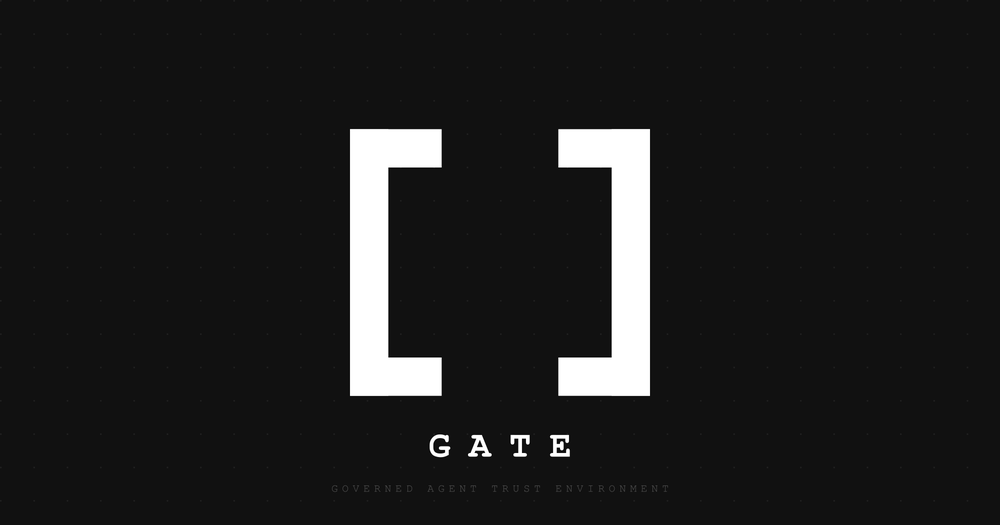

# Governed Agent Trust Environment {.unnumbered}

*A Cloud Reference Framework of Controls for Enterprise-Grade Trustworthy AI Agents*

{fig-align="center" width="70%"}

Version: 1.4

Copyright © 2026 Andrew Stevens.

License (Documentation): Creative Commons Attribution 4.0 International (CC BY 4.0)\
This work is licensed under the Creative Commons Attribution 4.0 International License. You may copy, redistribute, remix, transform, and build upon this material for any purpose, including commercial use, provided that you give appropriate credit, include a reference to the license, and indicate if changes were made.

Required attribution (minimum):

> Author: Andrew Stevens
>
> Title: Governed Agent Trust Environment (GATE)
>
> Source: [www.deterministicagents.ai](http://www.deterministicagents.ai)
>
> License: CC BY 4.0

No endorsement:\
Attribution must not suggest the author endorses you, your organization, or your use of this work.

Disclaimer:\
This document is provided "as is" without warranties of any kind. Implementers are responsible for validating security, compliance, and suitability for their environment and applicable requirements.

# Licensing & Use

This framework is intended for broad adoption and reuse.

**Documentation license (CC BY 4.0)**

The text, diagrams, and other non-code content in this document are licensed under Creative Commons Attribution 4.0 International (CC BY 4.0). You may copy, redistribute, remix, transform, and build upon this material for any purpose, including commercial use, provided you give appropriate credit, include a link to the license, and indicate if changes were made.

License: [https://creativecommons.org/licenses/by/4.0/](https://creativecommons.org/licenses/by/4.0/)

**Recommended attribution**

"Governed Agent Trust Environment (GATE)" by Andrew Stevens, licensed under CC BY 4.0.\
Source: deterministicagents.ai/gate

**No endorsement**

Attribution must not suggest the author endorses you, your organization, or your use of this work.

**Implementation responsibility**

This framework provides architectural and engineering guidance only. It does not constitute legal advice and does not guarantee security or compliance. Implementers are responsible for validating controls, evidence retention, and risk thresholds for their environment, threat model, and applicable regulatory or contractual requirements.

